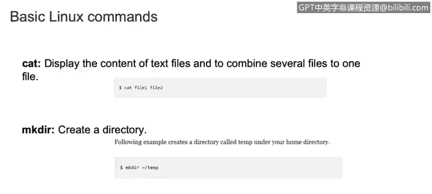
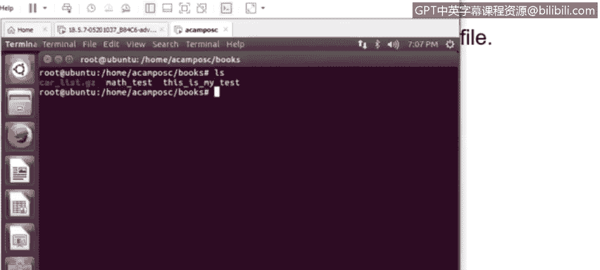
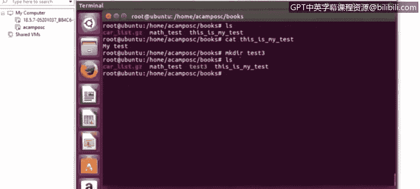
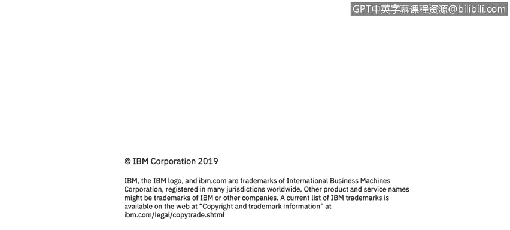

# 课程3：《网络安全合规框架与系统管理》：94：39_04_Linux基础命令（第三部分）📚


## 概述
在本节课程中，我们将继续学习Linux操作系统中的一些基础命令。我们将重点介绍用于文件删除、复制、移动、查看内容、创建目录以及网络配置和系统管理的命令。掌握这些命令对于进行有效的系统管理和故障排查至关重要。

## 文件与目录操作命令

上一节我们学习了文件查看和权限管理，本节中我们来看看如何对文件和目录进行更复杂的操作。

### 删除命令 `rm`
`rm` 命令用于删除文件或目录。使用不同的选项可以控制删除行为。

以下是 `rm` 命令的常用选项：
*   **`rm <文件名>`**：直接删除指定文件。
*   **`rm -i <文件名>`**：在删除文件前进行确认。这在防止误删重要文件时非常有用。
*   **`rm -r <目录名>`**：递归删除目录及其包含的所有子目录和文件。如果不使用 `-r` 选项，系统将不允许删除非空目录。

### 删除空目录命令 `rmdir`
`rmdir` 命令专门用于删除空目录。其基本语法是：
```bash
rmdir <目录名>
```

### 复制命令 `cp`
`cp` 命令用于复制文件或目录。

以下是 `cp` 命令的注意事项：
*   **`cp -p`**：在复制时保留原文件的属性（如所有权、时间戳）。
*   **`cp -i`**：在覆盖目标文件前进行确认。正确使用选项非常重要，以避免意外覆盖数据。
*   基本用法是：`cp [选项] <源文件> <目标文件/目录>`。



### 移动/重命名命令 `mv`
`mv` 命令用于移动文件或目录，也可用于重命名。其行为与 `cp` 命令类似。



以下是 `mv` 命令的常用选项：
*   **`mv -i`**：在覆盖现有文件前进行确认。
*   **`mv -v`**：显示移动操作的详细过程。
*   基本用法是：`mv [选项] <源文件> <目标位置>`。

### 查看文件内容命令 `cat`
`cat` 命令用于在终端显示文本文件的全部内容。例如，要查看 `my_test_file.txt` 的内容，可以运行：
```bash
cat my_test_file.txt
```



### 创建目录命令 `mkdir`
`mkdir` 命令用于在指定路径创建新目录。

以下是 `mkdir` 命令的用法示例：
*   创建单个目录：`mkdir test3`
*   创建嵌套目录（使用 `-p` 选项）：`mkdir -p parent/child/grandchild`。`-p` 选项会创建路径中所有不存在的父目录。

## 系统与网络管理命令

掌握了文件操作后，我们来看看一些用于系统状态查看和网络管理的实用命令。

### 网络接口配置命令 `ifconfig`
`ifconfig` 命令用于显示和配置Linux系统的网络接口信息。

以下是 `ifconfig` 命令的常见用法：
*   **`ifconfig -a`**：显示所有网络接口（包括未激活的）的状态。
*   **`ifconfig <接口名> up`**：启动指定的网络接口（例如 `eth0`）。
*   **`ifconfig <接口名> down`**：关闭指定的网络接口。

### 命令说明查询 `whatis`
`whatis` 命令用于快速显示某个命令的简短描述。当你不确定一个命令的用途时，可以使用它。例如：
```bash
whatis ls
```
它与 `man` 命令类似，但 `man` 会提供完整的手册页，包含所有选项和详细说明。

### 文件定位命令 `locate`
`locate` 命令能快速在系统中搜索包含特定名称的文件或目录的路径。例如：
```bash
locate myfile
```
它会列出所有路径中包含“myfile”的项目。

### 查看文件尾部内容命令 `tail`
`tail` 命令用于查看文本文件的末尾部分，默认显示最后10行。这在查看日志文件时特别有用。

以下是 `tail` 命令的用法：
*   **`tail <文件名>`**：显示文件最后10行。
*   **`tail -n <行数> <文件名>`**：显示文件最后指定行数。例如 `tail -20 log.txt` 显示最后20行。

### 分页查看器命令 `less`
`less` 命令用于分页查看大文件（如日志文件）的内容。它不会一次性加载整个文件，便于浏览和调查。

以下是使用 `less` 时的常用操作：
*   按**空格键**：向下翻一页。
*   按 **`Ctrl+F`**：向前翻一页。
*   按 **`Ctrl+B`**：向后翻一页。
*   按 **`q`** 键：退出 `less`。

### 切换用户命令 `su`
`su` 命令用于切换到其他用户账户执行命令。

以下是 `su` 命令的两种用法：
*   **`su - <用户名>`**：完全切换到指定用户的环境（如 `su - root`）。
*   **`su <用户名> -c "<命令>"`**：以指定用户身份执行单个命令后返回原账户。例如，`su john -c "ls -l"` 会以用户 `john` 的身份列出目录，然后切换回原用户。

### 网络下载命令 `wget`
`wget` 是一个非交互式的网络下载器，可以从互联网直接下载文件到当前系统环境。这比先下载到本地再上传到服务器更方便。用法如下：
```bash
wget <软件或文件的URL地址>
```



## 总结
本节课我们一起学习了Linux中更多的基础命令。我们涵盖了文件和目录的删除(`rm`, `rmdir`)、复制(`cp`)、移动(`mv`)、内容查看(`cat`, `tail`, `less`)和创建(`mkdir`)。此外，还介绍了网络接口管理(`ifconfig`)、命令查询(`whatis`)、文件搜索(`locate`)、用户切换(`su`)和网络下载(`wget`)等系统管理工具。熟练运用这些命令是进行有效Linux系统管理和网络安全分析的基础。