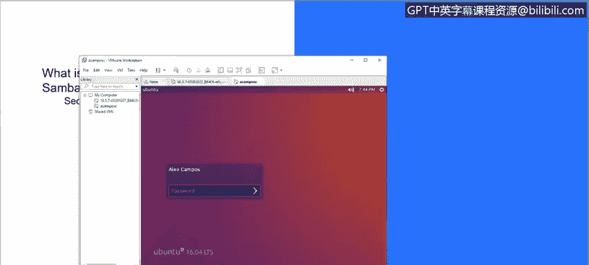
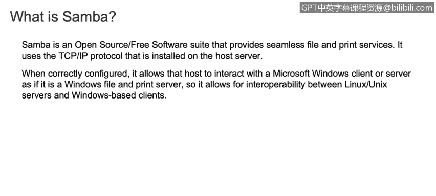
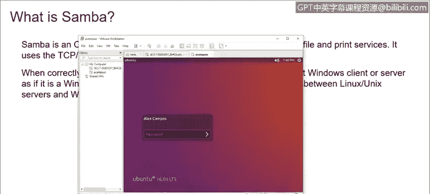
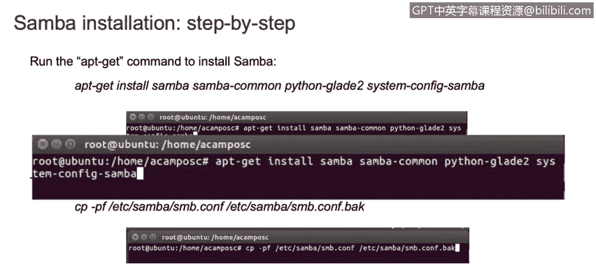
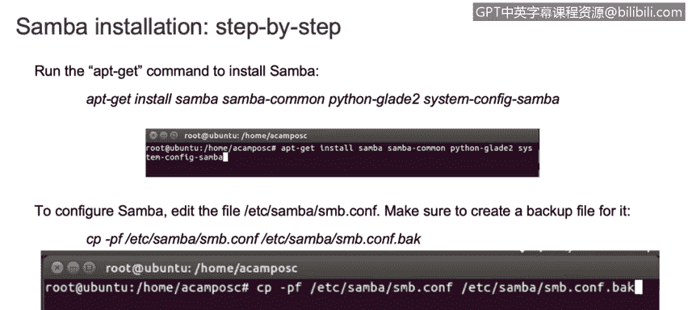
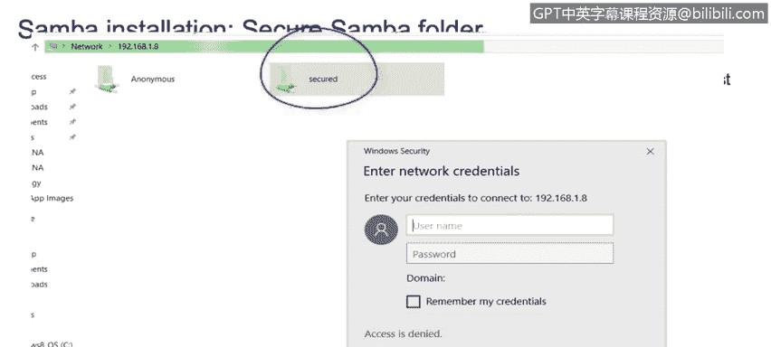

# 课程3：《网络安全合规框架与系统管理》：95：Samba安装与配置演示


## 概述


在本节课程中，我们将学习如何在Linux系统上安装和配置Samba服务。Samba是一个开源软件套件，它允许Linux系统与Windows系统之间共享文件和打印机。我们将通过一系列步骤，完成从安装到基础配置的整个过程，最终实现在Windows主机上访问Linux共享文件夹。

## 什么是Samba？ 🤔




上一节我们介绍了课程目标，本节中我们来看看Samba是什么。

Samba是一个开源免费软件套件，它能够提供无缝的文件和打印服务。它使用安装在主机服务器上的**SMB/CIFS协议**。如果正确配置此软件，它可以让你与Microsoft Windows客户端或服务器进行交互，就像它是一个Windows文件或打印服务器一样。因此，它能够在Linux服务器和Windows主机之间建立通信。例如，你可以在Linux发行版上设置Samba，以便与你的Windows主机共享文件或信息。

## Samba安装步骤 🛠️

了解了Samba的基本概念后，我们现在来看看具体的安装步骤。以下是安装Samba所需执行的基本命令。



*   首先，在你的Linux发行版上运行以下命令来安装Samba软件包：
    `sudo apt-get install samba`
    （注：如果你使用的是CentOS等基于RPM的系统，命令可能为 `sudo yum install samba`）
*   安装完成后，系统会在 `/etc/samba/` 目录下生成一个名为 `smb.conf` 的配置文件。
*   在修改此配置文件之前，建议先进行备份。可以使用 `cp` 命令创建备份：
    `sudo cp /etc/samba/smb.conf /etc/samba/smb.conf.backup`



## 配置匿名共享文件夹



安装并备份配置文件后，接下来我们需要编辑配置文件以设置一个共享。我们将首先配置一个允许匿名访问的共享文件夹。

我们需要使用文本编辑器（如 `nano` 或 `vi`）编辑 `/etc/samba/smb.conf` 文件，并在文件末尾添加以下配置行。添加内容的顺序不重要，但需确保所有行都已正确添加。

```
[anonymous]
   path = /samba/anonymous
   browsable = yes
   writable = yes
   guest ok = yes
   read only = no
```

配置信息添加完毕后，需要执行以下操作来创建共享目录并设置权限。



*   使用 `mkdir` 命令创建在配置中指定的目录：
    `sudo mkdir -p /samba/anonymous`
*   为该目录设置适当的权限，允许所有用户访问：
    `sudo chmod -R 0777 /samba/anonymous`
    `sudo chown -R nobody:nogroup /samba/anonymous`
*   最后，重启Samba服务以使配置生效：
    `sudo service smbd restart`
    （在某些系统上，命令可能是 `sudo systemctl restart smb` 或 `sudo systemctl restart smbd`）

## 在Windows中访问共享

服务重启后，我们就可以从Windows主机访问这个共享了。以下是访问步骤。

*   在Windows电脑上，打开“文件资源管理器”。
*   在地址栏中输入Linux服务器的IP地址，格式为：`\\<Linux服务器的IP地址>\`。
*   要查看Linux服务器的IP地址，可以在Linux终端中运行 `ifconfig` 或 `ip addr` 命令。

## 配置带密码保护的共享文件夹

我们已经成功创建了匿名共享。如果你需要更安全的共享方式，可以配置一个需要用户名和密码才能访问的共享文件夹。

首先，需要创建一个Samba用户。以下是为用户 `secureuser` 设置Samba密码的命令（请先确保该用户已存在于Linux系统中）：
`sudo smbpasswd -a secureuser`

接着，再次编辑 `/etc/samba/smb.conf` 配置文件，添加一个新的共享段。

```
[secured]
   path = /samba/secured
   valid users = @securegroup
   guest ok = no
   writable = yes
   browsable = yes
```

然后，执行以下操作来创建安全共享的目录结构。

*   创建安全共享目录：
    `sudo mkdir -p /samba/secured`
*   创建一个用户组并将目录权限赋予该组：
    `sudo groupadd securegroup`
    `sudo usermod -aG securegroup secureuser`
    `sudo chown -R root:securegroup /samba/secured`
    `sudo chmod -R 0770 /samba/secured`
*   最后，再次重启Samba服务：
    `sudo service smbd restart`



完成以上步骤后，在Windows网络文件夹中输入Linux服务器的IP地址，你将能看到名为“secured”的文件夹。尝试双击访问时，系统会提示你输入之前设置的用户名（`secureuser`）和密码。

## 总结

本节课中，我们一起学习了Samba服务的安装与配置。我们首先了解了Samba的作用是连接Linux与Windows系统以实现文件共享。然后，我们分步完成了Samba软件的安装、配置文件的编辑、匿名共享和安全共享文件夹的创建与权限设置，并最终在Windows主机上成功访问了这些共享。


通过本节的学习，你掌握了在混合操作系统环境中建立基本文件共享服务的核心技能。建议你在自己的实验环境中尝试运行这些命令，以加深对Linux系统管理和网络服务配置的理解。