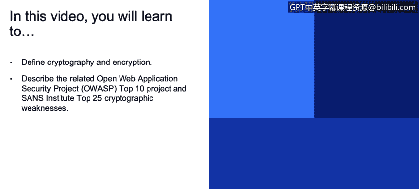
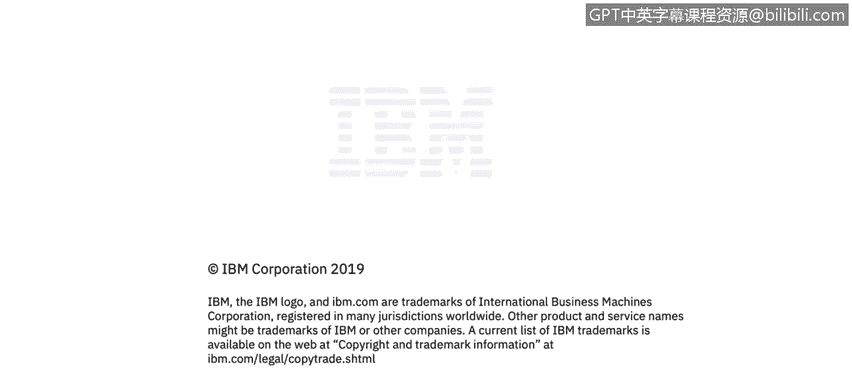

**课程3：《网络安全合规框架与系统管理》：97：密码学入门**

在本节课程中，我们将学习密码学与加密的基本定义，并了解相关的OWASP十大项目及SANS研究所列出的25种常见密码学弱点。

大家好，我是Dimitri Boza，是IBM X-Force道德黑客团队的一员。渗透测试是一种模拟攻击者、对手或黑客行为的测试。

我们试图侵入产品。作为工作的一部分，在完成测试并发现软件中的安全漏洞后，我们会将其反馈给开发团队，他们利用这些信息来提升产品质量和安全性。

因此，今天我们将讨论密码学、加密以及相关的密码学机制，例如哈希或数字签名。这些技术用于保护客户数据及其完整性。

同时，它们也用于防止对数据的未授权访问。今天我们将重点讨论在产品中应用密码学时常见的错误，而不会深入探讨密码学理论或算法实现细节。

这些是庞大的主题，通常是整个大学课程或一些非常厚的书籍的研究对象。

此外，还有一个名为“开放Web应用程序安全项目”（OWASP）的组织。

如果你还不熟悉它，我强烈推荐你去了解，特别是如果你正在构建面向Web的应用程序（这在当今非常普遍）。

这是一个非常有用的非营利组织，他们发布了许多关于产品安全的建议，并且还发布了一个名为“十大常见漏洞”的列表。

正如你在往年数据中看到的，与“未使用加密保护数据”相关的“敏感数据泄露”问题，不仅一直位列前十，而且在过去几年中重要性日益凸显。

因此，它正变得越来越重要和普遍。

另外，还有一个名为“SANS研究所25大危险软件错误”的列表。我也强烈建议你熟悉它，因为它列出了25种最危险的软件错误。

正如你所见，该列表中至少列出了四种与密码学相关的错误类型。

为了说明这不仅仅是理论讨论，这里有一些近期新闻中出现的、与密码学相关的错误和漏洞的小样本。我只花了几分钟就找到了这些链接，如果你搜索一下，肯定会发现更多。

例如，在Twitter的软件中曾出现一个错误，本应加密的密码实际上以明文形式暴露。另一家公司Kaland Health Systems，在一台笔记本电脑被盗时，失去了对其私人业务数据以及44.3万名患者个人数据的控制，这意味着硬盘上的数据并未加密。

由此可见，这些都是非常常见的问题类型，并且在日常攻击中被频繁利用。

---

**总结**

本节课我们一起学习了密码学与加密的基本概念，了解了OWASP十大漏洞和SANS 25大危险错误中与密码学相关的弱点。我们认识到，正确应用密码学技术（如加密、哈希和数字签名）对于保护数据安全和完整性至关重要，而忽视这些实践可能导致严重的数据泄露事件。