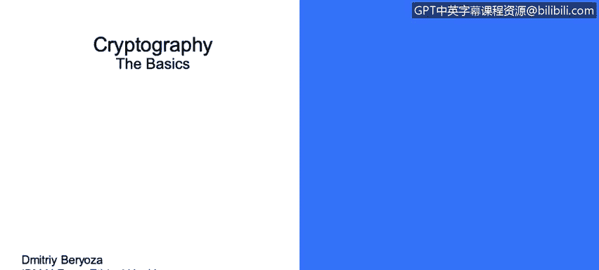

# 课程3：《网络安全合规框架与系统管理》：98：密码学基础 🔐

在本节课程中，我们将学习密码学的基础知识，包括加密的定义、常见加密算法类型，以及哈希函数和数字签名等核心概念。

---

## 加密概述

加密是一种对数据进行编码的过程，旨在防止未经授权的方访问数据。

需要明确的是，加密仅提供**机密性**保证。即使数据被加密，仍有可能被修改。如果仅使用加密算法，你可能无法察觉数据已被篡改。后续我们将讨论一种与此相关的特定攻击类型，即攻击者可以在不解密的情况下修改加密数据，并滥用应用程序。因此，对所使用的加密数据应用**完整性**机制同样重要。

数据通常在三种场景下被加密：
*   **静态数据**：存储在文件、数据库、备份或移动设备中的任何数据。
*   **使用中数据**：当应用程序运行时，数据被加载到计算机内存中。理想情况下，数据在直到被使用的最后一刻都应保持加密状态。
*   **传输中数据**：数据通过网络发送时。

在当今时代，敏感的商业和个人数据在任何必要的地方都应始终进行加密。其重要性在过去几年急剧上升，原因包括：
*   在线收集、存储和访问的敏感信息量巨大。
*   安全漏洞数量急剧增加。
*   世界各国政府正在出台新法规来应对此类攻击，如果企业未对敏感数据进行加密，将追究其责任。

---

## 加密算法类型

上一节我们介绍了加密的基本概念，本节中我们来看看主要的加密算法类型。最常见的两大类是对称密钥加密和非对称密钥加密。

### 对称密钥加密

对称密钥加密使用一个**私钥**。数据使用该密钥加密后变为乱码，当需要解密数据时，使用相同的密钥进行反向操作以恢复明文。

其特点是**速度快**。当今使用的对称密钥加密算法速度相当快。

但这种方法存在一个难题：**密钥共享**。通常，你不仅需要加密数据，还需要将加密后的数据发送到某处。你需要安全地发送数据，同时也需要安全地发送密钥。这是一个重大问题，而公钥密码学试图解决它。

### 非对称密钥加密

非对称密钥加密，也称为公钥加密，涉及一对**数学上相关联的密钥**：一个公钥和一个私钥。

以下是其工作原理：假设我想向同事发送加密消息。我的同事创建两个密钥，一个是私钥，他将其严密保管；另一个是公钥，他可以与全世界共享。这样，我可以用他的公钥加密要发送给他的消息，而他只能用他秘密保管的私钥来解密该消息。

这使许多人可以向他发送消息，但无法看到其他人发送的消息，因为唯一能解密这些消息的人必须拥有那个私钥。因此，它解决了预先共享密钥的问题。但这些算法通常比对称密钥加密算法**速度慢**。

你可能听说过的一些算法包括：**RSA**、**椭圆曲线**、**Diffie-Hellman**。

---

## 哈希函数

在了解了加密如何确保机密性后，我们来看看如何确保数据的完整性。哈希函数将任意大小的数据映射到固定大小的数据，其作用类似于一种校验和。

因此，哈希函数提供**完整性**保证，但不提供**机密性**。它们必须与加密算法结合使用。

你可能在工作中见过或使用过这些算法：**MD5**、**SHA-1**、**SHA-2**、**SHA-3**。

在这些场景中，从哈希值重构原始数据是刻意设计得非常困难的。例如，你获取一个文件，生成该文件的哈希值。如果该文件被恶意修改，然后你再次生成其哈希值，修改后文件的哈希值将与原始哈希值截然不同。

这样，我们就可以通过一个小的校验和来验证大块数据的完整性。

哈希函数用于完整性检查，有时也用于敏感数据存储，例如密码。我们稍后会简要讨论这一点。

---

## 数字签名

最后，我们来探讨一个结合了加密和哈希的强大概念：数字签名。它是一种用于验证数字消息和文档**真实性**的数学方案。

它实际上使用了我们前面提到的两个概念：哈希和公钥加密。

其工作方式如下：假设一条消息从一方发送到另一方。消息被哈希处理，然后使用发送方的**私钥**对该哈希值进行签名。

接收方在收到消息或文件后，可以验证哈希值，并使用发送方的**公钥**来验证哈希值是否未被篡改。

因此，数字签名实际上确保了三件事：
1.  **认证**：你可以确信发送消息的一方确实是声称发送消息的一方，因为只有该方应拥有私钥。
2.  **不可否认性**：这意味着发送方不能否认他们发送过消息，因为消息再次使用了只有该方或人员拥有的私钥进行签名。
3.  **完整性**：确保消息或文件在传输过程中未被修改。

---

## 课程总结

本节课中，我们一起学习了密码学的基础知识。我们首先定义了加密及其在静态、使用中和传输中三种状态下的应用。接着，我们探讨了对称密钥加密和非对称密钥加密这两种主要算法类型及其特点。然后，我们介绍了哈希函数如何确保数据完整性。最后，我们了解了数字签名如何结合哈希和公钥加密技术，为数字通信提供认证、不可否认性和完整性保障。理解这些基础概念对于构建安全的系统和遵守合规框架至关重要。