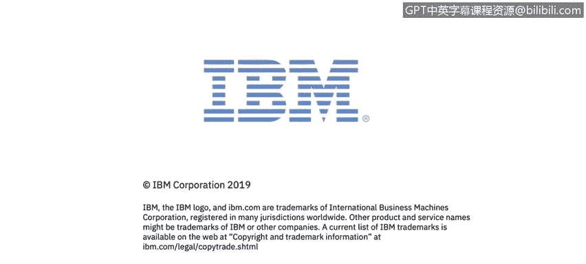

# 课程3：《网络安全合规框架与系统管理》：99：常见加密陷阱 🔐

## 概述
在本节课程中，我们将探讨在产品和系统开发中，与密码学应用相关的几个常见陷阱。理解这些陷阱对于设计和实现安全的加密解决方案至关重要。

## 常见加密陷阱详解

上一节我们介绍了课程概述，本节中我们来看看具体有哪些常见的加密陷阱。

### 1. 数据与通信未加密
第一个非常明显的问题是数据和通信缺少加密。产品处理各种敏感的商业和个人数据。数据通常是企业最有价值的资产之一。当以明文形式存储或传输数据时，它很容易被泄露或窃取。这是一个巨大的危险。在当今时代，没有理由不对存储或传输的数据进行加密。十年前或十五年前，对此的关注可能较少，但如今这绝对是至关重要的。我们拥有非常成熟的加密技术，它经过充分测试，并且适用于所有环境和编程语言。因此，基本上没有理由不在产品中使用它。我们的建议是加密所有处理的敏感数据，并确保其完整性。因为正如前面提到的，加密提供机密性，但不一定提供完整性。

我们与之交谈的一些产品所有者选择不加密某些数据，因为他们声称其产品的用户无法访问产品运行所在的操作系统的文件系统。不幸的是，这不是一个充分的理由。因为存在大量漏洞可能允许暴露存储在文件系统上的文件，例如配置文件、数据库、密钥库。这些漏洞包括路径遍历、本地文件包含、XML外部实体攻击等。攻击者可以构建一个所谓的“杀伤链”，利用一系列漏洞攻击特定企业。例如，路径遍历可能是其中之一，他们可以窃取包含敏感客户数据的数据库，然后利用使用了弱加密或未加密的事实来解密和使用数据。实际上，另一个危险是运行产品的物理机器可能被盗，硬盘可能被直接访问。如果数据未加密，就会被泄露和滥用。

一个通用的经验法则是，你必须假设包含敏感信息的文件可能被盗、可能被攻击者暴露和分析。这是一个你必须接受的基本假设。

### 2. 自行实现加密算法
我们有时看到的另一个问题是自行实现加密算法。开发人员经常使用混淆而非真正的加密。你可能熟悉Base64编码或XOR编码等混淆方案。不幸的是，这些方案对于保护数据安全毫无作用。它们非常容易被分析和逆转。这并不是说你完全不应该使用这些方案，但绝不能认为，例如，对某些数据进行Base64编码就能使其安全，它不能。我们甚至有时会看到产品实现自己的加密算法。这是一种非常危险的做法，绝对不应该这样做。这样的算法在面对认真的攻击者时毫无胜算。

有趣的是，有一个被称为“施奈尔定律”的说法。比尔·施奈尔是一位著名的密码学家，同时也是IBM Resilient的首席技术官。他写道：“任何人，从最业余的爱好者到最好的密码学家，都能创造出连他自己都无法破解的算法，这并不难。难的是创造出即使经过多年分析，也没有其他人能破解的算法。”因此，很可能你自己想出的算法，你自己无法找到破解方法，你的同事也不能。但是，如果你开发的、使用了该算法的产品正在保护某些数据，而某个国家行为体盯上了这些数据，那些人拥有非常合格的人才、杰出的数学家和密码学家，他们很可能轻易就能破解你想出的算法。

所以请不要这样做。请依赖经过验证的密码学，那些被成千上万专业人士、数学家和密码学家仔细审查过的算法。美国国家标准与技术研究院提供了关于当前哪些算法被认为是安全的指导。建议查阅并使用这些推荐算法。

### 3. 依赖算法保密性
我们看到的另一件事是，一些产品依赖其算法的保密性。他们只是说：“我们的应用程序是编译过的，全是机器码，攻击者永远不会知道内部算法。”如果你这样想，那么我有个坏消息：他们可以并且会发现，这只是攻击者动机有多强的问题。实际上，有一个完整的黑客分支叫做“逆向工程”，专门致力于发现隐藏的算法和数据。甚至存在持续进行的竞赛，黑客们比赛谁能最快逆向某个特定应用程序。想象一下，人们以此为乐。再想象一下，如果存在经济激励去发现你的秘密算法。

所以，再次强调，即使你的应用程序仅以编译形式分发，它也可以被“反编译”。像Java、Scala等运行在Java虚拟机上的语言，以及像C#等为.NET虚拟机编译的语言，Python和其他语言，它们都可以被轻易反编译。基本上可以从编译后的表示形式重建原始源代码。例如，如果你给我一个Java的`.jar`文件，我很可能可以为你反编译它，并返回你的原始源代码。情况就是如此糟糕。即使是像C/C++这样更难反编译的语言，因为机器码层面进行了各种优化，仍然存在特殊的工具可以重建出类似于你原始源代码的C代码。所以，所有这些都是可逆的。

攻击者还可能利用以下情况：如果你的产品很昂贵，攻击者可能无法获得。他们可能会获得一个试用版进行分析，或者只是在暗网上获得一个盗版副本。此外，不幸的是，现实情况是，有时会有不诚实的员工可能泄露公司机密。最近的一项研究发现，超过三分之一的员工在被问及是否愿意出售公司私有数据或专有信息时，表示同意，其中一些人甚至愿意以低至155美元的价格出售。所以你可以想象，你可能有一个非常秘密的算法，只保存在公司内部，不对外共享。实际上，只需要一个在经济上受到激励的“流氓”员工，就可以窃取并出售给外面的坏人。因此，依赖算法保密性并不是一个好的安全机制，这被称为“隐蔽式安全”，根本不是真正的安全。实际上，密码学已经反复证明，当今保护我们安全的所有算法都是开源的，并且经过了充分研究。例如AES、RSA、SHA等。我们今天使用的所有技术，包括银行通信，都依赖于众所周知的开源算法。实际上，这正是它们的力量所在，因为如此多的人已经审视和审查过它们，所以大多数错误已经被发现和修正。

底线是：不要依赖你的算法是秘密的。假设对手会知道它们。这里还有一个很好的指导原则，叫做“柯克霍夫原则”。奥古斯特·柯克霍夫是19世纪的一位荷兰密码学家。他说：“一个密码系统应该是安全的，即使除了密钥之外，关于它的一切都是公开知识。”我认为这是一个在工作中可以使用的伟大原则。

### 4. 使用硬编码、可预测或弱密钥
我们看到的另一个陷阱是使用硬编码的、可预测的或弱的密钥。不妥善保管你的密钥，几乎会使你的加密机制失效。密钥就像是王国的钥匙。如果你不控制它们，如果你暴露了它们，那么有人就可以直接使用它们，并使用你用来加密数据的算法来解密数据。

当密码和密钥被硬编码在产品中时（不幸的是，我们确实不时看到这种情况），或者它们以明文形式存储在配置文件中时，它们很容易被发现。如果你有一个加密密钥，也许不是以明文形式编码在某处，但很容易被猜到，攻击者可以通过尝试常见的已知密码来发现。有一个叫做“RockYou”的列表，以及许多其他类似的列表。它目前包含1400万个不同的常见密码。假设你使用你的电子邮件账户，并且有一个并非真正随机的密码，那么它很可能已经在这个列表上了。攻击者可以逐一尝试列表上的所有密码，然后就能够进入你的电子邮件账户，或者解密你用常见密码加密的某些数据。

此外，当密钥是随机生成时，必须小心地从密码学安全的随机源生成。假设你是一名Java程序员（其他编程语言情况类似），有一个叫做`java.util.Random`的东西，它是一个伪随机数生成器。不幸的是，它生成的数字非常可预测。因此，如果你使用该源生成加密密钥，攻击者可以通过暴力破解来发现你的密钥。相反，如果你要生成加密密钥，在Java中应该使用`java.security.SecureRandom`（其他语言有类似的变体），它是一个密码学安全的随机源，应在生成加密密钥时使用。

建议是依赖难以猜测的、随机生成的密钥和密码，并安全地存储它们。

### 5. 加密受出口管制
我们有时看到的问题是加密受出口管制。因此，任何包含加密算法、调用其他库或组件中的加密算法，或指导其他产品中加密功能的代码，在发布前都必须进行出口管制分类。

## 总结
本节课中，我们一起学习了在应用密码学时常见的五个主要陷阱：**数据与通信未加密**、**自行实现加密算法**、**依赖算法保密性**、**使用硬编码/可预测/弱密钥**以及**忽视加密出口管制**。理解并避免这些陷阱，对于构建真正安全、合规的系统和产品至关重要。请始终依赖经过验证的、标准的加密算法和协议，并妥善管理你的加密密钥。