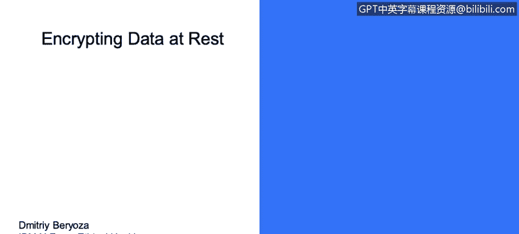
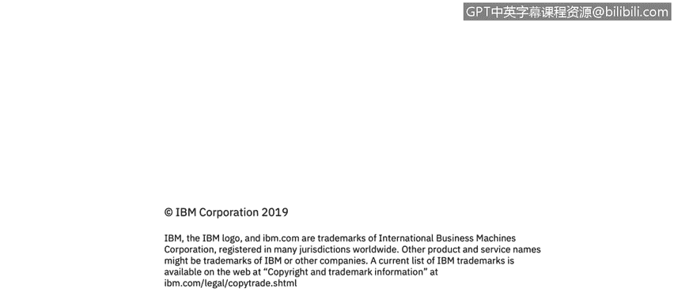

# 课程3：《网络安全合规框架与系统管理》：100：静态数据加密 🔐

在本节课中，我们将学习静态数据加密的核心概念与实践指南。我们将了解数据的数字状态，并探讨如何通过加密技术保护存储中的敏感数据。

---

## 数据的数字状态

数据根据其状态可分为三类：传输中、使用中和静态数据。本节我们重点讨论**静态数据**，即存储在硬盘、数据库或备份介质等持久化介质中的数据。

---

## 静态数据加密

上一节我们介绍了数据的三种状态，本节中我们来看看如何保护静态数据。一个基本原则是：对所有敏感数据进行加密。这包括配置文件、数据库、备份文件以及其他任何有价值的数据。

以下是实施静态数据加密时需遵循的关键指南：

*   **选择经批准的算法**：遵循美国国家标准与技术研究院的指南，选择当前被认可的加密算法。目前，AES（高级加密标准）的CBC模式和三重DES是获得批准的算法。
    *   **公式/代码示例**：`加密算法 = AES-CBC 或 3DES`
*   **淘汰不安全的旧算法**：随着时间推移，一些加密算法会因漏洞被发现或计算能力提升而变得不安全。必须将这些算法逐步淘汰。
    *   **例如**：DES、RC4等算法已被认为不安全，应停止使用。
*   **使用强密钥**：加密的安全性取决于密钥的强度和保护措施。必须使用密码学意义上安全的随机密钥。
    *   **核心原则**：`加密安全性 ∝ 密钥强度 × 密钥保护`
*   **避免密钥复用**：不要在不同的安装实例或客户环境中重复使用相同的加密密钥。如果一个实例的密钥泄露，所有使用相同密钥的实例都会面临风险。
*   **安全存储密钥**：切勿将密钥以明文形式存储在其保护的数据附近（这就像把钥匙藏在门垫下）。正确做法是将密钥存储在密码学上安全的密钥库中。
*   **正确使用初始化向量**：某些加密算法（如AES-CBC）需要使用初始化向量，且每次加密都必须随机生成。重复使用初始化向量会引入安全弱点。
*   **选择最大可用密钥长度**：在性能允许的范围内，尽可能选择更长的密钥长度以增强安全性。

---

## 总结

本节课中我们一起学习了静态数据加密的重要性与最佳实践。我们了解到，保护静态数据需要选用当前认可的强加密算法（如AES），生成并安全保管强随机密钥，避免密钥复用，并确保初始化向量等参数的随机性。遵循这些原则是构建安全数据存储体系的基础。