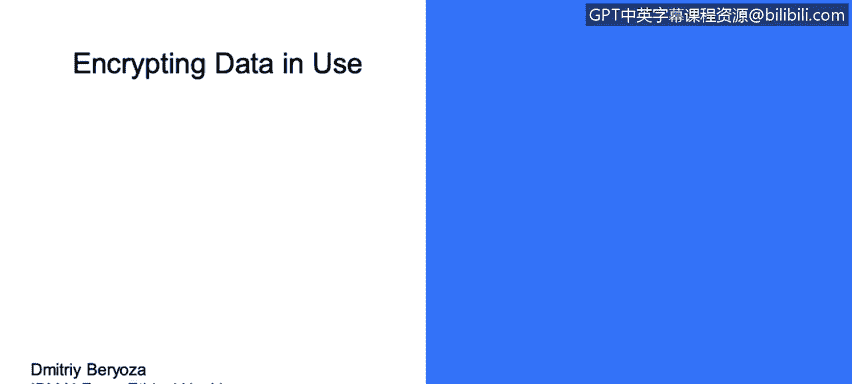
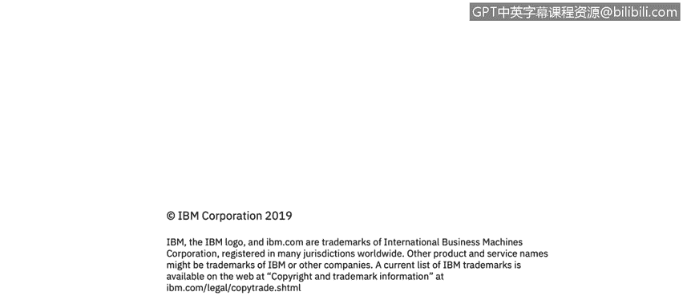

# 课程3：《网络安全合规框架与系统管理》：101：使用中数据加密 🔐

在本节课程中，我们将学习数据的一种状态——“使用中数据”，并探讨如何通过加密技术来保护这种状态下的数据安全。


---

## 概述


数据在其生命周期中会处于三种状态：静态、传输中和使用中。本节课我们将聚焦于“使用中数据”，即正在被应用程序或系统处理的数据。我们将了解为何加密此类数据至关重要，并介绍相关的加密技术。

---



## 数据的状态

上一节我们介绍了数据的静态和传输中状态。本节中，我们来看看数据的第三种状态——使用中数据。

“使用中数据”指的是正被应用程序加载到内存（如RAM）中进行处理的数据。例如，当你打开一个文档进行编辑时，该文档的内容就处于“使用中”状态。

---

## 使用中数据加密的挑战与重要性

遗憾的是，对使用中数据进行加密在实践中并不常见。

通常，产品会从磁盘加载数据，解密后直接在内存中进行处理。这种做法非常危险，因为某些类别的安全漏洞可能会暴露产品进程的部分内存。

一个非常著名的漏洞案例是几年前出现的 **Heartbleed**。该漏洞实际上泄露了使用OpenSSL协议的进程内存，并将这些数据泄露到了互联网上。如果那些产品能够将数据在内存中保持加密状态，那么这次泄露事件就不会发生，其危害性也不会如此之大。

因此，核心思想是：**即使在从磁盘加载数据后，也应尽可能保持其加密状态；仅在真正需要时短暂解密，使用后立即擦除**。这种方式能大大减少数据泄露的机会。

---

## 进阶概念：同态加密

另一个需要考虑的概念是同态加密，它可能适用于你的产品场景。

同态加密是一类特殊的加密算法，它允许你**直接对加密数据进行操作，而无需先解密**。这背后涉及非常复杂的数学原理，但某些应用场景支持这种操作。

这意味着你可以始终保证数据的安全，同时又能对其进行分析。这是一个值得了解的概念，或许你的产品未来可以利用这项技术。

以下是同态加密的一个简单概念示意：

```
加密数据A + 加密数据B = 加密后的（数据A+数据B）
```

然后，只有拥有密钥的人才能解密并看到最终结果“数据A+数据B”，而无法看到原始的A和B。

---

## 总结

本节课中，我们一起学习了：
1.  **使用中数据**的定义：正在内存中被处理的数据。
2.  加密使用中数据的**重要性**：能有效防范类似Heartbleed的内存泄露漏洞。
3.  最佳实践是：**保持内存数据加密，仅在必要时短暂解密并立即擦除**。
4.  了解了**同态加密**这一前沿概念，它允许对加密数据直接进行计算。



保护使用中数据是构建深度防御安全策略的关键一环，有助于确保数据在整个生命周期内的机密性。