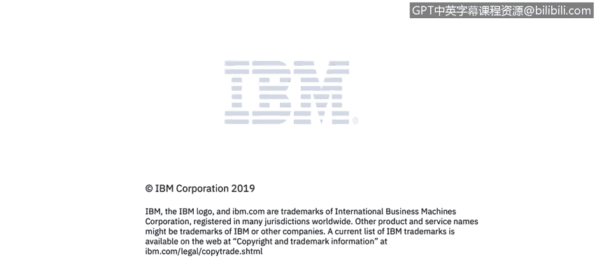

# 课程3：《网络安全合规框架与系统管理》：102：传输中数据的加密 🔐


在本节课程中，我们将学习如何描述数据的数字状态，并深入探讨传输中数据加密的重要性、常见协议、潜在风险以及最佳实践。

---

## 概述

数据在传输过程中，即通过网络从一点移动到另一点时，处于“传输中”状态。加密传输中的数据至关重要，可以防止未经授权的访问和窃听。

---

## 传输中数据的状态

数据在传输中是指数据正在网络中移动。加密传输中的数据是我们熟悉的概念。

在当今时代，以明文形式进行通信是绝对不可接受的，请不要这样做。业界对此已达成共识。最近，Firefox和Chrome浏览器开始将HTTP站点标记为不安全。因此，使用加密进行通信的站点，其正确的前缀是HTTPS。那些以明文通信的站点，他人可以非常容易地窃听这些对话并发现敏感信息。

所有通信都应加密。不仅仅是HTTP会以明文传输，有时远程过程调用、数据库连接等也会以明文形式通过网络传输，这是不推荐的，请务必避免。请确保加密所有通信。

---

## TLS/SSL协议

TLS/SSL是最常用的加密协议。它们在内部使用了多种加密原语：使用**非对称加密**进行身份验证和密钥交换，使用**对称加密**进行实际的数据加密。服务器会向客户端出示一个**数字证书**，该证书引用了通信中要使用的公钥及其颁发机构，我们稍后会详细讨论。

有时，一些产品选择仅使用对称密钥加密，如果安全地实施，这也可以。但主要问题在于如何在不同的节点之间安全地共享密钥。假设你的应用程序中有两个不同的节点需要通信，你如何安全地共享私钥，以确保其在传输过程中不被泄露？

---

## 常见的陷阱与风险

以下是传输加密中常见的一些问题：

*   **自签名证书**：我们经常看到自签名证书被使用。这基本上是你自己生成的证书。对于内部通信来说问题较小，但如果你的产品通过互联网通信，这就是一个更大的问题。正确的方式是使用由公认的**证书颁发机构**验证的证书，这样你才能确信该证书确实来自声称创建它的那一方。
*   **接受任意证书**：不幸的是，有些产品在不验证的情况下接受任意证书。如果你是一名Java开发者，查看下面的代码片段可能会认出这种模式。不幸的是，我们时常在代码中看到这种情况。

    ```java
    // 不安全的示例：接受所有证书（切勿使用）
    TrustManager[] trustAllCerts = new TrustManager[] {
        new X509TrustManager() {
            public java.security.cert.X509Certificate[] getAcceptedIssuers() { return null; }
            public void checkClientTrusted(X509Certificate[] certs, String authType) { }
            public void checkServerTrusted(X509Certificate[] certs, String authType) { }
        }
    };
    ```

    攻击者基本上可以颁发自己的证书，并坐在客户端和服务器之间的通信中间，这被称为**中间人攻击**。如果你的代码包含这种模式，就等于接受了网络上传来的任何证书。攻击者可以给你他们自己的证书，代表你与服务器通信，并监听你所有的通信，窃取所有私人数据。因此，**切勿在不验证的情况下接受证书**。

*   **证书验证不足**：不幸的是，仅验证证书本身可能还不够，因为当今的攻击者实际上可以创建有效的证书。他们可以利用某些证书颁发机构获取有效的证书，并且在你验证时也能正确通过验证。应对这种情况的方法是使用**证书绑定**机制。在这种机制中，出示的证书会与你预期看到的一组证书进行比对。这样，你就不会接受任何任意的有效证书，而只接受你的产品中某个节点预期从另一个节点收到的特定证书。在这种情况下，实施中间人攻击的难度就大得多。

---

## 协议与配置问题

除了证书，协议版本和加密套件的配置也至关重要。

*   **使用过时的或不安全的协议版本**：有时产品会使用过时的协议版本或不安全的加密套件。旧版本的SSL和TLS存在漏洞，你可以查到许多针对它们的著名攻击，例如DROWN、POODLE、BEAST、CRIME、BREACH等。随着时间的推移，旧版SSL和TLS被发现不安全，存在各种问题。这些问题后来得到了修正。目前我们推荐使用**TLS 1.2或更高版本**（TLS 1.1仍被认为是安全的，但1.2是推荐版本）。如果你使用任何低于此的版本，可能面临风险。因此，请审查你支持的TLS版本。有许多自动化工具可以帮助你，例如Nessus、Qualys SSL Server Test（仅适用于公开暴露的站点）、sslyze和sslscan（Linux工具）。使用这些工具来检查你是否安全。
*   **允许降级到不安全版本**：另一个问题是允许加密强度降级到不安全的版本，甚至降级到HTTP。为了解决这个问题，你必须锁定支持的TLS版本，不再支持其他版本，不允许降级。如前所述，使用HTTP已经不再是一个好主意。
*   **私钥保护**：当然，你必须保护好你的私钥。如果你失去了对私钥的控制，攻击者就能解密你的通信。

---

## 其他安全建议

为了进一步增强传输安全，请考虑以下建议：

*   **前向保密**：考虑实施**前向保密**。一些加密套件可以保护过去的会话，即使未来的秘密密钥或密码被泄露，过去的通信也无法被解密。请研究并实施支持前向保密的加密套件。
*   **TLS压缩风险**：在TLS下使用压缩存在一些问题。如果你使用HTTP压缩，并且通过安全通道传输，攻击者有时可以推断出你的数据，因为它被压缩了。实际上存在CRIME和BREACH等一系列攻击专门利用这一点。建议是：如果你加密了某些内容，**不要压缩静态服务的页面**，并且尽量避免压缩动态变化的页面。
*   **HSTS头部**：在你的所有通信中实施**HTTP严格传输安全**头部。这可以强制浏览器只通过HTTPS与你的站点连接，防止降级攻击。
*   **保持信息更新**：随时关注最新的安全动态。时不时会有某个协议中发现漏洞，你必须及时做出反应。

---

## 总结



本节课我们一起学习了传输中数据加密的核心知识。我们明确了加密所有网络通信的必要性，深入了解了TLS/SSL协议的工作原理，识别了自签名证书、无效证书验证、过时协议等常见风险，并掌握了使用证书绑定、启用前向保密、配置HSTS以及保持协议更新等一系列最佳实践。牢记这些要点，是确保数据传输机密性和完整性的基础。