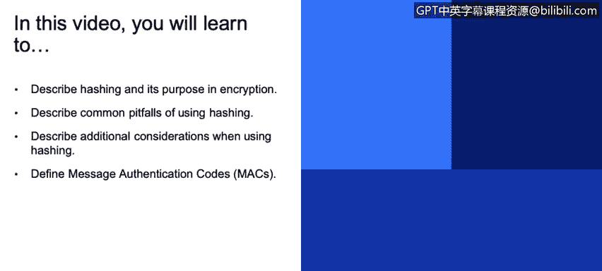

# 课程3：《网络安全合规框架与系统管理》：103：哈希与消息认证码





在本节课中，我们将学习哈希的概念、用途、常见陷阱以及相关的高级应用。我们将探讨哈希在密码验证、数据完整性检查等方面的作用，并了解如何安全地使用哈希函数。最后，我们会介绍消息认证码的概念及其重要性。

## 哈希的定义与用途 🔍

哈希是一种加密技术，它将任意长度的输入数据转换为固定长度的输出，这个输出通常称为哈希值或摘要。哈希的主要用途包括验证密码、确保数据和代码的完整性，以及在数字证书中验证真实性和完整性。

为了增强密码哈希的安全性，我们通常会使用“盐值”。关于这一点，稍后会详细讨论。

## 推荐的哈希函数 ✅

目前推荐的哈希函数主要有以下几种：
*   **SHA-2**
*   **SHA-3**

## 使用哈希的常见陷阱 ⚠️

上一节我们介绍了哈希的基本概念和推荐函数。然而，如果使用不当，哈希也会带来安全风险。以下是几个常见的陷阱：

首先，许多旧的、过时的哈希函数现在已被认为是不安全的，应该逐步淘汰。当一个哈希函数能够被轻易地找到“碰撞”时，它就被认为是不安全的。碰撞是指两个或更多不同的输入对应到同一个哈希值的情况。

以下是两个应该被淘汰的常见哈希函数：
*   **MD5**：该函数已被破解超过十年，碰撞可以相对容易地生成。
*   **SHA-1**：最近已被证明不可靠，不再推荐使用。你甚至可以访问一个名为 `shattered.io` 的网站，查看两个不同文件却拥有相同SHA-1哈希值的演示。

## 哈希与盐值 🧂

使用可预测的明文进行哈希是有问题的。例如，如果你哈希一个密码，而这个密码因为太常见而容易被猜到，攻击者就可以通过暴力破解，尝试所有可能的组合来找到对应的哈希值。

解决这个问题的方法是使用“盐值哈希”。除了上述列表中的问题，另一个相关威胁是“彩虹表”。彩虹表是暴力破解的一种变体，本质上是别人预先计算好的、包含所有可能字符组合及其对应哈希值的巨大表格。

当然，为整个问题空间生成彩虹表几乎是不可能的，但对于合理大小的输入，生成彩虹表是可行的。有一个名为 `hashkiller` 的网站，你可以输入一些常见名称或小数字，它可能会给出对应的哈希值。

可以推测，一些国家行为体能够生成巨大的彩虹表，并以此方式破解哈希。防止这种情况的方法就是使用盐值。盐值是一个随机的字节序列（建议至少8字节），在计算哈希之前将其添加到明文中。这个盐值可以公开。结果是，即使密码相同，使用不同的盐值也会产生完全不同的哈希值。

以下是一个示例，两个用户的密码相同，但由于使用了盐值，他们的哈希值完全不同：
```python
# 伪代码示例
hash_user1 = hash(password + salt1) # 结果：0x3A7B...
hash_user2 = hash(password + salt2) # 结果：0xF29C...
```
如果使用了盐值，彩虹表攻击就变得不切实际。

## 使用哈希的其他注意事项 📝

上一节我们通过引入盐值解决了彩虹表攻击的问题。本节中，我们来看看其他一些增强哈希安全性的重要考虑因素。

使用哈希时，还有一些额外的注意事项：
*   **使用密钥延伸函数**：结合哈希使用密钥延伸函数，并进行大量迭代。这些函数被故意设计得很慢（通过迭代次数控制），使得在线和离线的暴力破解攻击变得不切实际。通常，目标是让操作耗时约750毫秒，这会大大减慢哈希计算速度，使得对大量密码列表进行暴力破解变得不可行。PBKDF2就是一个例子。
*   **为未来做准备**：在存储哈希值时，包含算法标识符。这样，如果将来发现某个算法不安全，你可以做出反应，切换到不同的算法，只需存储不同的算法ID即可。

## 消息认证码 🔐

还有一种与哈希相关的技术叫做消息认证码。它们用于确认数据块来自预期的发送方且未被篡改。

基于哈希的MAC，即HMAC，基于SHA-256、SHA-3等加密哈希函数。它们借助一个密钥来生成待传输消息的哈希值。如果攻击者不知道这个密钥，他们就无法在修改消息后生成一个新的、匹配的哈希值。

这就是问题所在：假设你发送一条带普通哈希的消息，有人可以在传输中修改它，重新计算哈希，并用新哈希替换旧哈希，然后发送到目的地。使用HMAC则不可能，因为哈希是使用一个秘密密钥生成的，而该密钥不为攻击者所知。

因此，这类技术可能不应该到处使用，而只应用于数据可能在攻击者控制下被恶意篡改的场景。例如，在客户端浏览器中存储Cookie，或者传输消息时，HMAC就非常有用。

正如前面提到的，即使是加密数据也应该受到HMAC的保护，因为存在一种叫做“位翻转攻击”的手段。攻击者可以玩弄加密消息中的位，虽然不知道具体内容，但足以进行篡改。例如，他们可能将正在发送的转账金额从100美元改为100万美元，而无需实际解密数据。HMAC可以防止这类位翻转攻击。


## 总结 📚


本节课中，我们一起学习了哈希在网络安全中的核心作用。我们了解了哈希的定义、推荐使用的函数（如SHA-2、SHA-3），并重点探讨了使用哈希时的常见陷阱，如使用已破解的MD5和SHA-1函数。为了应对暴力破解和彩虹表攻击，我们引入了盐值技术。此外，我们还学习了通过密钥延伸函数和包含算法ID来增强哈希的未来安全性。最后，我们介绍了消息认证码的概念，特别是HMAC，它通过结合密钥来确保数据的完整性和真实性，有效防止了数据在传输中被篡改。掌握这些知识对于构建安全的系统至关重要。