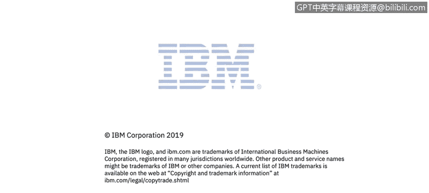

# 课程3：《网络安全合规框架与系统管理》：104：数字签名及其推荐用途 🔐

在本节课程中，我们将学习数字签名的概念及其在网络安全中的主要应用场景。数字签名是一种确保数据来源真实性和传输完整性的关键技术。

---

上一节我们介绍了网络安全的基础概念，本节中我们来看看数字签名如何具体应用。

数字签名能够确保消息和文件来自真实的来源，并且在传输过程中未被篡改。

以下是数字签名的一些推荐用途：

*   **验证节点间数据交换的完整性**：确保在网络中不同系统间传输的数据是完整且未被修改的。
*   **通过网络传输并执行的代码**：例如小程序、JavaScript脚本、Android或iOS应用程序。这些代码通常都经过数字签名，以验证其真实性和完整性。
*   **客户安装的服务包和修复包**：这些更新包必须受数字签名保护，以确保没有人篡改过它们，没有在要应用于产品的服务包中植入恶意内容。
*   **临时保存在客户机器上的数据**：例如备份数据。数字签名可以确保这些数据的来源可信且未被更改。

为了使数字签名发挥作用，它们必须被验证。如果你创建了一个数字签名但从不验证它，那么这个签名就毫无用处。

---

本节课中我们一起学习了数字签名的核心作用——验证数据来源和完整性，并了解了其在代码验证、软件更新和数据备份等关键场景中的具体应用。理解这些用途是构建安全系统管理实践的重要一环。