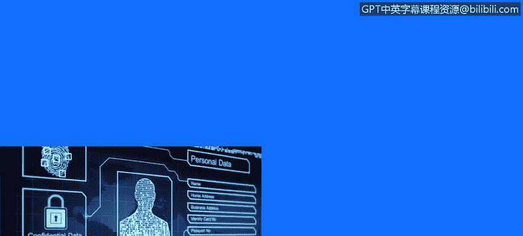
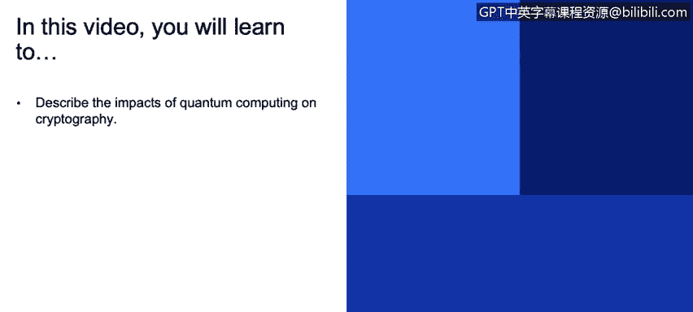
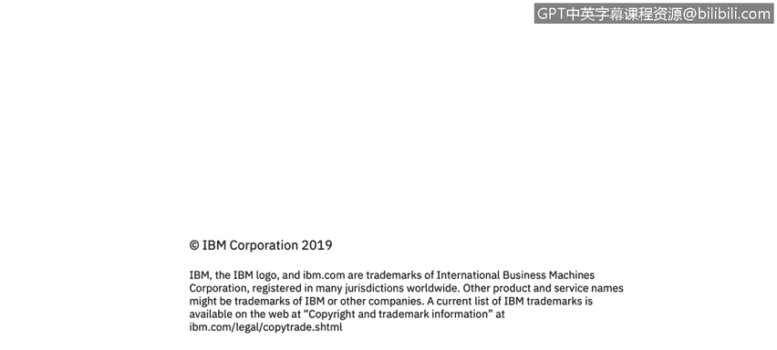

# 课程3：《网络安全合规框架与系统管理》：106：量子计算的影响 🔬

在本节课程中，我们将探讨量子计算对现代密码学技术可能产生的影响。量子计算是一种利用量子力学现象进行计算的新兴技术，它预示着计算能力的巨大飞跃，同时也对当前广泛使用的加密方法构成了潜在威胁。

## 量子计算概述

量子计算是使用量子力学现象进行计算的技术。你可能听说过它，也可能了解到它将对当今使用的密码学技术产生负面影响。

幸运的是，距离量子计算具备实际应用能力大约还有10到15年的时间。但这并不妨碍我们现在就开始思考其影响。

## 对密码学的具体影响

量子计算的影响主要体现在两个方面：对称加密和非对称加密。

上一节我们介绍了量子计算的基本概念，本节中我们来看看它对两类主要加密算法的具体影响。

### 对称加密算法的影响

量子计算将削弱对称加密算法的安全性。例如，如果你目前使用**AES算法**配合**128位密钥**来保证安全，当量子密码学可用时，你将需要升级到**256位密钥**才能维持同等级别的安全性。

以下是应对措施：
*   将对称加密算法的密钥长度升级，例如从AES-128升级到AES-256。

### 非对称加密算法的影响

不幸的是，公钥密码学将受到严重影响，基本上会被破解。这意味着依赖公钥基础设施的技术，如**TLS/SSL**、**区块链**和**数字签名**，都将变得不安全。

因此，现在就开始思考如何保护你的客户是值得的。全同态加密可能是解决方案之一。此外，还有一类抗量子算法，例如基于格的密码学等。

以下是当前的一些研究方向：
*   **全同态加密**：允许在加密数据上直接进行计算。
*   **抗量子算法**：如基于格的密码学等能够抵抗量子计算攻击的新型算法。

我认为这方面的具体建议尚未完全成型。但为了保护客户安全，尽早开始准备可能是最佳实践。

## 长期数据安全与算法可替换性

其中一个问题是，如果你所保护数据的生命周期相当长，攻击者现在就可以捕获加密通信，等到量子密码学实用时再对其进行解密。如果存在这种危险，你可能需要立即开始考虑对策。

在这方面，一个通用的良好实践是使你的加密算法具备“可替换性”。因为随着时间的推移，情况会发生变化，有些东西会变得不安全，有些算法会被破解。

如果你在产品中拥有一个健壮的机制，能够通过**修复包**或**服务包**将当前的加密算法替换为另一种，我认为你的客户会对此表示赞赏。

并且，如果某个算法被曝出不安全，而你能在产品中快速反应，无需进行太多更改即可替换算法，这将是一个优势，可能会让你在竞争中处于领先地位。

你可以进一步探索与密码学相关的资源。

## 课程总结

本节课中我们一起学习了量子计算对密码学的潜在影响。我们了解到，对称加密（如AES）需要通过增加密钥长度来应对，而公钥加密体系则面临被彻底破解的风险。为此，业界正在研究全同态加密和抗量子算法等解决方案。同时，我们强调了对于生命周期长的加密数据需提前规划，并在系统设计中贯彻加密算法的“可替换性”原则，以灵活应对未来密码学领域的变革。