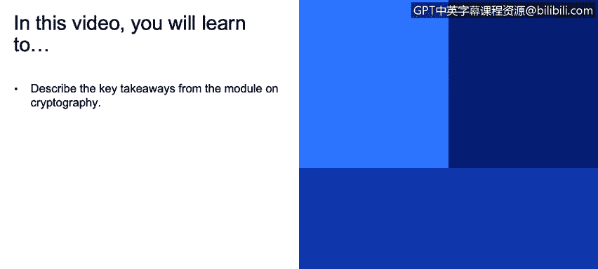
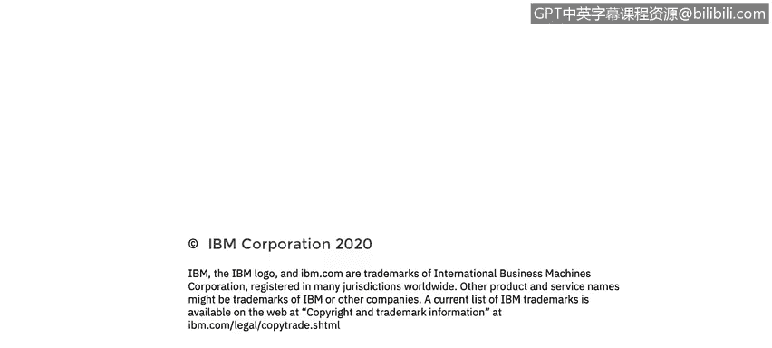

# 课程3：《网络安全合规框架与系统管理》：107：密码学与加密核心要点 🧠

在本节课程中，我们将回顾密码学模块的核心要点，总结加密数据、选择算法、管理密钥以及保持安全警觉性的关键实践。

上一节我们深入探讨了密码学的具体应用，本节中我们来总结一下整个模块的核心要点。

以下是本模块的关键收获：

*   **加密所有敏感数据**：无论数据是处于**静态**、**使用中**还是**传输中**，都应进行加密。
*   **依赖并正确使用成熟算法**：应使用经过验证的加密算法，并确保正确实施。一个微小的错误就可能导致整个加密方案失效。
*   **切勿自创或依赖隐蔽性算法**：不要尝试编写自己的加密算法，也不要指望通过算法保密来获得安全。**“通过隐匿实现安全”并非真正的安全**。
*   **使用强密钥并安全存储**：确保加密密钥难以被猜测，并将其存储在安全的位置。
*   **持续关注安全动态**：密码学领域不断发展，需保持对安全新闻和研究的关注。算法可能随时间变得不再安全，一旦你的产品中使用的算法出现问题，你必须准备好及时应对。

本节课中，我们一起学习了密码学应用的核心原则，包括全面加密、正确使用标准算法、避免安全误区、妥善管理密钥以及保持对安全威胁的持续警觉。掌握这些要点是构建安全系统的基础。