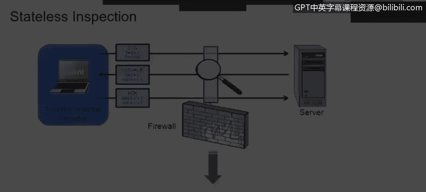

# 课程4：《网络安全与数据库漏洞》：3：无状态检查

在本节课中，我们将学习数据包如何被无状态防火墙检查。我们将讨论网络基础知识和网络安全的一些基本概念。本讲座由Moises Mong开发，由Ben Briggs主讲。

## 无状态与有状态检查的区别

首先，我们来回顾一下无状态检查与有状态检查的一些区别。我们将首先关注防火墙和路由器在现代企业中的工作原理。然后，我们将简要讨论入侵检测系统（IDS）与入侵防御系统（IPS）之间的差异。最后，我们将介绍网络地址转换路由器（NAT）的一些基础知识。

常规路由器和某些防火墙采用无状态方式过滤数据包。**无状态**意味着每个数据包都是独立检查的，不依赖于之前的数据包信息。系统不维护会话表，因此每个数据包的检查都独立于其他所有数据包。

## 数据包检查内容

那么，数据包中检查哪些内容呢？

以下是检查的关键要素：

*   **源IP地址**：检查该地址是否被允许访问。我们可能拥有一条访问控制列表规则，用于决定是否允许该源IP地址进入我们的网络。
*   **目标地址**：检查是否允许访问目标地址。
*   **目标端口或服务**：检查是否允许该目标端口或服务进入网络。

基本上，这个过程是逐个数据包进行的。无状态检查不了解任何会话信息。我们将在后面讨论会话。它没有一个数据库来记录已检查数据包的详细信息。

## 无状态检查示例

这里是一个无状态检查事件的示例。

1.  我们的源计算机（客户端系统）启动其网络浏览器。
2.  网络浏览器在网络应用层运行。浏览器可以创建TCP或UDP流量，但TCP是我们将在网络中看到的最常见流量。
3.  由于我们的数据包在网络第4层使用TCP，它将具有IP地址。数据包头将包含我们客户端机器的**源IP地址**和接收计算机或Web服务器的**目标IP地址**。
4.  然后，第2层信息（关于我们本地网段的信息，由网络添加）将被添加到数据包头中。这包括源计算机和目标计算机的物理或MAC地址，以及我们网关的MAC地址。
5.  接着，封装好的数据包将被发送到物理层（可以是有线或无线以太网）。
6.  数据包将到达路由器，路由器将评估该数据包。
7.  如果源IP地址（本例中为我们的客户端机器）被允许访问我们的服务器，并且TCP或UDP协议被允许，同时目标端口也被允许（即我们的服务器正在监听来自外部甚至公司网络内部的该特定服务的流量），那么数据包将被转发到服务器。

## 无状态检查的优势

无状态检查有哪些优势呢？

以下是其主要优点：

*   **速度更快**：无状态检查比有状态检查速度更快。
*   **提供控制度**：无状态检查使我们能够在一定程度上控制网络中允许发生的情况。
*   **便于故障排除**：当我们需要对数据包进行分类时，无状态检查非常有用。
*   **支持虚拟化**：如果我们有一个支持虚拟化的路由器，当有来自特定源、试图前往特定目的地的流量时，我们可以将其发送到路由器内的特定虚拟实例。
*   **支持服务质量**：我们可以执行一些服务质量交换，从而优先处理某些流量。

## 总结

本节课中，我们一起学习了无状态防火墙检查数据包的基本原理。我们了解了无状态检查的核心特点是独立处理每个数据包，不维护会话状态。我们探讨了检查的具体内容，包括源/目标IP地址和端口，并通过一个示例了解了数据包从客户端到服务器的检查流程。最后，我们总结了无状态检查在速度、控制、故障排除和虚拟化支持等方面的优势。理解无状态检查是深入学习更复杂的有状态检查和现代网络安全技术的重要基础。