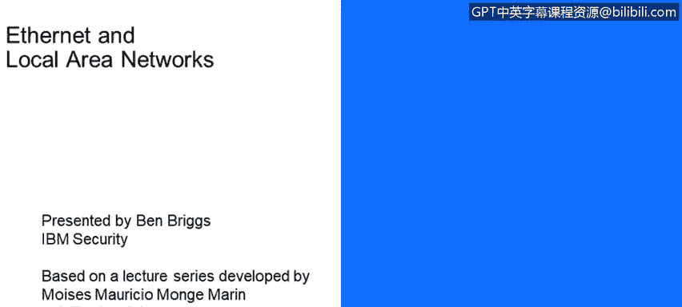
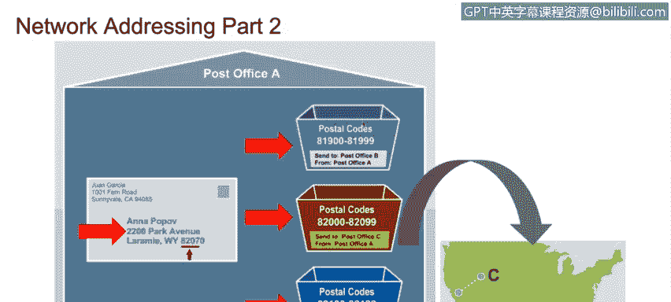
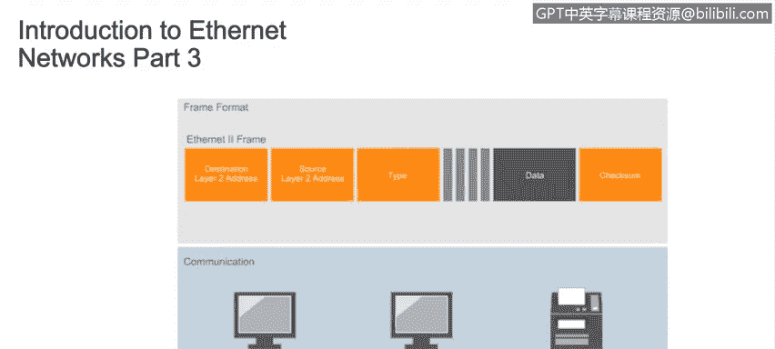
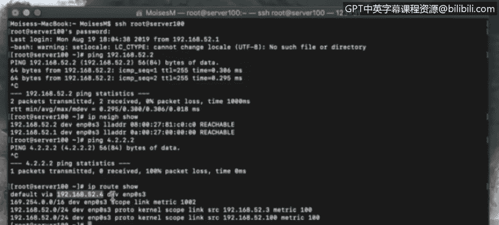

# 课程4：《网络安全与数据库漏洞》：8：7_局域网简介.zh


在本节课中，我们将学习以太网和局域网的基本工作原理。我们将了解网络设备、地址方案以及数据如何在网络中传输。



## 以太网与局域网简介 🖧

本节将介绍局域网的基本概念。我们的学习目标是描述以太网网络如何工作。


具体目标包括：
*   理解各种网络设备及其区别。
*   理解冲突域和广播域的区别。
*   描述分割广播域的不同方法。
*   理解虚拟局域网的工作原理。
*   理解现代网络中使用的不同寻址方案。

## 网络寻址方案：二层与三层地址 🏷️

上一节我们介绍了课程目标，本节中我们来看看网络中的两种核心寻址方案。这两种方案分别位于OSI模型的第二层（数据链路层）和第三层（网络层）。

数据链路层使用**MAC地址**，而网络层使用**IP地址**（可以是IPv4或IPv6格式）。数据包从一台主机传送到另一台主机的方式，可以类比邮政服务投递邮件的过程。

我们将信息放入信封，这类似于数据被封装在数据包头部。然后，这个头部又被封装在另一个头部中。IP数据包在数据链路层被封装进以太网帧（如果网络使用其他技术，则封装进其他类型的二层帧）。最后，在物理层（第一层）会再次封装，并添加物理信息。这就像我们把要发送的信息放入信封，并在信封上写上寄件人和收件人地址，包括城市、州、国家和邮政编码。

邮局将你的信封放入一个运往指定邮政编码区域的货箱，并在箱外清晰标记该邮编。邮局会寻找最短、最高效的路线，将货箱从当前位置运送到目标邮政编码指定的邮局。这类似于二层设备（路由器）在网络或互联网上为你的信息寻找最高效路由的方式。




一旦货箱被运送到你指定的国家、州和城市的邮局，你的信封就会被取出，并投递到指定的街道、门牌号，放入邮箱。你的朋友收到信封，打开它，阅读信息。正如你所见，在发送前封装信息的每一步，在接收端都会按相反顺序一步步解封装。

## MAC地址与IP地址详解 🔢

二层地址和三层地址有很大不同。

二层地址被称为**媒体访问控制地址**或**MAC地址**。MAC地址也被称为硬件地址、物理地址或烧录地址，因为它们被永久蚀刻在每个网络接口卡中，并且对于该卡是唯一的。在已生产的数十亿张网卡中，没有两张具有相同的MAC地址。

这是一个MAC地址的例子，它是一个6字节（48位）的地址：
```
00:1A:2B:3C:4D:5E
```

每当数据包通过一个三层设备（如路由器）并从一个网络传递到另一个网络时，数据包头中的二层信息会被剥离，并替换为新的物理源地址和目的地址。

三层地址是**IP地址**，也被称为逻辑地址。这是一个无法在互联网上路由的私有IPv4地址的例子：
```
192.168.1.10
```

三层地址标识计算机或终端设备，并且不会随着数据包的路由而改变（当然，NAT路由器进行的替换除外）。

## 局域网内通信：ARP协议的作用 🔄

让我们看看局域网如何工作，以便更好地理解设备之间的连接以及控制它们通信的规则。为了在同一局域网内将信息从一台主机传送到另一台主机，我们需要知道与目标设备IP地址相关联的MAC地址。




让我们登录服务器查看一下。假设我们想ping这个地址：`192.168.52.2`。

**Ping**（Packet Internet Groper）是用于测量向另一台计算机发送数据包并接收响应所需时间的实用程序。它是快速测试你的计算机与另一系统之间是否存在开放通信路由的最简单方法。

你可以看到ping成功发送，并且我们收到了响应。我们能够ping通一个IP地址，是因为**地址解析协议**或**ARP**能够在我们输入的IP地址和现在屏幕上看到的MAC地址之间建立关联。

这对于局域网内的通信工作得很好。但是，当我们需要将数据包发送到局域网外部时，**默认网关**就是确保数据包被转发到局域网外的设备。

现在，让我们尝试ping一个位于我们局域网之外的地址：`4.2.2.2`。但由于我们的ARP表中没有找到默认网关的地址，所以ping没有成功。没有默认网关，数据包就无法路由到我们的局域网之外。




## 总结 📝


本节课中，我们一起学习了以太网和局域网的基础知识。我们了解到，为了将消息传送到我们局域网内的任何计算机（无论数据包是源自局域网内的计算机，还是从外部网络路由到我们的局域网），我们都需要知道与目标IP地址相关联的MAC地址。我们还区分了二层MAC地址和三层IP地址，并通过类比邮政服务理解了数据封装与路由的过程。最后，我们看到了ARP协议和默认网关在局域网内外部通信中的关键作用。