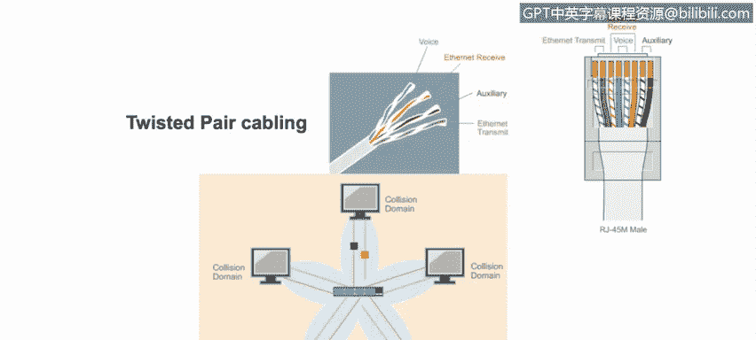

# 课程4：《网络安全与数据库漏洞》：10：9_以太网和局域网网络设备

在本节课程中，我们将学习如何区分和理解各种网络设备，并了解虚拟局域网在局域网中的工作原理。

## 网络连接线缆 🧵

首先，我们从连接网络设备的基础——线缆开始。

以下是两种常见的网络线缆：

*   **同轴电缆**：通常使用F型连接器。
*   **双绞线**：通常使用RJ-45连接器。

其中，带有RJ-45连接器的双绞线是局域网中最常用的线缆，适用于长度不超过100米的连接。

双绞线以太网电缆通过“Cat”评级系统来标定速度和长度。例如：

*   **Cat 5**：支持最高100 Mbps的传输速度，距离可达100米。
*   **Cat 6** 和 **Cat 6a**：分别支持最高1 Gbps和10 Gbps的传输速度，距离同样可达100米。

## 常见网络设备 🔌

上一节我们介绍了网络连接的基础线缆，本节中我们来看看连接这些线缆的各种网络设备。

以下是几种常见的网络设备类型：

*   **中继器**：也称为**集线器**，是一种“哑”设备。当它收到一个数据帧时，会将该帧从其所有接口转发出去。因此，连接到该设备的所有终端都会收到这个帧。每个终端需要自行检查帧中的第二层MAC地址，以判断该帧是否发给自己。集线器在发送信号前会重新生成信号，因此发出的信号是干净且全强度的。但由于中继器没有智能，无法判断何时发送信号是安全的，因此**冲突不可避免**。检测到冲突后，接收方必须通知发送方重发包，这会降低网络通信速度。在现代网络中，已很少见到中继器或集线器这类“哑”设备。

*   **网桥**：网桥比集线器更先进。它与集线器类似，但不会将信号发送到所有连接的端口，而是通过维护一个**MAC地址表**，只将信号发送到目标计算机所连接的端口。网桥查看传入帧的第二层目标MAC地址，并在MAC地址表中匹配该地址对应的连接端口。因此，网桥是一种可以为局域网增加一定智能的设备。连接到集线器的所有设备都处于同一个**冲突域**中，而网桥通过划分冲突域来增加网络智能——网桥的每个端口都创建一个独立的冲突域。

*   **交换机**：交换机是网桥的现代版本。网桥有一些局限性，例如它是**半双工**设备（数据一次只能单向传输），且连接到其端口的终端设备必须**共享可用带宽**，同时无法实现**虚拟局域网**。而交换机是现代网络中最常见的设备，它使用**全双工**通信（每个端口可同时收发数据），每个端口专用于单个设备（带宽不再共享），并且可以在交换机上实现VLAN，这意味着我们可以在同一设备内实现广播域的逻辑隔离。VLAN提供了一种在同一交换机上分隔局域网的方法，一个VLAN中的设备不会收到来自另一个VLAN设备的广播消息，本质上是逻辑划分广播域的一种方式。当然，交换机也有其局限性，例如当多个交换机作为同一网络的一部分连接在一起时，**网络环路**仍然是个问题（此时可使用**生成树协议**等协议来帮助解决），交换机可能无法改善多播/广播流量的性能，并且交换机无法连接地理上分散的网络。

## 总结 📝

本节课中，我们一起学习了局域网的基础构成。我们从网络连接线缆（如同轴电缆和双绞线）及其规格开始，然后深入探讨了三种关键网络设备：功能简单、易产生冲突的集线器；能通过MAC地址表智能转发、划分冲突域的网桥；以及功能全面、支持全双工、专用带宽和VLAN的现代交换机。理解这些设备的工作原理和差异，是构建和分析安全网络架构的重要基础。