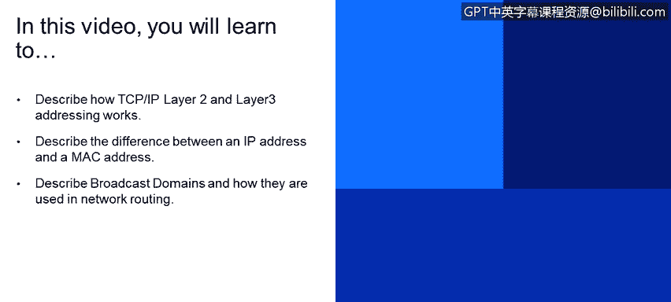
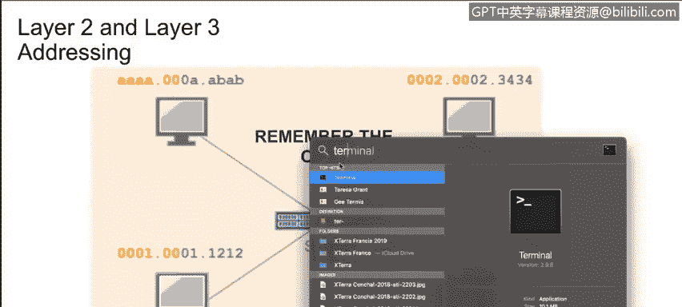
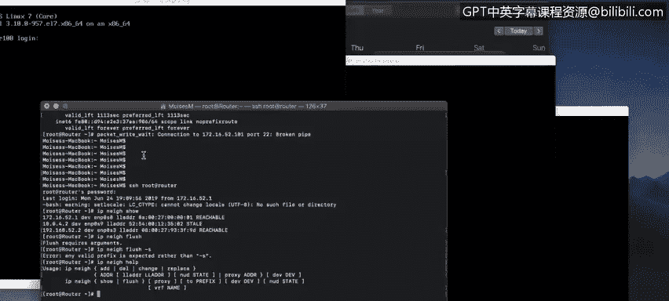
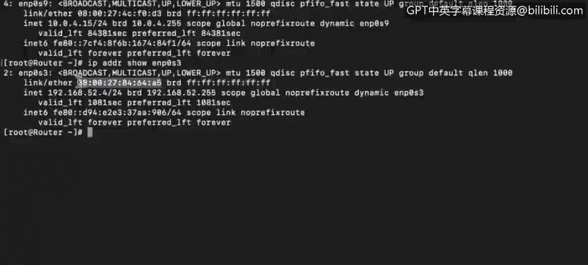
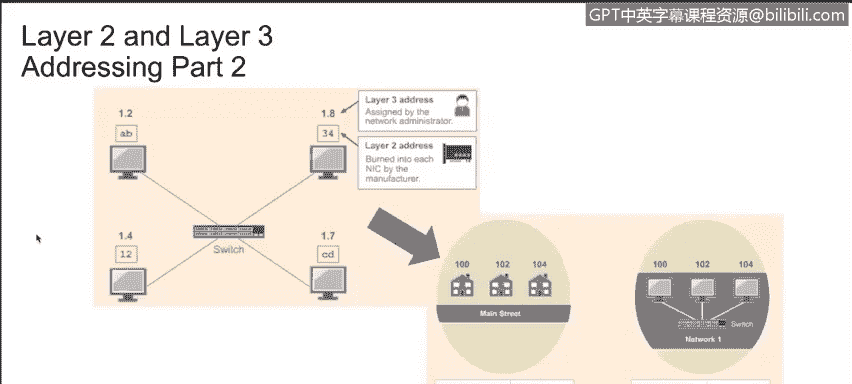
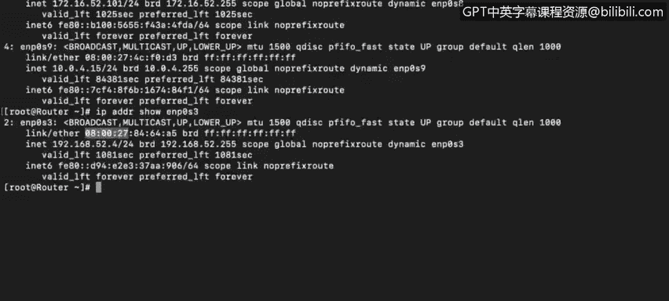
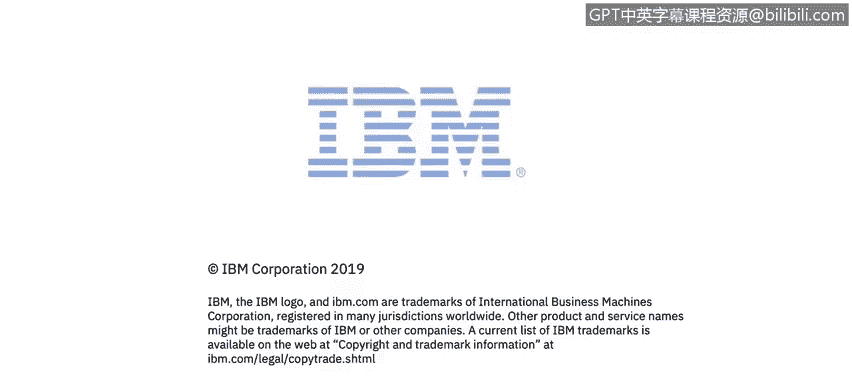

# 课程4：《网络安全与数据库漏洞》：12：第2层和第3层网络寻址 🖧

在本节课中，我们将要学习TCP/IP协议栈中第2层和第3层寻址的工作原理。我们将了解IP地址和MAC地址的区别，并探讨广播域的概念及其在网络路由中的应用。

---

## MAC地址：设备的物理标识符 🔍

上一节我们介绍了网络通信的基础，本节中我们来看看设备在网络中的唯一物理标识。

观察你的计算机内部，你会看到某种网络接口。它可能是一个单独的芯片，也可能是一整块网络接口卡。你的网卡可能支持有线连接、无线连接，或两者都支持。网卡总会有一个固化在硬件上的地址，这被称为MAC地址或物理地址。MAC地址被物理编码在网卡上，通常无法更改。

> **核心概念**：MAC地址是一个48位（bit）的二进制字符串，通常表示为`48个1或0`。它被分为6个八位组（octets），即6组8位二进制数。前三个八位组用于标识网卡制造商，称为组织唯一标识符。后三个八位组由制造商用于标识每一张唯一的网卡。

有学生曾提到MAC地址欺骗，并质疑MAC地址固化不可更改的说法。事实上，MAC地址确实被固化在网卡中，无法从硬件层面更改。然而，许多操作系统可以被“欺骗”或配置成使用一个不同的地址来代表其接口的MAC地址。这被称为MAC地址欺骗，可用于绕过防火墙上的MAC地址过滤策略。该策略通过限制只允许预先授权的机器访问来保护资产。攻击者要成功，首先需要知道一台已被授权通过防火墙的系统的MAC地址，然后将其系统配置为使用这个被盗用的MAC地址进行通信。

每月有超过3亿台新设备连接到互联网，我们可能会担心MAC地址耗尽的问题。2的48次方大约是281万亿。以目前的消耗速度，我们还有近一百万年才会遇到MAC地址不足的问题。

要查看你计算机的MAC地址，请打开终端或命令提示符窗口。

以下是查看MAC地址的方法：
*   在Linux系统上，运行 `ifconfig` 命令。
*   在Windows系统上，运行 `ipconfig /all` 命令，物理地址会清晰地列在许多其他参数和地址之中。

---

## 网络接口与地址查看实例 💻

了解了MAC地址的基本概念后，我们通过一个实例来具体观察网络接口及其地址。

在这个例子中，我们使用SSH连接到一台路由器。输入密码后，我们可以看到所有接口的信息。请记住，无论单个设备中有多少个网络接口，每个独立的网络接口都有自己的地址。

仔细观察其中一个接口，我们可以看到第2层的MAC地址。这就是我系统的物理地址或MAC地址。同时，我们还能看到广播地址，该地址可用于向此网段内的所有设备发送消息。

请注意，MAC地址并非显示为六组8位的1和0，而是通过将每个二进制八位组用两个十六进制数表示来简化，以便于我们人类使用。计算机内部处理的仍是8位的1和0，但为了我们的便利，只显示两个十六进制数。

---

## 数据包传递与地址验证 📦

现在我们已经了解了单个设备的地址，接下来看看数据包在网络中传递时，这些地址是如何协同工作的。

当一个数据包从一台计算机发送到另一台计算机时，数据包头部将同时包含第2层（MAC）地址和第3层（IP）地址。数据包实际上是被传递到第2层或MAC地址。随后，计算机会验证头部中的第3层或IP地址是否与其自身分配的IP地址匹配。系统接着会检查数据包头部的第2层MAC地址是否与该系统的MAC地址匹配。如果匹配，系统将开始处理该数据包。

当我们谈论广播域时，我们指的是计算机所在的网络段。

---

## 广播域与虚拟局域网 🌐

最后，我们来探讨广播域的概念，这对于理解网络分段至关重要。

观察我们登录的路由器，可以看到它有许多网络接口，例如eNP0s3、eNP0s8和eNP0s9。这意味着这台设备连接到了三个不同的网络，也就是三个不同的广播域。你可以看到我的本地IP地址是什么，广播地址是什么。如果数据包被发送到广播地址，该广播地址范围内的所有终端设备都将接收到该数据包。广播域也可以被称为虚拟局域网。

---

**本节课中我们一起学习了**：TCP/IP模型中第2层（数据链路层）和第3层（网络层）寻址的核心机制。我们明确了MAC地址作为不可更改的物理标识符与IP地址作为逻辑标识符的根本区别，并通过命令实践了如何查看这些地址。我们还探讨了数据包传递过程中两层地址的协同验证过程，并理解了广播域（或虚拟局域网）作为网络逻辑分段的概念及其在网络通信中的作用。掌握这些基础知识是分析网络流量和识别潜在安全漏洞的重要前提。