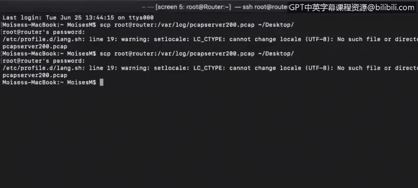
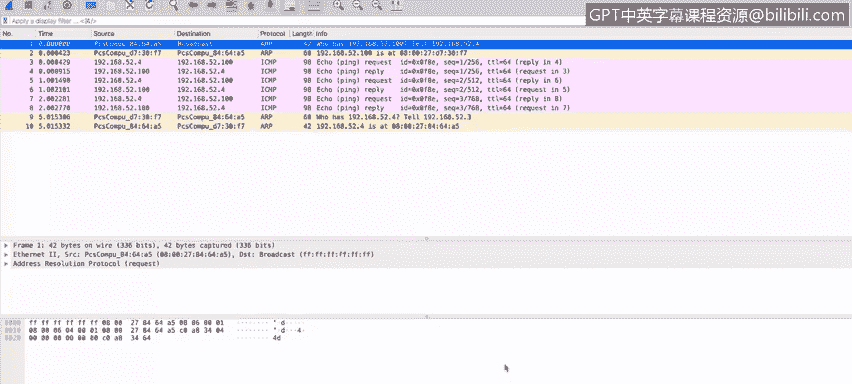
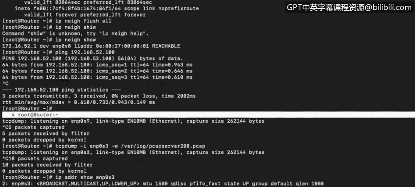
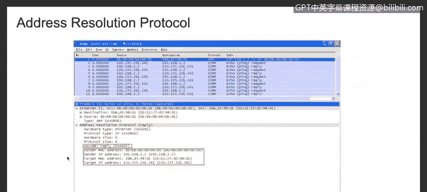
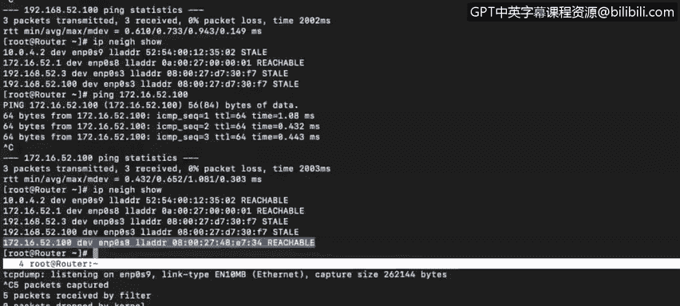

# 课程4：《网络安全与数据库漏洞》：13：12_地址解析协议


在本视频中，你将学习描述地址解析协议，以及ARP表在网络路由中的使用方法。

## 深入理解ARP协议

上一节我们介绍了网络通信的基本概念，本节中我们来看看一个关键的协议：地址解析协议。这个协议的原理相当简单。ARP接收一个IP地址作为输入，并返回该IP地址所分配给的计算机的MAC地址。

我们将查看Linux路由器上的ARP表。你也可以在自己的Windows、Linux或Mac OS X系统上，通过在终端或命令提示符窗口中运行 `arp -a` 命令来查看ARP表。这台Linux路由器有自己的一套命令来显示此信息。

以下是查看ARP表的命令示例：
```bash
ip neighbor show
```
运行此命令将显示该设备上所有IP地址对应的MAC地址信息。例如，IP地址 `172.16.52.1` 连接到接口 `enp0s8`，其对应的逻辑地址或MAC地址会在此处显示。我们可以看到 `enp0s8` 位于广播域或本地网络内，其CIDR范围是 `172.16.52.101`。

## ARP协议的工作过程

假设我们想ping一个位于该网络内的设备，但我们的ARP表中还没有该IP地址到MAC地址的转换记录。让我们看看实际会发生什么。

首先，我在另一个屏幕上启动 `tcpdump` 来捕获接口 `enp0s9` 上的流量信息。我们将把输出重定向到一个pcap文件中并让其持续运行。在开始之前，让我们快速重新检查一下ARP表。

现在，让我们ping一个不在ARP表中的设备：`192.168.52.100`。然后观察会发生什么。我们可以看到ping成功了。

接下来，停止捕获并查看我们抓取到的数据包。将pcap文件传输到桌面进行分析。




## 分析数据包捕获结果

首先我们会看到，在ping成功之前，计算机需要获取目标IP地址的物理地址。因为数据包从不直接发送给IP地址，而是始终发送给物理地址或MAC地址。

因此，当计算机尝试ping一个IP地址（如 `192.168.52.100`）时，第一件事就是尝试查找其MAC地址。计算机会向其本地网络上的所有其他计算机发送查询。你可以在这里看到源地址，而目的地是广播地址。所以这个帧会被发送到其广播域内的所有其他设备。

拥有地址 `192.168.52.100` 的设备，如果它存在于我们的网络中，就应该让我们知道。这本质上是在问：“谁拥有这个IP地址？” 发起ping请求的是我的计算机，IP地址为 `192.168.52.4`，这也是需要回复的地址。



如果我再次登录路由器并查询，你会看到这是我的IP地址。所以这是我在询问：“谁有我想ping的这个IP地址？” 幸运的是，为了演示，我们确实收到了一个回复。




第二行的回复来自具有此MAC地址的计算机。消息发送到我的MAC地址。消息内容是：`192.168.52.100` 拥有这个MAC地址。


一旦我们的ARP表填充了这个转换记录，ping请求就可以被发送了。在这里你可以看到互联网控制消息协议（ICMP）的回显请求和ICMP回复。

这就是地址解析协议如何将IP地址转换为系统通信所需的MAC地址的工作过程。

## 不同系统中的ARP表

以下是一个来自Windows机器的ARP表示例。在Windows机器上，你在命令提示符窗口中输入命令 `arp -a`，就会看到ARP表。

我们也可以在Wireshark数据包嗅探器上看到这些数据。你会看到与我们之前展示的实时数据包捕获相同的内容。

这是一个回复的示例。如果我选择这个数据包，你可以看到地址解析协议和回复。如图所示，这是IPv4，这是该数据包的源MAC地址，这是源IP地址，这是目的地。在本例中，目的地是我们的路由器，你可以看到它的目标地址是我们的IP地址和MAC地址。

## 重要注意事项

需要记住一个重要点：**目的地的MAC地址仅在同一个广播域内传输数据时才需要**。当我们将数据包发送到不同的广播域时，我们唯一需要的MAC地址是我们的默认网关（在本例中是我们的路由器）的MAC地址。

因此，让我们查看一下路由表。




在本例中，我们的默认网关地址是 `10.0.4.2`。如果我们想ping `google.com`，我们不需要找到 `google.com` 的MAC地址，但我们确实需要获取默认网关 `10.0.4.2` 的MAC地址。


让我们再确认一下。是的，我们已经有这个记录了。

## 总结

本节课中我们一起学习了地址解析协议。总而言之，**ARP协议的作用是在同一个广播域内查找机器**。它通过将IP地址解析为MAC地址，使得局域网内的设备能够直接通信。对于跨广播域的通信，则只需要获取默认网关的MAC地址即可。


