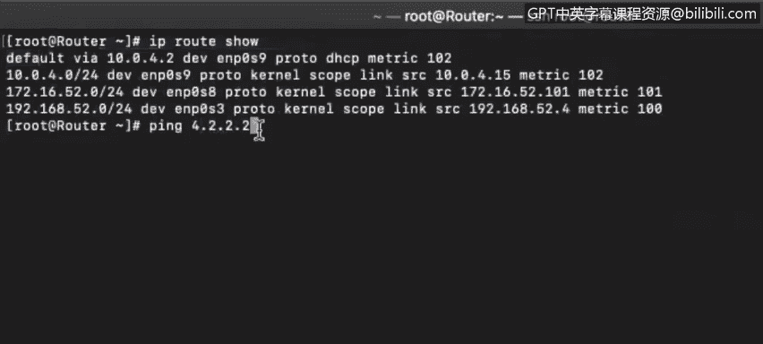
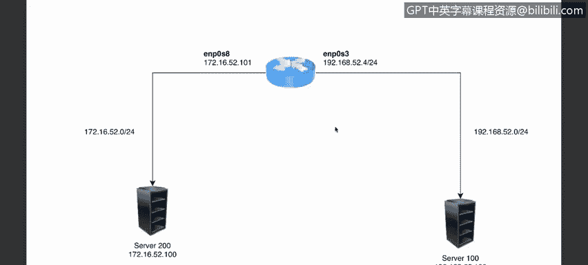
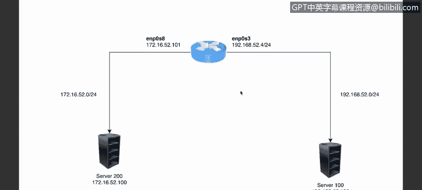

# 课程4：《网络安全与数据库漏洞》：16：路由器和路由表 第3部分

在本节课中，我们将学习路由表中定义的不同路由类型，了解MAC地址如何出现在系统的ARP表中，并详细探讨网络如何精确地知道将数据包成功转发到何处。

上一节我们介绍了路由表的基本构成，本节中我们来看看路由表中具体包含哪些不同类型的路由条目。

## 路由表中的路由类型

路由表中定义了多种类型的路由。在上一节的视频中，我们在一个终端和路由器上看到了三种不同的路由类型。现在让我们再次检查这些路由。

以下是三种主要的路由类型：

1.  **默认路由**：用于将数据包发送到我们没有其他路由信息的地址。例如，如果我们向IP地址 `4.2.2.2` 发送一个数据包，我们对该网络一无所知，那么数据包将被发送到默认网关。在本例中，该子网的默认网关是 `10.0.4.2`。数据包被发送到那里后，默认网关将负责将其路由到另一个网络。从我们能够成功收到ping回复来看，默认网关工作正常。

2.  **直连路由**：除了默认路由，我们还看到了另外三条路由，它们直接连接到我们的服务器。这表示这些网络存在于与此接口直接相连的位置。这些是另一种类型的路由。

因此，我们目前看到了两种主要的路由类型：指向本地网络直连系统的路由，以及通过默认网关的路由。

当然，路由类型不止这两种。还存在动态路由协议，如OSPF、RIP版本1和版本2，以及思科专有协议EIGRP。

## 数据包转发实例分析

现在，让我们通过一个实例来详细分析网络如何知道将数据包转发到哪里。

假设有一个简单的网络，试图将数据从网络1发送到网络3。这个网络非常简单，只包含一个路由器、服务器100和服务器200。

我们使用SSH以root用户身份登录到IP地址为 `192.168.52.100` 的服务器100。

从服务器100，我们想要ping通服务器200。

`ping server200` 命令返回“未知的服务”，这意味着我们没有启用DNS解析。但我们知道服务器200的IP地址是 `172.16.52.100`，所以我们可以直接ping这个地址。

可以看到ping操作是成功的。现在，让我们检查路由表，看看路由器是如何确保这个数据包被传送到服务器200的。

通过查看路由表，我们可以看到路由器正在做什么。表中没有直接指向 `172.16.52.0`（我们试图ping的网络）的路由。但我们有一个连接到接口 `ENP0S3` 的默认网关。

因此，发生的情况是：数据包被发送到我们的默认网关，然后由默认网关确保该数据包被送达。默认网关同样会确保回复数据包被路由回我们。

我们可以运行 `traceroute` 命令来精确查看数据包是如何从本地主机通过网关路由的，网关如何确保数据包被传送到其目的端点。

在这里可以看到，`172.16.52.0` 并没有直接连接到我们的接口。在本例中，我们只有一个物理接口。我们有一个回环接口（逻辑接口），以及 `ENP0S3`（该设备的物理接口）。同一个接口上分配了两个IP地址，这是完全有效的。

## ARP表与MAC地址

这里是我们的MAC地址。如果我们检查ARP表，会发现ARP表只填充了直接连接到我们接口的设备信息，即来自同一广播域的设备。

在本例中，我们唯一处于 `192.168.52.3/24` 这个网段的接口，因此我们的ARP表只填充了该地址的信息。

尽管我们正在ping `172.16.52.100` 并且ping成功了，但这个172地址不会被添加到ARP表中。再次强调，ARP表只会转换我们本地广播域内的地址。

在向远程IP地址发送数据时，我们需要知道的是我们默认网关的MAC地址。

在本例中，当我们检查路由表时，默认网关的IP地址是 `192.168.52.4`。我们可以在ARP表中查找该地址的转换记录。

该IP地址对应的条目就是物理地址（MAC地址）`08:00:27:84:64:a5`。

至此应该很明显，每个IP地址都会有一个不同的MAC地址，因为MAC地址是该接口的物理或固化地址。

## 跨网段发送数据包的原理

这就是我们能够跨不同网段发送数据包的方式。我们的默认网关将确保数据包被传送到最近的第3层设备，直到找到一个第3层设备，其某个接口直接连接着目标系统。

本节课中我们一起学习了路由表中的不同类型（如默认路由和直连路由），通过实例分析了数据包转发过程，并理解了ARP表仅记录本地广播域内设备的IP-MAC映射关系，而跨网段通信依赖于默认网关的MAC地址进行数据包的中继转发。