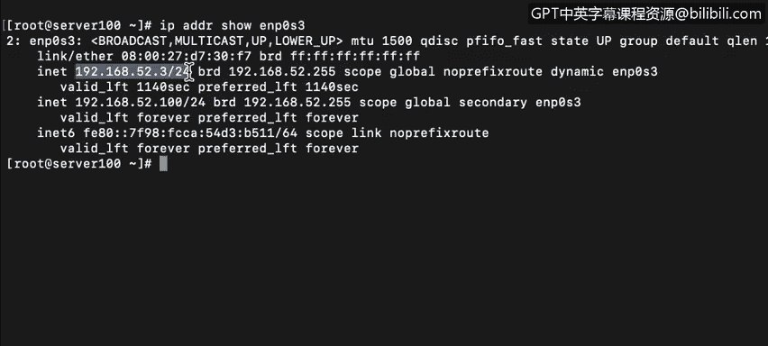

# 课程4：《网络安全与数据库漏洞》：19：18_IP地址结构和网络类 🌐

在本节课中，我们将要学习IPv4地址的结构，包括其四段八位组格式，以及早期网络分类（A、B、C、D、E类）的区别。理解这些基础知识对于分析网络架构和识别潜在漏洞至关重要。

---

## IP地址的四段八位组格式

上一节我们回顾了二进制与十进制的转换，本节中我们来看看IPv4地址的具体构成。

Internet协议版本4（IPv4）使用一个32位的寻址方案。这个32位的地址被划分为4个部分，每个部分称为一个“八位组”，包含8位。每个八位组在十进制表示法中的取值范围是0到255（即 \(2^8\)）。因此，一个完整的IPv4地址范围从 `0.0.0.0`（所有位为0）到 `255.255.255.255`（所有位为1）。

IPv4地址的总数量为 \(2^{32}\)，即 **4,294,967,296** 个。虽然这个数字看起来很大，但IPv4地址实际上已经面临短缺。

计算机以二进制方式识别IP地址。例如，将十进制IP地址 `192.168.52.10` 转换为二进制，需要分别转换每个八位组。转换方法如下：

对于十进制数10：
*   检查16的位置：16 > 10，所以该位为 **0**。
*   检查8的位置：8 ≤ 10，所以该位为 **1**，余数为2。
*   检查4的位置：4 > 2，所以该位为 **0**。
*   检查2的位置：2 ≤ 2，所以该位为 **1**，余数为0。
*   剩余位（1）为 **0**。

因此，十进制10的二进制表示为 `00001010`。每个八位组都包含8位，故称“八位组”。

一个IP地址被分为**网络部分**和**主机部分**。这可以在计算机上手动配置，但如今大多数计算机都设置为使用DHCP（动态主机配置协议）来自动分配IP地址。

---

## 网络部分与主机部分

理解了IP地址的基本格式后，我们通过一个实例来观察网络部分和主机部分的划分。

让我们登录到服务器 `Ser100` 并查看其网络接口的IP地址。假设其IP地址显示为 `192.168.52.3/24`。这里的“/24”被称为CIDR（无类别域间路由）表示法。

`/24` 定义了IP地址中有多少位 dedicated（专用于）网络部分。具体来说，它表示前24位是网络地址，剩下的位是主机地址。

---

## 网络类别（Classful Addressing）

在IPv4的早期，网络使用“分类寻址”方案，该方案只允许五种不同的地址范围。

以下是各类网络的地址范围及其用途：

*   **A类网络**：范围从 `0.0.0.0` 到 `127.255.255.255`，用于特殊用途和单播。默认子网掩码为 `255.0.0.0`。
*   **B类网络**：范围从 `128.0.0.0` 到 `191.255.255.255`。默认子网掩码为 `255.255.0.0`。
*   **C类网络**：范围从 `192.0.0.0` 到 `223.255.255.255`。默认子网掩码为 `255.255.255.0`。
*   **D类网络**：范围从 `224.0.0.0` 到 `239.255.255.255`，保留用于多播组通信（例如，某些协议会使用此范围内的地址）。
*   **E类网络**：范围从 `240.0.0.0` 到 `255.255.255.255`，保留用于研究、开发和未来用途。

在分类寻址中，网络和主机部分的划分是固定的：
*   在**A类网络**中，第一个八位组用于网络部分，后三个八位组用于主机部分。其主机数量最多，为 \(2^{24}\)。
*   在**B类网络**中，前两个八位组用于网络部分，后两个用于主机部分。
*   在**C类网络**中，前三个八位组用于网络部分，仅最后一个八位组用于主机部分，因此单个网段内可容纳的主机数量最少，为 \(2^8 - 2 = 254\)个（需减去网络地址和广播地址）。

---

本节课中我们一起学习了IPv4地址的四段八位组结构，并通过实例了解了网络部分与主机部分的划分。我们还回顾了早期的网络分类（A、B、C、D、E类）及其固定的地址范围与用途，这是理解现代无类别寻址（CIDR）的重要基础。