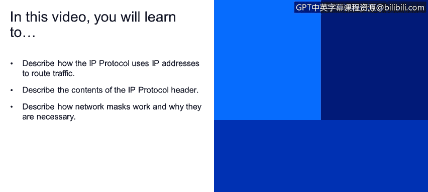
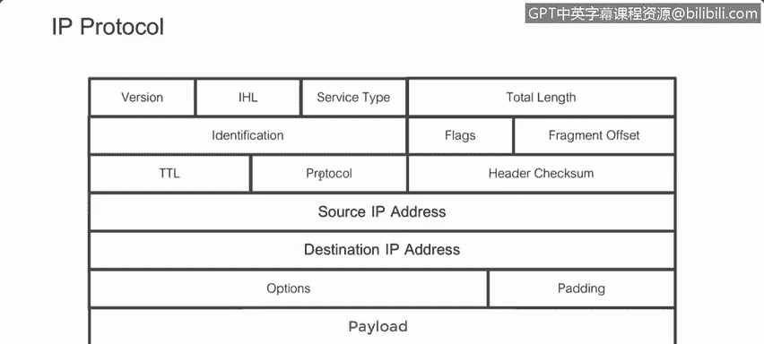
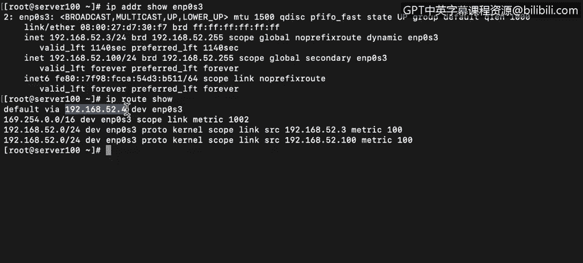
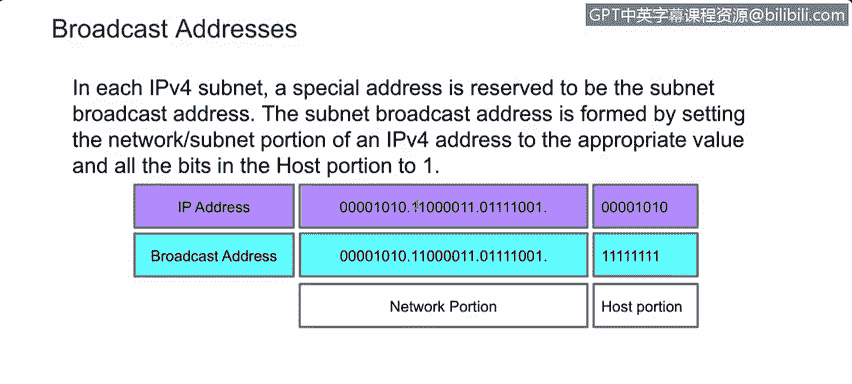
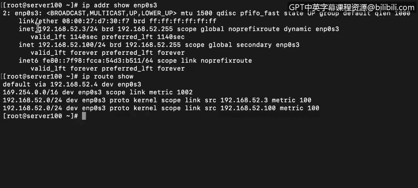
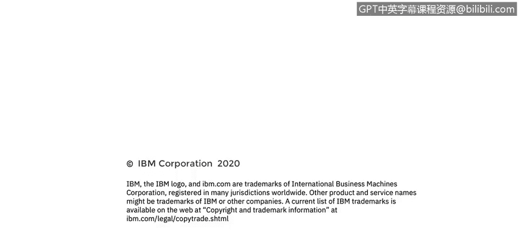

# 课程4：《网络安全与数据库漏洞》：20：19_IP协议和流量路由

在本节课中，我们将要学习IP协议如何利用IP地址来路由流量。具体内容包括：描述IP协议头的内容，解释网络掩码的工作原理及其必要性。

---

## IP协议与路由基础

上一节我们介绍了网络分层模型，本节中我们来看看工作在第三层的IP协议。IP协议与第三层设备协同工作，这些设备利用IP头部来识别和处理流量。

所有路由器都会检查每个数据包的目的地址。而有状态防火墙还会检查源地址，以便识别流量的来源。

正如我们在上一个视频中所见，IP地址由点分四组表示法表示，即四个由点分隔的数字组成的字符串。例如：`10.195.210.10`。可以看到，这里有四个八位组，即四组八位二进制数，由点分隔。

在十进制形式中，一个8位二进制数的取值范围是`0`到`255`，始终为正整数。在二进制形式中，其范围表示为`00000000`到`11111111`。

可路由协议是指可以在其起源网络之外被路由的协议，通常指互联网。IP是一种可路由协议，但并非所有IP地址都是可路由的。

因此，熟练掌握IP地址的工作原理非常重要，包括子网掩码和默认网关的作用。

---

## IP协议头详解

这是一个IP协议头的示例。协议版本，无论是IPv4还是IPv6，是头部中声明的第一项。这很合理，因为IPv4和IPv6的头部结构不同，执行检查的设备必须先知道如何解析头部，才能理解其内容。

**TTL**是生存时间。当数据包被发送时，会设置一个TTL值，以限制数据包在被丢弃前可以经过的跳数。每次数据包被第三层设备检查时，TTL值减一。当TTL值减至`0`时，路由器将丢弃该数据包，而不是转发它。这样做是为了防止具有错误IP地址的数据包在互联网上无限循环，导致无法管理的拥塞。这是一个8位字段，因此我们知道它可以包含`0`到`255`的值，但互联网标准委员会建议大多数正常流量的TTL设置为`64`。

请注意，TTL在IP协议中以跳数计量，但对于某些协议（如DNS），则以秒计量。

另一个重要字段是**协议**。每个协议都有一个ID。例如：
*   ICMP（Ping）的协议ID是 `1`。
*   TCP的协议ID是 `6`。
*   UDP的协议ID是 `17`。

两个非常重要的字段是**源IP地址**和**目的IP地址**。源IP地址标识发送此数据包的端点，而目的IP地址显然是数据包要发送到的位置。

最后，**有效载荷**是被发送消息的实际内容。

---

## 网络掩码与子网划分

上一节我们了解了IP地址的结构，本节中我们来深入探讨网络掩码。子网掩码的作用是分配比特位，供主机和路由器确定如何从IP地址中划分出网络、子网和主机信息。

还记得上一个视频中IP地址末尾的`/24`吗？它表示该特定IP地址的前24位（即前3个八位组）是网络部分，剩下的8位（1个八位组）是主机地址。网络掩码正是实现将IP地址划分为网络段和主机段的工具。

这种复杂性是必要的，因为不同的网络被配置为使用不同数量的IP地址位来表示网络和主机。回想一下关于A类、B类、C类和D类网络架构的讨论。

在示意图中，我们看到前缀为`/24`的IP地址。`24`意味着前24位（3个八位组）用于网络部分，最后一个八位组用于主机部分。

当我们需要创建一个要发送到本地网络之外的数据包时，它将被发送到默认网关。因此，在这种情况下，我们需要与网络外部的主机通信，数据包将被发送到此地址。这是充当我们默认网关的路由器。网关会将数据包转发到我们的网段之外。

因此，每当我们需要与网段外的系统通信时，我们只需要与我们的网关对话，它将管理进出我们网络的流量。如果我们需要与网段内的主机通信，任何交换机或集线器都可以完成这项工作。

---

## 本地通信与广播地址

但是，数据包不会发送到默认网关。我们的系统将查看MAC地址表，将IP地址转换为MAC地址，这样数据包就可以直接转发给本地接收者。

广播IP地址在某种意义上与网络掩码相反。在这种情况下，广播IP地址将保留原始IP地址中网络部分的所有八位组，而将主机部分的八位组或比特位全部设置为`1`。

对于这台计算机，IP地址是`192.168.52.3`，因此广播地址将是`192.168.52.255`。

如图所示，地址主机部分的所有比特位都被置为`1`。

---

## 总结

本节课中我们一起学习了IP协议的核心机制。我们描述了IP协议如何利用源和目的IP地址在网络上路由流量，并详细解析了IP协议头中版本、TTL、协议类型等关键字段。我们还深入探讨了网络掩码（子网掩码）的作用，它如何将IP地址划分为网络部分和主机部分，并解释了默认网关在跨网段通信中的角色。最后，我们了解了本地网络内通信的MAC地址解析过程以及广播地址的构成原理。掌握这些概念是理解网络流量如何被定向和管理的基础。