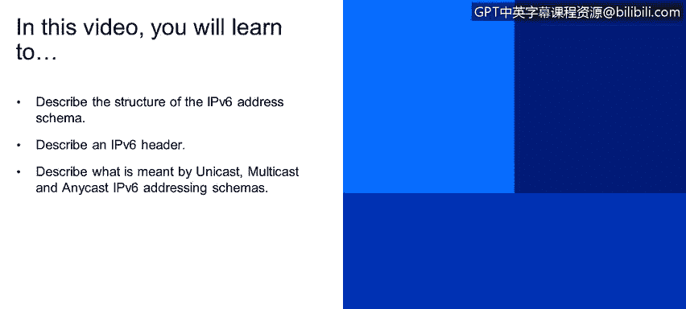
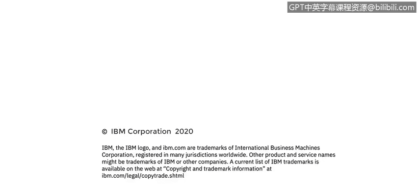

# 课程4：《网络安全与数据库漏洞》：21：IPv6地址方案简介 🌐

在本节课中，我们将要学习IPv6地址方案的基本结构。我们将了解IPv6地址的格式、其头部信息，并探讨IPv6寻址方案中的单播、多播和任播概念。

---

## IPv6地址结构

上一节我们介绍了IPv4地址的局限性。本节中我们来看看IPv6地址的结构。

IPv4地址长度为32位，而IPv6地址长度扩展至128位。这意味着IPv6的地址空间远大于IPv4。具体来说，IPv4最多可提供约43亿个地址（`2^32 ≈ 4.3 × 10^9`），而IPv6可提供约 `3.4 × 10^38` 个地址（`2^128`）。这是一个极其庞大的数字。

一个IPv6地址由8组4位的十六进制数组成，每组之间用冒号分隔。例如：
`2001:0db8:85a3:0000:0000:8a2e:0370:7334`

以下是IPv6地址的表示规则：
*   IPv6地址不区分大小写。
*   每组中的前导零可以省略。
*   连续多组零可以用双冒号 `::` 表示一次。

例如，地址 `2001:0db8:0000:0000:0000:0000:1420:57ab` 可以简写为 `2001:db8::1420:57ab`。

---

## IPv6头部

了解了地址格式后，我们来看看IPv6数据包的头部结构。

IPv6头部比IPv4头部更简单，字段更少。主要字段包括：
*   **版本**：标识IP版本，此处为6。
*   **源地址**：发送方的128位IPv6地址。
*   **目的地址**：接收方的128位IPv6地址。

与IPv4头部相比，IPv6头部省略了如校验和等字段，将部分功能交由其他协议层处理，从而提高了处理效率。

---

## IPv6寻址类型

最后，我们来比较IPv4和IPv6的寻址方式。

IPv4支持三种寻址模式：单播、广播和多播。IPv6则支持单播、多播和任播。

以下是三种寻址模式的定义：
*   **单播**：数据包从一个源发送到**一个**特定的目的地。这是最常见的通信方式。
*   **多播**：数据包从一个源发送到**一组**订阅了该多播地址的目的地。属于“一对多”通信。
*   **任播**：这是IPv6新增的类型。一个任播地址被分配给**多个不同的接口**（通常属于不同的设备）。发送到任播地址的数据包会被路由到**最近**的拥有该地址的接口。这常用于负载均衡和寻找最近的服务节点。

---

本节课中我们一起学习了IPv6地址方案。我们了解了其128位的地址结构、简化的头部格式，以及单播、多播和任播这三种寻址类型。理解IPv6是迈向现代网络管理和网络安全的重要一步。