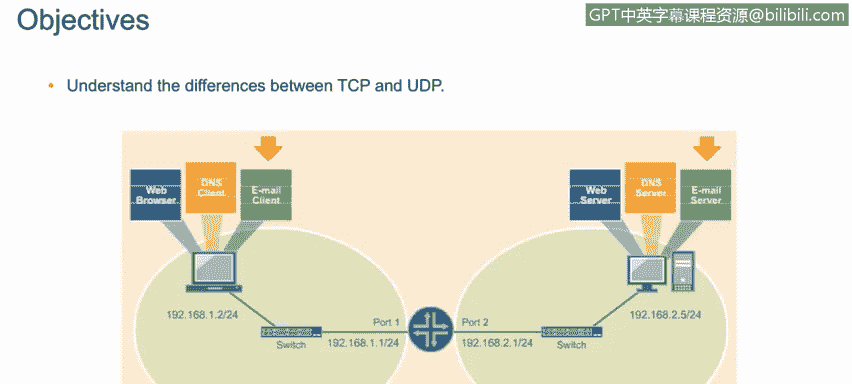
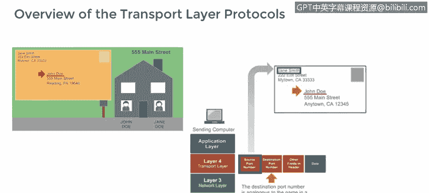
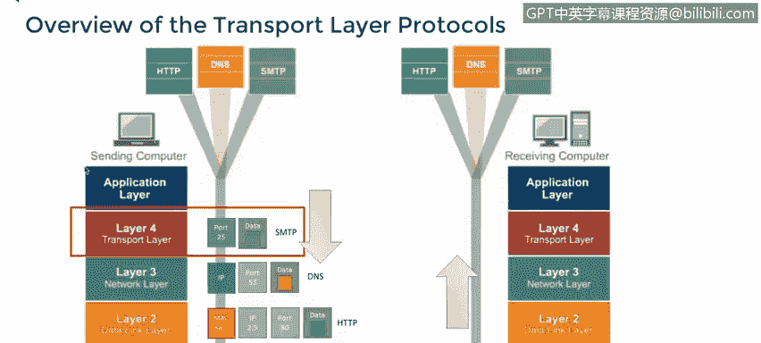

# 课程4：《网络安全与数据库漏洞》：22：应用层和传输层协议 UDP和TCP 第1部分 🧩

在本节课中，我们将要学习传输层的两个核心协议：TCP和UDP。我们将描述它们之间的主要区别，并了解哪些常见的网络应用和工具会选择使用UDP协议。

---

## 传输层协议概述 📦

上一节我们介绍了网络模型的基本概念，本节中我们来看看传输层的具体协议。传输层协议可以被类比为邮寄信件时使用的信封。信封的正面就像数据包的头部，上面写有发送方地址、目的地地址等信息。

为了进一步延伸这个类比：
*   **TCP** 就像使用挂号信服务。你会得到一个追踪号码，并且需要收件人签收，因此你可以确信信件已送达预期的收件人。
*   **UDP** 则更像使用批量平邮。它速度快、成本低，绝大多数信件都能到达目的地，但你永远无法完全确定。

一些应用喜欢使用TCP，而另一些则偏爱UDP。有些应用可以配置为使用两者之一，少数应用甚至会同时使用TCP和UDP来完成不同的功能。

---

## TCP与UDP的核心区别 ⚖️

了解了基本概念后，我们来深入探讨TCP和UDP在机制上的根本不同。

**TCP** 会建立连接。发送方和接收方计算机都知道哪些数据包已被发送和接收，以及正确的顺序是什么。这种确保数据包不丢失（否则会重发）且顺序正确的保证，对许多应用至关重要。但所有这些“握手”和确认过程需要大量开销，因此速度不是很快。

**UDP** 则不同，它不会像TCP那样建立连接。发送方不知道每个数据包是否已被接收，接收方也只能按照数据包到达的顺序来重组数据流，即使有些包的顺序与发送时不同。这需要非常少的开销，因此它是一个非常快速的协议，非常适合流媒体视频和音乐等应用，在这些场景中，丢失或顺序错乱的少数几个数据包影响不大。

在传输层（第4层），数据被分割成块并添加头部。源端口号标识发起网络调用的进程，因此会被添加到数据包头部。目标端口号代表我们试图连接的远程服务，同样也会被添加到头部。

---

## 使用UDP的常见协议 📋

既然UDP以速度见长，那么哪些应用会利用这一特性呢？以下是几种主要使用UDP的常见协议：

*   **TFTP**：简单文件传输协议，使用端口 **69**。它与FTP类似，但使用UDP而非TCP，以避免仅为传输小文件而建立和维护连接的所有开销。
*   **DNS**：域名系统，使用端口 **53**。DNS使用UDP进行名称查询，但也可以使用TCP执行一些不常见的任务。DNS通常用于将域名转换为IP地址。
*   **SNMP**：简单网络管理协议，使用端口 **161** 和 **162**。虽然不常见，但SNMP也可以使用TCP。SNMP用于监控和管理网络设备。
*   **DHCP**：动态主机配置协议，使用端口 **67**。DHCP自动为订阅它的系统分配和管理IP地址池。
*   **VoIP**：网络语音协议，使用端口 **5060**。它也可以使用TCP实现，用于通过互联网传输语音，并随着基于互联网的电话服务的普及而日益流行。
*   **IPTV**：互联网协议电视，用于传输电视信号。IPTV同时使用UDP和TCP，以及端口 **80**、**5004** 和 **12000**，具体取决于所使用的服务以及流量是传入还是传出。

所有这些协议都利用了UDP速度快的优势，因为在这些场景中，偶尔丢失一两个数据包并不会造成严重问题。

---

## 总结 📝

本节课中我们一起学习了传输层的两个核心协议：TCP和UDP。我们了解到，TCP通过建立连接、确认和重传机制来提供可靠的数据传输，但开销较大；而UDP则采用无连接方式，追求传输速度，适用于能容忍少量数据包丢失或乱序的应用场景。我们还列举了DNS、DHCP、VoIP等常见的使用UDP协议的服务，理解了它们选择UDP的原因。在下一部分，我们将继续探讨TCP协议的更多细节。