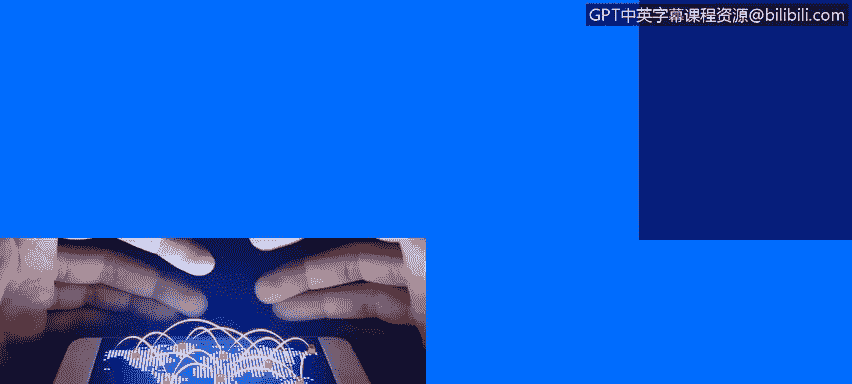
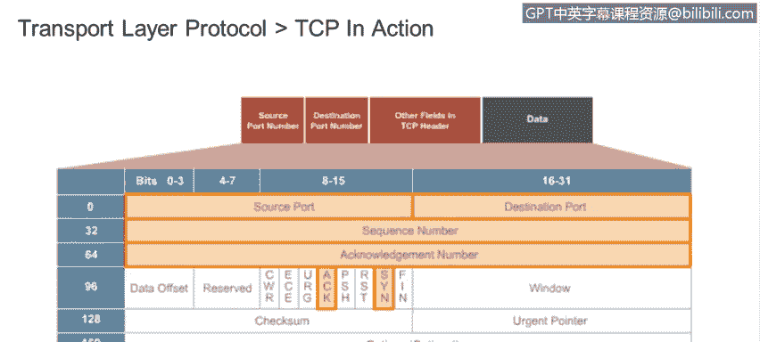
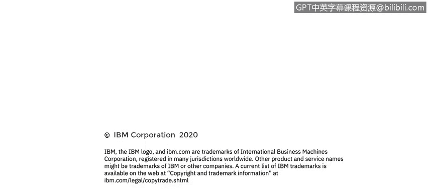

# 课程4：《网络安全与数据库漏洞》：23：应用层和传输层协议 UDP和TCP 第2部分 🔐

在本节课中，我们将要学习传输层协议TCP和UDP的核心区别，特别是TCP的可靠性机制、连接建立过程以及它们在安全性和速度方面的表现。我们将通过类比和实际数据包分析来理解这些概念。

上一节我们介绍了UDP协议的基本特点，本节中我们来看看TCP协议如何通过其机制提供可靠的数据传输。

## TCP与UDP的可靠性对比 📮

回到传统邮件的类比来解释UDP：发送者在信件上写上目的地地址，投入邮箱，过程就结束了。信件要么送达，要么丢失。发送者永远不会知道结果。

而TCP则要求目的地发回一个确认，告知信件已收到。与传统邮件不同，TCP在建立连接后，如果大约3秒内未收到确认，它会自动重新发送数据包。

## TCP的三次握手 🤝

当建立一个TCP连接时，首先要进行的是“三次握手”。

1.  发送方（尝试建立连接的一方）向接收方系统发送一个**SYN**（同步序列号请求）。
2.  接收方系统回应一个**SYN-ACK**（即SYN加上一个确认），以指示通信将开始的序列号。
3.  发送方最后发送一个**ACK**（确认）来完成握手。

让我们看几个捕获的数据包。在这个例子中，我们正尝试从IP地址为`192.168.52.1`的系统，与服务器`192.168.52.100`建立一个SSH（安全外壳）连接。

以下是前三个数据包：
*   第一个数据包是**SYN**。可以看到这里的标志位，SYN标志被设置为1。每个标志位只能是0或1，这里标志位为“开”。
*   我们期望下一个数据包包含**SYN-ACK**。我们看到，SYN和ACK标志都处于“开”的状态。
*   最后一个数据包只包含一个简单的**ACK**。

一旦三次握手成功，TCP连接就建立了，我们可以开始传输数据。可以看到，握手之后跟随的是从客户端发送到服务器的实际SSH信息。

## 传输层协议概述

以下是UDP和TCP的关键特性对比：

*   **端口复用**：UDP和TCP都使用端口来复用数据。这意味着数据流被分解成小块，放入独立的数据包中，分别寻址和发送。用邮件类比，就像把一封长信一页一页地分别装入信封邮寄。
*   **连接方式**：UDP是无连接协议。它发出数据包，不询问也不接收来自目的地的任何确认。TCP是面向连接的协议。它在开始传输任何数据之前，首先使用三次握手与接收方建立连接。
*   **可靠性**：UDP被认为是不可靠的，因为它不关心目的地是否收到了数据包。TCP则被认为是可靠的，因为它会持续重传数据包，直到收到目的地发来的确认。
*   **数据顺序**：UDP按照传输层从请求应用程序获取的顺序发送数据报。接收系统仅按实际接收到的顺序重新组装数据包。显然，这对许多应用来说效果很好，但对另一些则不然。
*   **数据单元**：在UDP中，数据和头部的捆绑称为**数据报**。在TCP中，这种捆绑称为**段**。
*   **流量控制**：TCP具有流量控制功能，这意味着发送方发送数据包的速度不会超过接收系统的处理能力。UDP没有流量控制，因此在某些条件下始终存在接收方不堪重负的风险。

## TCP数据包头部详解 🔍

我们之前看过UDP头部。这是TCP数据包的头部结构。

从我们刚刚看到的数据包捕获中，你应该能识别出诸如**源端口**、**目的端口**、**SYN和ACK标志**等特征，以及其他一些字段。

让我们再看一下第4层的传输控制协议。对于这个数据包，我们可以看到源端口是`58038`，目的端口是`22`。

端口22用于SSH。因此，这个数据包头告诉我们，一个使用本地端口`58038`的进程正在尝试连接到远程SSH服务器。

数据包头包含**序列号**和**确认号**，以及一系列标志位（如果你想深入了解，可以通过谷歌搜索轻松查到），还有**校验和**。

## 使用TCP的应用程序 🌐

使用TCP的应用程序包括：
*   **HTTP**：超文本传输协议，连接万维网。
*   **HTTPS**：安全HTTP，增加了加密功能。
*   **SMTP**：简单邮件传输协议。
*   **FTP**：文件传输协议。

如前所述，在TCP中，发送的段必须得到目的地的确认，我们才能继续发送数据包。实际上，TCP通常以一系列数据包的形式发送数据，而不是等待每一个数据包的确认。接收计算机可以查看序列号来判断系列中是否缺少数据包，并可以通知发送方仅重传丢失的数据包。

## TCP序列与确认机制 🔢

TCP使用序列号和确认号。一旦数据包被接收，接收系统会发送一个ACK（确认号）。这个确认号将是下一个要发送的数据报段的序列号。

## HTTP与HTTPS 🔒

HTTP以请求-响应周期工作。客户端请求一个网页，服务器返回该请求的页面作为响应。HTTP数据包由三个块组成：起始行、头部和主体。

现在，每个渴望成为网络安全分析师的人都应该知道，HTTP协议一点也不安全。HTTPS（安全HTTP）的开发是为了满足互联网上对隐私和安全的需求。

HTTPS结合了SSL证书的使用，因此你的数据被加密并在网络中安全传输。更准确地说，SSL充当最外层的协议层，因此在初始握手之后，没有任何内容是暴露的或未经加密发送的。

---

本节课中我们一起学习了TCP协议如何通过三次握手建立可靠连接，以及它与UDP在可靠性、流量控制和数据确认机制上的根本区别。我们还了解了基于TCP的常见应用协议（如HTTP/HTTPS）及其安全特性。理解这些传输层协议的运作机制，是分析网络通信和识别潜在漏洞的基础。