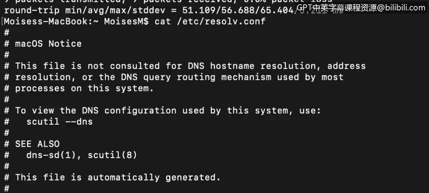

# 课程4：《网络安全与数据库漏洞》：24：23_DNS和DHCP

在本节课中，我们将要学习两个非常重要的应用层协议：域名系统（DNS）和动态主机配置协议（DHCP）。DNS负责将我们熟悉的域名转换为计算机使用的IP地址，而DHCP则自动为网络中的设备分配和管理IP地址。理解这两个协议的工作原理是理解网络通信和网络安全的基础。

本节课由Ben Briggs主讲，内容基于Moisees Mong开发的系列讲座。

## DNS：域名系统 🌐

上一节我们介绍了本节课的学习目标，本节中我们来看看第一个核心协议：域名系统（DNS）。

DNS服务运行在我们的本地机器或网络服务器上。它的核心功能是将URL中的域名翻译成IP地址。这个过程非常简单。

例如，当你在浏览器中输入 `www.google.com` 时，DNS服务会将该域名解析为谷歌网络服务器的实际IP地址。当我们尝试使用 `ping` 命令测试 `www.google.com` 时，DNS会先获取该服务器的IP地址，然后才能发送Ping请求。

我们可以查看当前使用的DNS服务器地址。通常，它可能是我们的默认网关（例如 `192.168.0.1`），该网关设备上运行着DNS服务。

## DHCP：动态主机配置协议 🔄

了解了DNS如何将域名映射到IP地址后，我们来看看设备是如何获得IP地址的。这就是动态主机配置协议（DHCP）的作用。

DHCP允许计算机在连接到本地网络时，自动从一个由DHCP服务器管理的可用IP地址池中获取一个IP地址。

DHCP的交互过程通常包含四个数据包，在请求系统和DHCP服务器之间传递。它们被称为：发现（Discover）、提供（Offer）、请求（Request）和确认（Acknowledgement）消息。

以下是DHCP工作流程的详细步骤：

当一个配置为使用DHCP的终端设备连接到网络时，系统会立即尝试发现DHCP服务器。它会向网络段上的所有设备发送一个广播消息。如果该设备在之前启动时已经获得过一个IP地址，它可能会在请求中询问是否可以续租该地址，而不是获取一个新地址。

如果网络段上存在DHCP服务器（如果网络中有配置为DHCP的终端，就应该有），DHCP服务器会向请求的终端发送一个提供（Offer）消息。这个消息包含请求终端的MAC地址、提供的IP地址、子网掩码、租用期限以及发出此提供的DHCP服务器的IP地址。

一个网络可能配置了多个DHCP服务器，因此请求终端可能会收到多个提供。收到提供后，终端会回复一个请求（Request）消息，表明它接受了哪个提供。

最终，获胜的DHCP服务器向终端发送一个最终的确认（Ack）消息，确认终端可以使用提供的IP地址，并将该IP地址标记为已租借给该终端的MAC地址。其他DHCP服务器则将其提供的地址返回到它们的可用地址池中。

## 深入分析DHCP数据包 📦

为了更直观地理解DHCP，让我们通过Wireshark捕获的数据包来查看其通信细节。

这是一个DHCP发现（Discover）数据包。最初，你的计算机不知道DHCP服务器的IP地址或MAC地址。因此，在数据链路层（第2层），请求计算机使用广播MAC地址，以便其广播域中的所有设备都能收到该帧。在网络层（第3层），我们看到使用了广播IP地址。在传输层（第4层），我们看到使用了BOOTP（即DHCP），它运行在UDP协议上，源端口是68，目的端口是67。DHCP服务器在端口67上监听。

一旦DHCP服务器收到请求，它会检查其IP地址池，看是否有可用的地址。如果有可租借的地址，它会用一个DHCP提供（Offer）包回复请求终端，其中包含提议的IP地址及相关信息，如DHCP服务器地址、默认网关地址、子网掩码和租用期限。

尽管终端现在知道了DHCP服务器的地址，但它会以广播（而非直接发送）的方式回复它接受的提供（Offer）。这是为了通知其他可能响应的DHCP服务器，告知它们有一个提供已被接受，它们可以将提供的IP地址返回到自己的地址池中。

这是一个DHCP请求（Request）数据包。你可以看到它重复了在提供（Offer）消息中发送给终端的IP数据。

最后，DHCP服务器向终端发送确认（Acknowledgement）消息，确认之前发送的IP地址已成功租借给它。

## 总结 📝

本节课中我们一起学习了两个核心的网络应用协议：DNS和DHCP。DNS作为互联网的“电话簿”，负责将人类可读的域名（如 `www.google.com`）解析为机器可读的IP地址。而DHCP则像一个“自动分配器”，为网络中的设备自动分配IP地址、子网掩码、网关等配置信息，极大地简化了网络管理。理解这两个协议的基本原理和交互过程，是进一步学习网络配置、故障排查以及网络安全的重要基础。