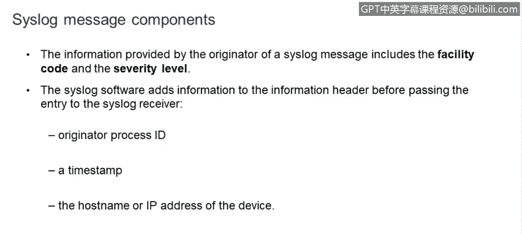
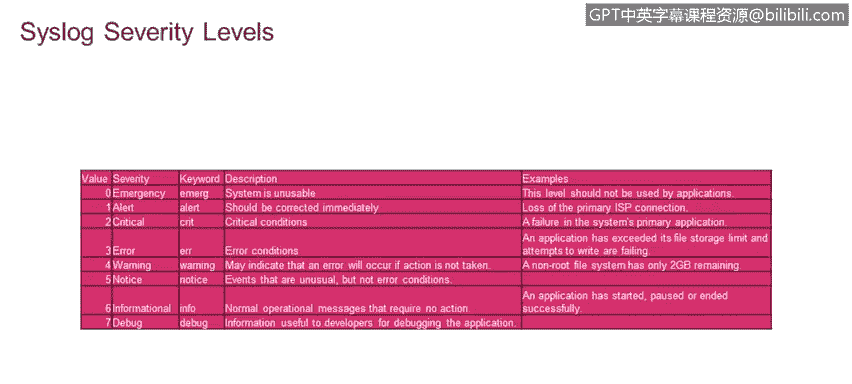
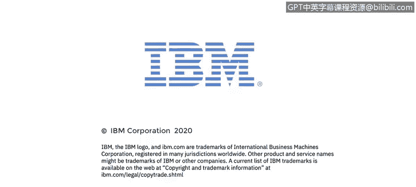

# 课程4：《网络安全与数据库漏洞》：25：Syslog消息记录协议 📝

在本节课中，我们将要学习Syslog协议及其提供的功能，并描述Syslog的三个层次：内容层、应用层和传输层。

---

## Syslog协议概述

Syslog是一种用于消息传递和日志记录的标准协议。任何计算机或网络设备上的每一个事件都会生成一条消息，该消息存储在本地日志文件中。Syslog协议提供了一种标准格式和机制，可以将所有这些消息转发到一个集中的Syslog服务器，以便进行系统管理和系统审计。同时，Syslog数据也可用于调试和取证调查中的通用信息分析。

## Syslog的三个层次

上一节我们介绍了Syslog协议的基本概念，本节中我们来看看Syslog的三个层次：内容层、应用层和传输层。

*   **内容层**：包含实际的Syslog消息。
*   **应用层**：负责对Syslog消息进行路由、分析和存储。
*   **传输层**：处理Syslog消息在网络中的发送。

## Syslog中的五个参与者

了解了Syslog的层次结构后，我们来看看Syslog通信过程中涉及的五个不同参与者。

以下是Syslog通信流程中的关键角色：

1.  **发起者**：即事件发生并创建原始消息的实体，例如您的本地计算机。
2.  **收集器**：即收集消息的Syslog服务器。
3.  **中继服务器**：位于发起者和收集器之间，仅负责转发消息。
4.  **传输发送方**：通常与发起者是同一实体，它使用UDP协议（或需要更高可靠性时使用TCP协议）准备消息以便传输。
5.  **传输接收方**：通常与中继服务器或收集器是同一实体，它从特定的传输协议中接收消息，并将其解包后交付给Syslog服务器。

## 消息格式与设施代码

发起消息的进程始终会在消息中包含进程ID和严重性级别。但是，Syslog客户端在将消息转发给Syslog服务器之前，会在消息头中添加三条信息。

以下是Syslog客户端添加的三条关键信息：

*   发起者进程ID
*   时间戳
*   发起消息的设备的主机名或IP地址

现在，让我们更详细地了解设施代码。设施代码用于标识发起消息的进程。Syslog最初在BSD Unix上实现，因此设施名称反映了伯克利软件发行版中的进程名称和守护进程。Syslog识别23种设施代码。如果您从Unix系统接收消息，请考虑首先使用用户设施代码。请注意，代码16至23（名为local0至local7）未被Unix使用，传统上由思科路由器等网络设备使用，它们通常使用local6或local7。

## 严重性级别配置

第二个需要配置的Syslog参数是Syslog严重性级别。

严重性级别共有8级，范围从最严重的0级（紧急）到最不严重的7级（调试）。计算机和网络设备每分钟可能生成数百万条日志消息。您肯定不希望用数百万条常规消息淹没您的Syslog服务器，这会使分析所有传入数据并发现可操作的异常变得困难。因此，在发起者上设置严重性级别非常重要，以便只发送达到该级别或更严重的消息。例如，如果将严重性级别设置为3，则所有严重性级别为0、1、2或3的消息都会被发送，但严重性级别为4至7的消息则不会被发送。

## 数据包捕获示例

这是一个Syslog消息的数据包捕获示例。此处是发起者，此处是收集器（在本例中，它也可能是中继服务器，但此处是最终的收集器）。这里标识了设施，而这里则是严重性级别。最后，是Syslog消息的实际内容，包括时间戳。

---

在本节课中，我们一起学习了Syslog协议及其在集中化日志管理中的作用。我们详细探讨了Syslog的三个层次（内容、应用、传输）、通信流程中的五个参与者、消息头的构成（特别是设施代码和严重性级别），以及如何通过配置严重性级别来有效管理日志流量。理解Syslog是进行系统监控、安全审计和事件调查的重要基础。