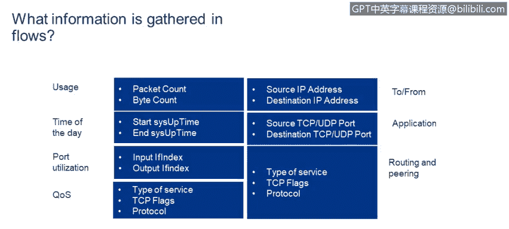

# 课程4：《网络安全与数据库漏洞》：26：25_流量和网络分析

## 📊 概述
在本节课中，我们将学习网络流量分析的基础知识，特别是如何使用NetFlow等流量工具来收集和可视化网络设备上的流量统计数据。理解这些数据对于监控网络健康状况、识别异常流量和潜在安全威胁至关重要。

## 🔍 什么是NetFlow？
NetFlow是一种网络协议，用于收集和记录流经网络设备（如路由器或交换机）接口的IP流量信息。它通过对流量进行采样，生成包含关键统计数据的记录，帮助网络管理员分析流量模式。

## 📝 NetFlow记录包含哪些信息？
当我们检查一个NetFlow采样记录时，可以看到以下关键信息。这些数据点共同描绘了一次网络通信的概况。

以下是NetFlow记录中包含的核心字段：

*   **数据包与字节数**：记录该数据流中传输的数据包数量和总字节数。
*   **时间戳**：记录数据流开始的时间以及采样发生的时间。
*   **接口信息**：标识数据流入和流出的网络接口。
*   **服务质量信息**：例如服务类型，用于区分不同优先级的流量。
*   **协议信息**：指明所使用的网络协议。例如，协议号1代表ICMP，17代表UDP，6代表TCP。
*   **地址与端口**：包含通信的源IP地址、目的IP地址，以及TCP/UDP协议的源端口和目的端口。

## 📈 如何解读NetFlow数据？
上一节我们介绍了NetFlow记录中的具体字段，本节中我们来看看这些数据如何被汇总和可视化，以便于分析。

NetFlow服务器负责收集数据并以易于理解的图表形式展示。通过这些可视化图表，我们可以快速洞察网络状况。

以下是常见的NetFlow数据分析视角：

*   **协议分布**：可以清晰地看到在特定接口上，各种协议所占的流量比例。例如，在一个案例中，超过84%的流量是TCP协议（即万维网流量）。**公式**：`TCP流量占比 = (TCP流量字节数 / 总流量字节数) * 100%`
*   **应用排名**：可以按使用接口的应用程序来查看流量，通常HTTP（网页浏览）会位居榜首。
*   **流量方向**：能够区分流入接口和流出接口的字节数，了解数据的进出情况。
*   **数据包计数**：可以查看每个方向上通过接口发送的数据包数量。

## ✅ 总结
本节课中，我们一起学习了NetFlow工具在网络流量分析中的应用。我们了解了NetFlow如何通过采样来收集包含数据包、字节、协议、地址和端口等关键信息的流量记录。更重要的是，我们学习了如何解读NetFlow服务器提供的可视化数据，包括分析协议分布、主要应用、流量方向等，这些技能对于监控网络性能和保障网络安全至关重要。