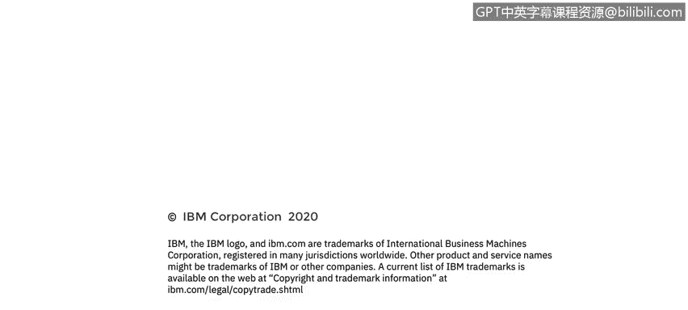

# 课程4：《网络安全与数据库漏洞》：27：26_端口镜像和混杂模式

在本视频中，你将学习：
*   描述端口镜像的含义及其用途。
*   描述混杂模式及其合法与非法的用途。

本课程最后要介绍的内容是端口镜像。

## 什么是端口镜像？

端口镜像非常简单，它指的是将交换机配置为复制流经该交换机上一个或多个端口的所有流量，并将复制的数据包发送到一个单一的目标端口。

在思科交换机上，端口镜像通常被称为**交换端口分析器**或**SPAN**。此外还有**远程交换端口分析器**或**RSPAN**，它允许目标端口位于远程或进行流量收集的交换机之外的另一台交换机上。

不同供应商对端口镜像使用不同的名称。例如，3Com公司称之为**RAP**，即漫游分析端口。

## 端口镜像的用途与风险

能够复制和使用流经交换机的所有网络流量副本，用于网络分析或调试网络错误，其好处显而易见。但希望到目前为止，你的直觉会告诉你，这也可能非常危险。

想象一下，如果攻击者能够访问组织内部的一台核心交换机，并设置端口镜像，将一份所有网络流量的副本发送到他们自己的服务器进行利用而不被发现，这可能会导致多大的麻烦。

## 入侵检测系统与端口镜像

大多数情况下，镜像数据包会被发送到连接到目标端口进行分析的**IDS**或入侵检测系统。IDS将被配置为实时监控所有流量，并在检测到任何异常时发送警报。

请记住，IDS是旁路工作的，只处理网络数据的副本。这意味着IDS不会降低网络速度，但也意味着它无法直接对其发现的情况采取行动，例如阻止数据包的传递，它只能发出警报来报告其发现。

## 混杂模式的作用

接收镜像数据的终端或服务器必须有一块运行在**混杂模式**下的**NIC**或网络接口卡，以便它能读取接收到的所有帧。请记住，这些帧的目的MAC地址都指向其他系统。因此，不在混杂模式下的NIC会直接忽略它们。

再次强调，要使IDS或其他网络分析工具正常工作，它必须有一块配置为混杂模式的NIC，以便能够读取发送到其入站端口的所有帧。否则，它将无法读取帧并执行分析。

当你使用像Wireshark这样的端口嗅探器时，Wireshark会自动将你的NIC置于混杂模式，以便捕获流经其接口的所有流量。

谢谢。

