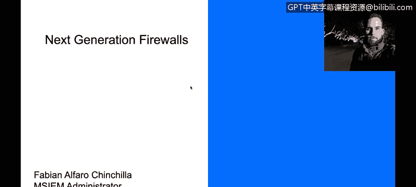
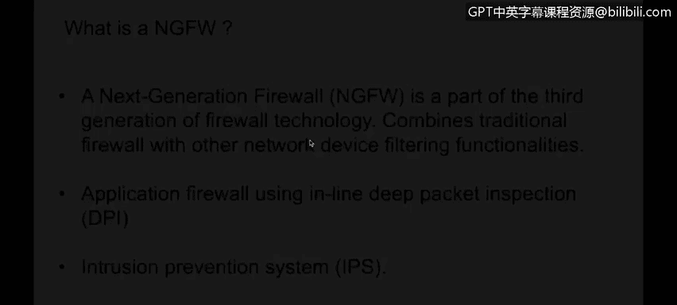
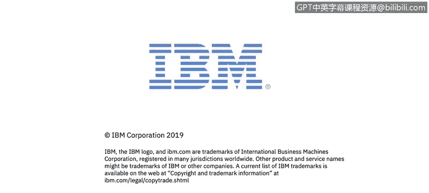

# 课程4：《网络安全与数据库漏洞》：28：下一代防火墙概述 🔥

在本节课中，我们将学习下一代防火墙与传统防火墙的区别，并了解下一代防火墙如何通过会话管理和深度包检测来增强网络安全。

---

上一节我们介绍了防火墙的基本概念，本节中我们来看看下一代防火墙的核心特性。

下一代防火墙属于防火墙技术的第三代。它从传统防火墙演进而来，具备应用层或深度包检测能力。

传统防火墙与下一代防火墙的主要区别在于**会话**。我们将理解会话的工作原理及其带来的优势。

下一代防火墙在做出阻断或允许流量通过网络的决策时，不仅基于IP地址和传输层端口，还能进一步检测数据包，直至应用层。此外，下一代防火墙还能提供入侵防御系统等增值服务，并能检查使用SSL加密的流量。

以下是传统防火墙与下一代防火墙在会话处理上的关键差异：

*   **下一代防火墙**：当流量（例如从个人电脑到网络服务器）被允许通过时，会创建一个安全会话并记录在会话表中。服务器返回的流量如果属于已建立的会话，则会被自动允许，无需再次检查所有返回流量。
*   **传统防火墙**：需要配置两条规则：一条允许从个人电脑到服务器的流量，另一条允许从服务器返回个人电脑的流量，即使这些流量属于同一个TCP会话。

---

本节课中我们一起学习了下一代防火墙如何通过会话感知和深度包检测，提供比传统防火墙更智能、更高效的网络安全防护。