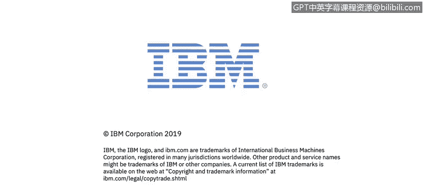

# 课程4：《网络安全与数据库漏洞》：29：28_NGFW和OSI模型

在本节课中，我们将学习下一代防火墙（NGFW）如何通过检查比传统防火墙更多的OSI模型层，来检测和阻止更多类型的入侵。

## 🔍 NGFW与传统防火墙的对比

上一节我们介绍了防火墙的基本概念。本节中，我们来看看NGFW与传统防火墙在OSI模型检查深度上的关键区别。

如图所示，传统防火墙的检查决策主要基于OSI模型的第3层（网络层）和第4层（传输层）。

而具备深度包检测（DPI）能力的下一代防火墙，其检查能力可以延伸至第7层（应用层）。

## 🧩 传统防火墙的局限性

以下是传统防火墙规则配置的一个典型场景：

假设我们有一条传统防火墙规则，配置为允许从我的个人电脑到网络服务器的HTTP流量。

如果存在另一个应用程序（例如Skype或任何其他使用HTTP协议传输流量的应用），我们无法通过这条规则来专门阻止该应用程序。因为传统防火墙的配置粒度不够精细，它只能识别到“HTTP流量”这一层级，而无法区分具体是哪个应用在使用HTTP。

## 🚀 下一代防火墙的精细控制

与上一节提到的传统防火墙不同，下一代防火墙能够检查到应用层。

这意味着我们能够确定流量的真实应用身份，而不仅仅是端口号。

以下是下一代防火墙或深度包检测防火墙的优势：

它允许我们基于具体的应用程序来允许或阻止流量。

举例来说，假设Facebook和YouTube都使用HTTP协议。在传统防火墙上，如果配置了一条允许HTTP流量的规则，你将无法专门阻止YouTube而允许Facebook，因为两者都使用HTTP。

但在下一代防火墙上，我们不仅检查目的端口（HTTP为80），还能识别出真正的应用程序。因此，你可以配置出更精细的规则，例如：

*   **允许HTTP流量**
*   **但同时阻止YouTube**
*   **同时允许Facebook**

下一代防火墙在配置允许或阻止流量的规则时，提供了这种级别的精细控制能力。

## 📝 总结

本节课中，我们一起学习了下一代防火墙（NGFW）的核心优势。关键在于NGFW能够检查OSI模型的应用层（第7层），而传统防火墙通常只检查到网络层和传输层（第3、4层）。这种深度检查能力使得NGFW能够基于具体的应用程序来制定更精细、更有效的安全策略，从而识别和阻止更多传统防火墙无法应对的入侵类型。