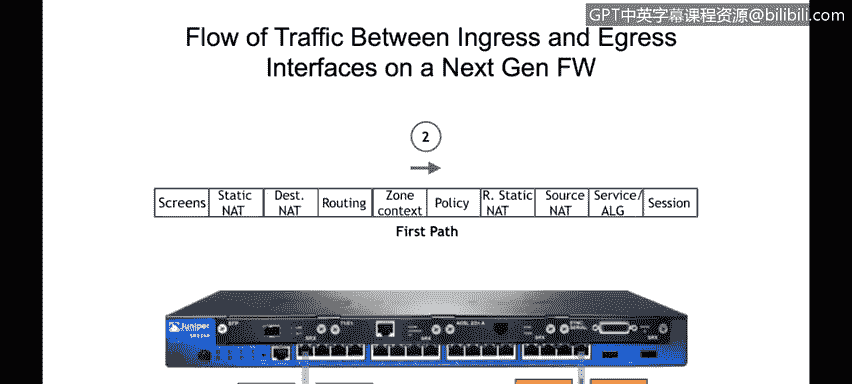
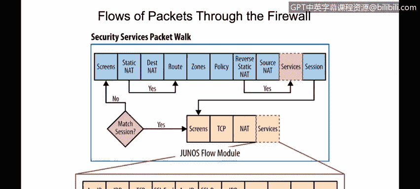
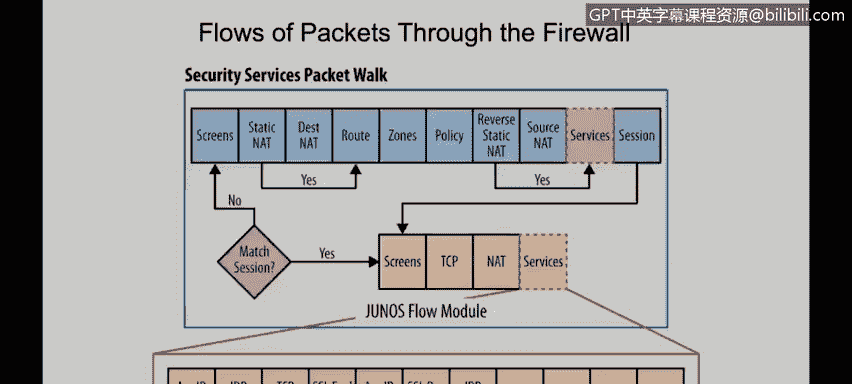
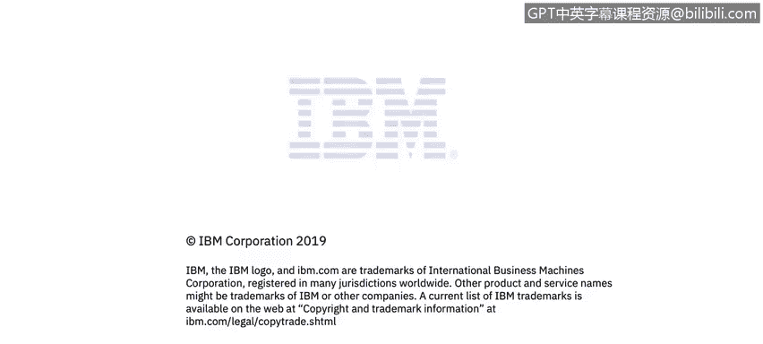

# 课程4：《网络安全与数据库漏洞》： 第30节：下一代防火墙数据包流与厂商比较

在本节课中，我们将学习描述数据包如何流经下一代防火墙，以及每个步骤中执行了哪些检查和服务。我们还将识别主要的下一代防火墙厂商，并了解他们系统之间的差异。

---

上一节我们介绍了下一代防火墙的基本概念，本节中我们来看看数据包在下一代防火墙中的具体处理流程。

我们以Juniper SRX 240防火墙为例进行说明。假设流量从接口1进入，从接口3离开。

其基本工作原理是：流量首先在接口1接收。在接口层面，我们可以配置传统的防火墙规则，这些规则主要检查OSI模型的第3层和第4层。随后，防火墙的流处理模块将提供下一代防火墙的增强能力。我们将在本节稍后描述这些模块或步骤的具体工作方式。在确定流量可以通过防火墙后，它将从出口接口发出。

---

现在，让我们详细分解数据包的处理步骤。

假设我们的入口接口是接口1。防火墙首先会检查是否已为该流量建立了会话。如果没有现有会话，数据包将进入以下处理模块。

以下是数据包处理的核心步骤：

1.  **屏幕检查**：这是针对最常见攻击（如拒绝服务攻击）的基础防护。
2.  **目的地址转换**：在做出路由决策之前，根据静态NAT或目的NAT规则，转换数据包的目的IP地址。这一步之所以先于路由决策，是因为路由决策需要使用目的IP地址。
3.  **路由决策**：检查路由表，确定出口接口。至此，我们知道了入口接口（本例中为1）和出口接口（本例中为3）。
4.  **安全区域与策略检查**：在Juniper下一代防火墙中，每个接口都归属于一个安全区域。假设接口1属于“信任”区域，接口3属于“非信任”区域。安全策略的上下文就是基于这些区域（例如，从“信任”区域到“非信任”区域）。策略规则包含匹配条件和对该数据包要执行的动作（例如允许或阻止）。如果流量被允许通过，则继续下一步。
5.  **源地址转换**：根据源NAT规则转换源IP地址（如果配置了相应规则）。
6.  **下一代防火墙服务**：这是下一代防火墙提供的关键增强服务，包括：
    *   **应用识别**：识别真实的应用，如Facebook、Skype或YouTube。
    *   **入侵检测与防御**：根据特征库分析流量，以发现病毒或其他威胁。
7.  **会话创建**：处理完成后，防火墙将创建一个会话，并将其写入会话表。

---

当来自服务器的响应流量返回时，情况会有所不同。

响应流量从接口3进入，从接口1离开。此时，下一代防火墙能够识别这是现有会话的一部分。因此，上述所有复杂的处理步骤都不会再次执行，因为它知道这只是一个响应数据包。

这正是下一代防火墙与传统防火墙的一个主要区别。

---

接下来，我们比较一下下一代防火墙与传统防火墙，并了解主要的市场厂商。

如前所述，下一代防火墙与传统防火墙相比，主要优势在于：
*   能够检查到应用层（第7层）。
*   能够提供更多增值服务。
*   在做出阻止决策时能够更加精细。

以下是一些主要的下一代防火墙厂商和设备示例：
*   Cisco ASA 设备
*   Palo Alto Networks
*   Juniper Networks SRX系列（即前面举例的型号）
*   其他厂商，如：McAfee、Meraki、Barracuda、SonicWall、Fortinet、Check Point和WatchGuard

此外，如果我们希望使用开源解决方案，也有以下选项：
*   **pfSense**
*   ClearOS
*   **IPFire**（一个基于Linux的开源防火墙）

---

本节课中，我们一起学习了数据包在下一代防火墙中的完整处理流程，包括从入口检查、策略匹配到增值服务和应用识别的各个步骤。我们还了解了下一代防火墙相比传统设备的优势，并认识了市场上主流的商业和开源下一代防火墙产品。理解这些流程和选项，对于设计和实施有效的网络安全防护至关重要。