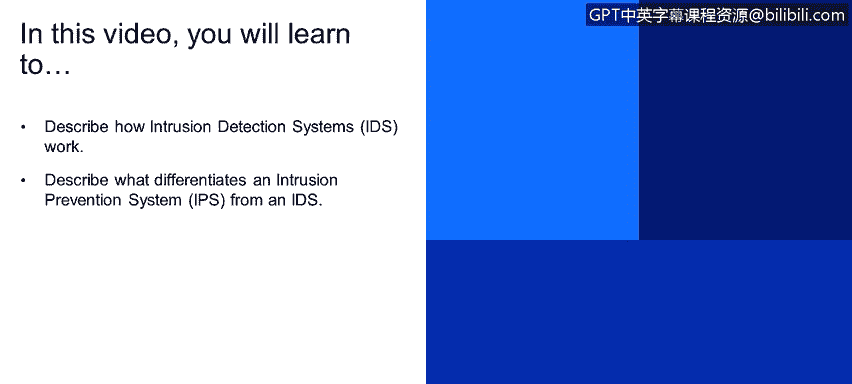
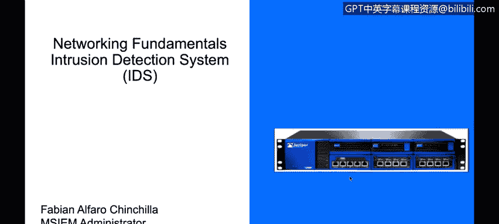
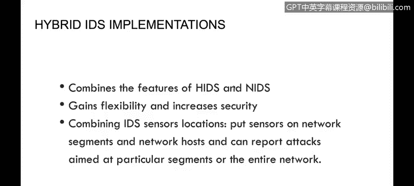
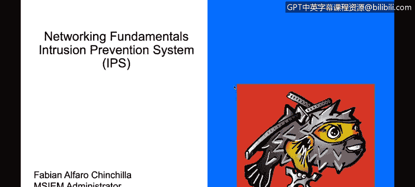
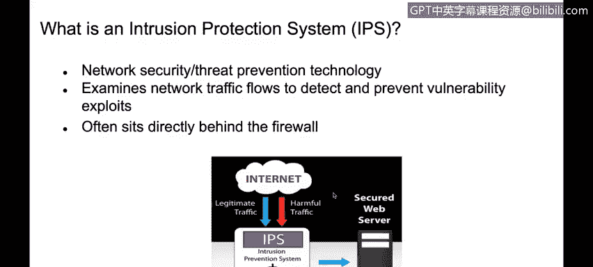
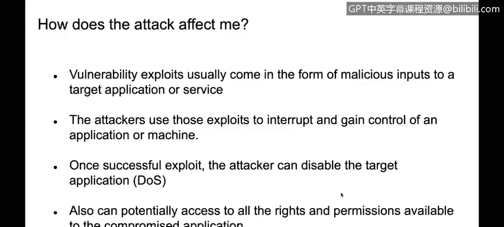

# 课程4：《网络安全与数据库漏洞》：31：入侵检测和入侵预防系统

在本视频中，你将学习如何描述入侵检测系统（IDS）的工作原理。你将了解入侵防御系统（IPS）与IDS之间的主要区别。

在之前的服务章节中，我们简要提到了入侵检测与防御。现在，我们将深入探讨入侵检测系统（IDS）与入侵防御系统（IPS）之间的具体差异。

## 入侵检测系统（IDS）详解

入侵检测系统本质上是一种能够分析每个数据包内容直至应用层的设备。它的核心功能是将网络流量与一个已知威胁特征的数据库进行比对，以识别网络威胁或病毒等，并检测这些威胁。IDS仅能检测到此类流量，并在发现病毒或类似威胁时向管理员发送警报。

IDS主要有两种类型：基于签名的检测和基于异常的检测。

以下是这两种类型的简要说明：

*   **基于签名的检测**：如前所述，它将数据包内容与一组预定义的签名（特征码）进行比较。
*   **基于异常的检测**：它监控网络流量，并建立一个网络流量的行为基线。如果检测到流量偏离了这个基线，它就会向管理员发出警报，提示可能存在异常活动，以便进一步检查。

同样需要了解的是，IDS可以是基于主机的，也可以是基于网络的。

以下是部署方式的说明：

*   **基于主机的IDS**：安装在终端主机上。
*   **基于网络的IDS**：部署在网络中，用于分析网络流量。

例如，IBM RealSecure Server Sensor 和 Cisco IDS 4200系列就是IDS产品的实例。

那么，IDS系统通常部署在哪里呢？部署基于网络的IDS有一个关键要求：我们需要在交换机上配置一个**镜像端口**。

镜像端口是一个用于发送流量副本的端口。例如，我可以配置交换机，将所有流经该交换机的流量副本发送到端口2，而我的基于网络的IDS就连接在端口2上，从而能够分析所有流量。

**混合IDS部署**则是一种结合了基于主机的IDS和基于网络的IDS的部署方式。

最后，我们来介绍入侵防御系统（IPS）。

## 入侵防御系统（IPS）详解

入侵防御系统不仅能够检测网络威胁，还能够主动阻止这些威胁流量进入网络。这是它与IDS的主要区别。

IPS是一个**内联设备**，这意味着所有流量都必须经过它。它能够做出决策，允许或拒绝流量通过网络。因此，IPS不仅能检测威胁，还能预防威胁。

在接下来的内容中，我们将看到IPS如何实现这一功能。它使用与IDS相同的检测技术。

以下是IPS使用的两种主要检测技术：

*   **基于签名的检测**：检查所有数据包的内容，并与预定义的签名数据库进行匹配。如果内容匹配到数据库中的条目，IPS将阻止该流量，不允许其通过防火墙或IPS本身。
*   **统计异常检测**：与IDS设备类似，IPS可以配置或建立一个行为基线。如果IPS判定流量偏离了该基线，它不仅会检测并报告此异常，还可以阻止这些偏离基线的流量。

本质上，下一代防火墙（NGFW）就是一种集成了IPS功能的设备，它结合了防火墙和入侵防御的能力。

本节课中，我们一起学习了入侵检测系统（IDS）和入侵防御系统（IPS）的核心概念。我们了解到IDS主要用于监控和警报，而IPS则能主动拦截威胁。两者都依赖基于签名和基于异常的检测技术，但IPS通过内联部署实现了防御功能。理解它们的区别对于构建有效的网络安全架构至关重要。

