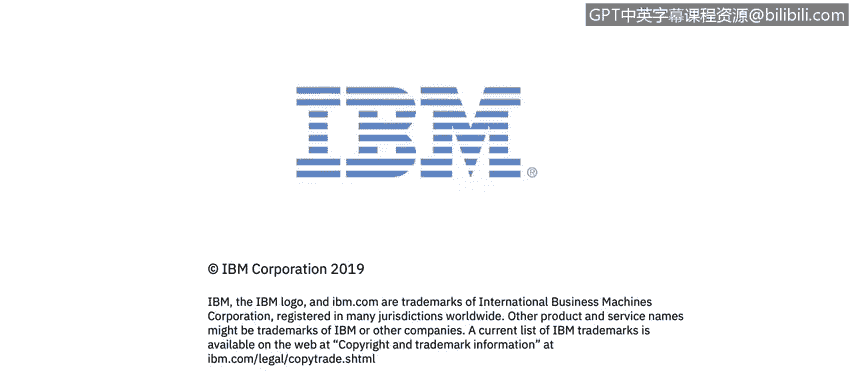

# 课程4：《网络安全与数据库漏洞》：36：35_数据模型类型

在本节课程中，我们将学习如何描述结构化数据、半结构化数据和非结构化数据。理解这些数据模型类型是分析和管理数据安全的基础。

## 📊 结构化数据

结构化数据是指已被组织成特定格式或存储库（通常是数据库）的数据。它具有可寻址的元素，以便进行更有效的处理和分析。

这意味着结构化数据是一种数据存储库，它有办法组织所有不同的数据。因此，我不仅可以定位到特定的数据片段，还可以根据数据和数据结构进行搜索。这种数据结构和存储库使我能够轻松做到这一点。即使我以前从未见过它，我也能理解该结构化数据的数据模型，然后立即找到我需要的任何数据。

结构化数据通常拥有数据库查询语言，例如 **SQL（结构化查询语言）**。它允许数据库管理员或连接到数据库的应用程序与数据库进行交互。

需要指出的是，结构化数据与非结构化和半结构化数据形成对比。这三者可以被视为存在于一个连续体上，其中非结构化数据格式化程度最低，而结构化数据格式化程度最高。另一种说法是，结构化数据最容易理解、组织性最强，而非结构化数据组织性最差、最难理解和找到所需内容。

## 🔄 半结构化数据

半结构化数据介于结构化和非结构化数据之间。它与非结构化数据的区别在于，非结构化数据尚未被组织成便于访问和处理的格式。而半结构化数据虽然未被组织成数据库这样的专用存储库，但它附带了元数据等信息，使其比原始数据更易于处理。

半结构化数据本质上是非结构化数据的对立面。它经过了重新格式化，其元素被组织成一种数据结构，使得元素可以被寻址、组织和以各种组合方式访问，从而更好地利用信息。

然而，结构化数据也可能变成非结构化数据。例如，如果我将来自多个不同数据库的结构化数据扔到一个新位置，并且没有花时间将其重新格式化并组织成一种数据结构，以便理解所有不同数据库的内容以及它们之间（如客户、产品等）的共同点，那么理解数据库中的数据、寻找共性并真正理解数据就会变得困难得多。

## 📄 非结构化数据

非结构化数据是指以多种不同形式存在、不遵循传统数据模型的信息，因此通常不适合主流的**关系型数据库**。

最常见的非结构化数据类型之一是纯文本。非结构化文本以多种形式生成和收集，包括：
*   Word文档
*   电子邮件
*   短信
*   PowerPoint演示文稿
*   调查问卷回复
*   文字记录
*   呼叫中心互动记录
*   博客帖子
*   社交媒体网站帖子

其他类型的非结构化数据包括图像、音频和视频文件。尽管所有这些不同类型的数据差异很大，但它们都被归类为非结构化数据。

## 📝 总结

本节课我们一起学习了三种主要的数据模型类型：结构化数据、半结构化数据和非结构化数据。我们了解到它们存在于一个从高度组织化到几乎无组织的连续体上，每种类型在存储、访问和分析方面都有其特点。理解这些差异对于有效管理数据和识别潜在的安全漏洞至关重要。