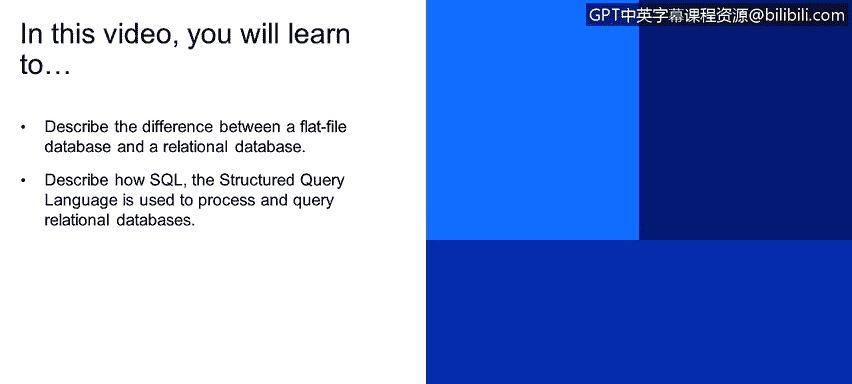

# 课程4：《网络安全与数据库漏洞》：37：结构化数据




在本节课程中，我们将学习结构化数据的基础知识。我们将描述平面文件数据库和关系型数据库的区别，并解释结构化查询语言（SQL）如何用于处理和查询关系型数据库。

## 平面文件数据库与关系型数据库

结构化数据有多种数据库类型，例如平面文件数据库和关系型数据库等。

平面文件数据库将所有记录的信息存储在一个单一的表中。这个表由行和列组成，可以简单地将其想象成一个电子表格，这是大家都很熟悉的形式。

以下是一个平面文件数据库的示例：

*   **SID**：学生ID
*   **First Name**：学生名
*   **Last Name**：学生姓
*   **Telephone**：学生电话
*   **CID**：ID
*   **Cname**：名称
*   **TID**：教师ID
*   **Trainer**：教师姓名
*   **Mobile**：教师手机

然而，您会注意到其中存在大量重复数据。例如，教师“Charles”的信息和课程“Databases”的名称在多个记录中反复出现。

平面文件数据库的一个缺点是存在大量数据冗余。如果将信息拆分到不同的表中，存储相同信息所需的空间会更少。

## 关系型数据库的设计

上一节我们看到了平面文件数据库的冗余问题，本节中我们来看看关系型数据库如何解决这个问题。

关系型数据库将大量信息分离到多个表中。每个表中的所有列都应围绕一个主题，例如学生信息、课程信息或教师信息。

设计关系型数据库的一部分艺术在于权衡：我可以创建数百甚至数千个表，但这可能会使数据库变得处理密集或过于复杂，难以将数据转化为有用信息。但核心思想是，关系型数据库能够将数据拆分到多个表中，以减少数据使用量。

在关系型数据库中，表之间通过“键”进行链接。每个表可以有一个主键和任意数量的外键。**外键**是一个表中的主键被放置到另一个表中。

例如：
*   `SID`（学生ID）可以是学生表的主键。
*   `CID`（课程ID）可以是课程表的主键。
*   `TID`（教师ID）可以是教师表的主键。

这些主键可以在其他表中作为外键使用。这样，当需要查询信息时，例如“哪些学生正在上教师Charles Hill的课程？”，数据库可以通过关联`TID`等键值，高效地组合来自学生表、课程表和教师表的信息，最终返回结果（例如，学生Mary和Paul）。

## 结构化查询语言

了解了数据库的结构后，我们需要一种与它们交互的方式。这就是SQL的用武之地。

SQL（结构化查询语言）是一种特定领域的语言，用于编程和设计，以管理关系数据库管理系统（RDBMS）中的数据。它特别适用于处理具有不同实体或变量之间关系的结构化数据。

以下是一个SQL查询示例：

```sql
SELECT title, release_year, length, replacement_cost
FROM film
WHERE length > 120 AND replacement_cost > 29.50
ORDER BY title DESC;
```

这个查询语句的意思是：
1.  **SELECT**：从`film`表中选择`title`（标题）、`release_year`（发行年份）、`length`（时长）和`replacement_cost`（置换成本）这些列。
2.  **FROM**：指定数据来源是`film`表。
3.  **WHERE**：设置过滤条件，只选择`length`大于120**并且**`replacement_cost`大于29.50的记录。
4.  **ORDER BY**：将结果按`title`列降序（DESC）排列。

执行后，结果会显示所有符合条件（时长>120且成本>29.50）的电影，并按片名字母逆序（从Z到A）排列。这体现了如何通过SQL实现业务逻辑查询。


## 安全控制策略

不同的数据源都需要制定恰当的控制策略。所谓安全控制，是指保护数据及各类数据源的所有不同方法。


## 总结


本节课中我们一起学习了结构化数据的核心概念。我们比较了平面文件数据库和关系型数据库，理解了关系型数据库通过多表和键关联来减少数据冗余的优势。我们还介绍了SQL的基本语法，看到了它如何用于从关系型数据库中精确查询所需数据。最后，我们认识到针对不同的数据源，制定相应的安全控制策略至关重要。