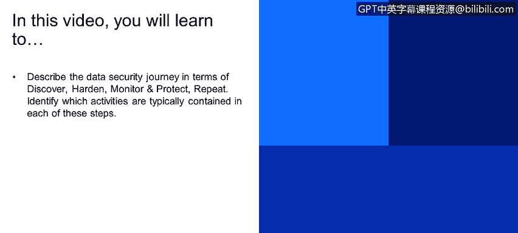
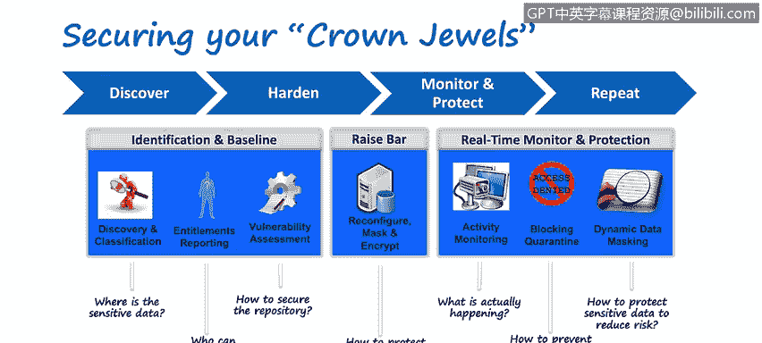
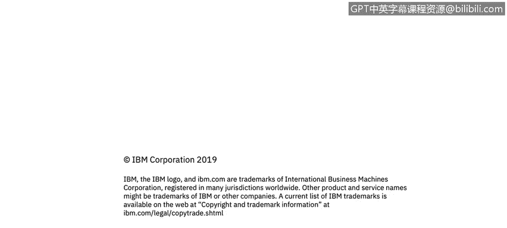

# 课程4：《网络安全与数据库漏洞》：38：37_保护皇冠上的宝石

在本视频中，你将学习如何描述数据安全旅程，包括发现、加固、监控和保护这几个阶段，并理解这是一个循环往复的过程。同时，你将识别每个步骤中通常包含哪些具体活动。

这是IBM在全球范围内观察到客户反复经历的数据安全旅程。

这是一个流程。你可以看到顶部的箭头：发现、加固、监控、保护、重复。实际上，你也可以将其重写为：发现、重复、加固、重复、监控、重复、保护、重复。因为在IT领域，事物永远不会一成不变。总会有新的数据库版本、新的操作系统，随之而来的是新的漏洞。总会有新的数据库被建立，旧的数据库和整个应用程序被淘汰，被新事物取代。变化是永恒的。

因此，即使你完成了其中一个步骤，也必须一次又一次地重复执行。这不仅是为了了解组织在某个时间点的状况，更是为了理解其随着时间推移的演变。你需要清楚地了解正在发生的事情。

我个人倾向于将其分为三个不同的阶段。我可以称第一阶段为识别或建立基线，我喜欢称之为“提高标准”阶段。而监控和保护阶段，则主要是为不同的数据源应用适当的安全控制措施。

接下来我将为你详细讲解。

**发现与分类**

安全的一个基本原则是：除非你知道某物存在并清楚了解它是什么，否则你无法充分保护它。

例如，如果我有一块金砖，我可能会考虑把它放在像诺克斯堡那样的保险库里。而我的家门钥匙虽然重要，我也希望保证其安全，但我可能觉得放在床头柜上也可以接受。因此，对于不同的物品，需要采取非常不同的控制措施。

发现过程就是发现环境中所有不同类型的数据源。分类过程则不仅是了解这些数据源的位置，还要对数据源中数据的类型、特别是敏感数据的类型进行分类。

所以，**发现**是发现环境中所有不同类型的数据源（结构化、半结构化、非结构化等）。**分类**是深入这些数据源，了解其中包含哪些类型的敏感数据，例如：
*   SoC信息
*   PCI信息
*   PII信息
*   PHI信息
*   GDPR信息

这个列表可以一直列下去。每种不同类型的数据，由于其不同的合规性需求和不断变化的法规要求，都需要应用不同类型的控制措施。例如，PCI要求通常与加密紧密相关。

**访问报告**

访问报告的内容远不止简单地了解谁有权访问数据。它还可以更深入，例如：
*   不仅是谁有权访问敏感数据（如PII、PHI、PCI数据）。
*   谁有权访问数据源本身。
*   谁有权重新配置数据源。

一个典型的例子是数据库管理员。他可能没有权限访问系统上的敏感数据（例如，他同事的薪资信息），因为日常工作不需要接触这些信息。但他可能拥有创建数据库用户账户的权限，并能随意分配角色、特权和访问级别。

针对这种情况，一个经典的控制措施是：每当这位DBA需要为新员工开通权限时，将其操作与你的工单系统集成。这样，你就可以看到他为新员工开通权限的请求与他正在进行的工作相关联，这是一个合理的控制措施，可以了解谁在做什么，并在特定窗口期和制衡机制下允许其执行创建操作。

**漏洞评估**

漏洞评估就是参照行业基准，检查组织内部的操作系统、数据库和其他数据源，并将其与最佳实践和所有可用的不同基准进行比较。

通常，组织会执行比基本基准更严格的评估。因为他们可能拥有一些知识产权或非常重要的信息（我们常称之为组织的“皇冠宝石”），他们认为这些资产需要比基本基准所考虑或允许的、更严格的测试和加固要求。

**提高标准**

我常认为这是组织开始行动的阶段。组织将审视在识别和建立基线阶段收集的所有信息，并开始实施。他们将开始根据操作系统和数据库的漏洞评估信息，重新配置数据源以加固它们。他们将开始实施诸如数据脱敏、编辑、加密等措施，甚至可能更进一步。

他们可以实施安全监控、告警，以及通过与事件管理团队（可能通过SIEM或类似QRadar的工具）交互的工作流。他们还可以执行其他操作，例如封锁用户账户以应对可疑活动。例如：“你应该在休假，但刚刚发生了异常大量的活动。通常你一次只处理一条记录，现在突然处理了100条。那么，我们不仅要封锁账户以防止任何可能发生的事件，还要隔离该账户以便调查，因为这完全不合常理。”这种情况可能涉及下班后工作等多种危险信号。

**活动监控**

活动监控很简单，就是捕获所有不同类型数据源（结构化、半结构化、非结构化）中发生的一切，并让你有能力了解在任何时间点发生了什么。这实际上为你提供了一个记录系统或单一事实来源。

最佳实践是将这些监控数据本身存储在一个经过加固、加密、防篡改的环境中。因为这显然是敏感数据，很可能是高度敏感的数据，因为它不仅是敏感数据，更是你的安全数据。

**总结**

本节课中，我们一起学习了数据安全旅程的四个核心阶段：**发现、加固、监控、保护**，并理解了这是一个需要**重复**进行的循环过程。我们详细探讨了每个阶段的关键活动，包括数据源的发现与分类、访问权限报告、基于基准的漏洞评估、实施加固与控制措施（如加密和脱敏），以及持续的活动监控与告警。掌握这个框架，有助于你系统地理解和实施数据安全防护。