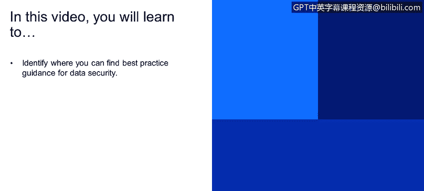

# 课程4：《网络安全与数据库漏洞》：39：38_利用安全行业最佳实践

在本视频中，你将学习如何找到数据安全最佳实践的指导资源。

上一节我们讨论了数据库安全的重要性，本节中我们来看看一些行业公认的最佳实践来源。这些资源为保护系统和数据提供了标准化的配置与策略指导。

以下是几个关键的安全最佳实践框架与资源：

*   **CIS基准**：由互联网安全中心制定，提供针对各种技术（包括操作系统、数据库、网络设备）的详细安全配置建议。
*   **CVE**：即通用漏洞披露，它是一个公开的漏洞字典，为每个已知的网络安全漏洞提供唯一的标识号（例如 `CVE-2021-44228`），便于跟踪和沟通。
*   **STIGs**：由美国国防部发布的安全技术实施指南，为软件、硬件和系统的安全配置提供严格的要求和检查清单。

所有这些最佳实践都涵盖了广泛的安全领域，包括权限配置、安全补丁管理、密码策略以及操作系统级别的文件权限设置。

例如，在密码策略方面，一个重要的实践是**设置失败登录尝试次数限制**。如果没有这个限制，攻击者就可以无限次地尝试猜测密码，直到成功进入用户账户，这显然是一个严重的安全隐患。

这些最佳实践的核心目标是帮助组织为其所有的应用程序和系统建立一个**安全基线**。这个基线定义了最低限度的安全配置标准，确保整个IT环境具备一致的基础防护能力。

本质上，上述框架所涉及的各种配置项，如果设置不当，都可能成为数据库和操作系统的安全漏洞。

本节课中我们一起学习了如何利用CIS基准、CVE和STIGs等行业最佳实践来识别和加固数据安全防护。掌握这些资源是构建有效安全基线、防范已知漏洞的关键步骤。