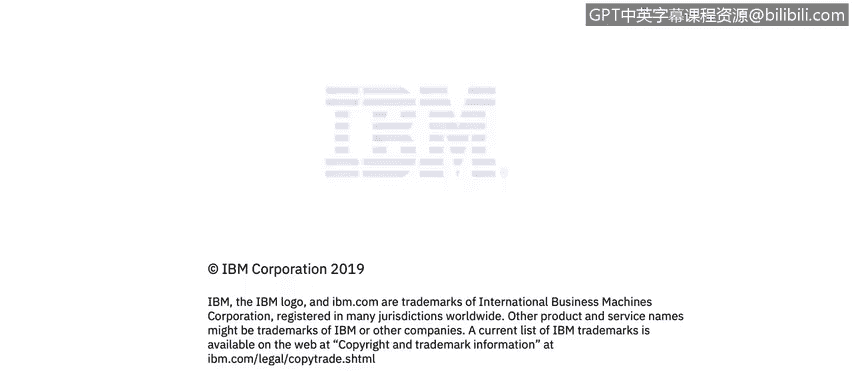

# 课程4：《网络安全与数据库漏洞》：40：39_结构化数据和关系数据库

在本视频中，你将学习如何描述一个典型的数据库访问设置。

## 概述

在本节中，我们将探讨数据库在现实世界中的典型应用场景，并理解不同类型的用户如何与数据库进行交互。我们将重点关注数据库管理员（DBA）的日常操作以及普通用户通过应用程序间接访问数据库的方式。

## 数据库管理员（DBA）的访问模式

上一节我们介绍了数据库的基本概念，本节中我们来看看数据库管理员是如何直接与数据库交互的。

这是一个在真实环境中如何使用数据库的示例。请重点关注此处的描述。

这里描述的是一个监控系统。你可以看到，一个名为Joe的数据库客户端通过数据库客户端连接到数据库以执行某些操作。如果他正在使用数据库客户端，他很可能是数据库管理员。

数据库管理员通常负责更新数据库本身，即数据库的**模式**。模式指的是数据库的实际布局。

以下是数据库管理员可能执行的一些典型任务：
*   添加新客户信息。
*   添加新的产品表。
*   甚至在数据库系统中创建新的数据库。

这些通常是数据库管理员的日常工作，涉及对数据源进行重大调整，以及更新操作系统和数据库本身（例如安装新版本、打补丁等）。

## 应用程序用户的间接访问

了解了管理员的直接访问后，我们再来看看更常见的、大多数用户熟悉的场景。

在另一侧，是一个更贴近现实世界的例子。例如，Joe、Chris、Sarah登录一个应用程序。

这个应用程序的后端实际上连接着一个数据库，而用户通常无需考虑甚至不知道这个数据库的存在。

以Gmail为例，Gmail的后端就是一个数据库。你只需登录，它就会显示存储在后台数据库中的所有信息。

## 总结

本节课中我们一起学习了典型的数据库访问设置。我们区分了两种主要访问方式：数据库管理员通过专用客户端直接管理数据库**模式**和数据；以及普通用户通过前端应用程序（如Gmail）间接地与后台数据库进行交互，而无需了解底层技术细节。理解这两种访问路径对于分析数据库安全漏洞至关重要。