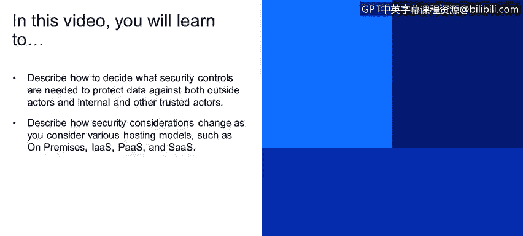
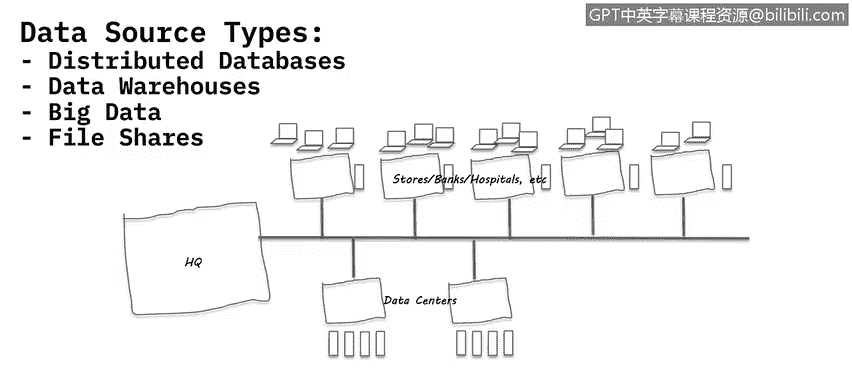
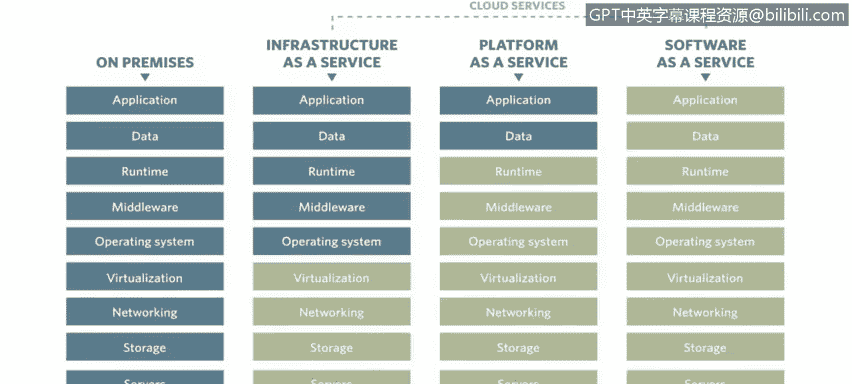
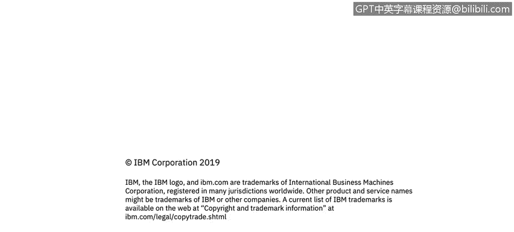

# 课程4：《网络安全与数据库漏洞》：42：41_按数据源类型保护数据

在本节课程中，我们将学习如何根据不同的数据源类型来决定所需的安全控制措施，以保护数据免受外部攻击者以及内部和其他可信参与者的威胁。我们还将探讨当考虑不同的托管模型时，安全考量会发生怎样的变化。

## 🛡️ 数据保护与访问控制

上一节我们讨论了边界防御和VPN。然而，一个重要考量是，连接到您的数据源和数据中心的不仅仅是您的用户和员工。您的业务合作伙伴以及其他与您有业务往来的实体，也常常拥有直接访问您的数据中心和各种数据源的权限。

因此，为这些不同实体设置和需要设置的控制措施，必须根据您的组织如何在环境中利用这些数据源来仔细思考和考量。这就像我之前举的金条和车钥匙的例子：**不同的数据需要不同级别的控制**。

除了监控，您可能还需要考虑对数据进行加密或令牌化。保护数据的方法多种多样，例如静态加密、传输中加密等。此外，您还需要对承载数据的操作系统和数据库进行不同程度的加固。

## ☁️ 托管模型与安全责任

我们讨论了各种数据中心、数据类型以及运行在这些数据类型上的不同应用程序。但还有一个关键点尚未涉及：数据源实际托管在何处。

以下是几种主要的托管模型，每种模型下组织的安全责任范围各不相同：

*   **本地部署**：这是大多数人认为的组织数据中心。在这种模式下，您运营数据中心并对其中发生的一切拥有完全控制权。从应用程序、数据本身，到运行时环境（如Java运行时）、中间件、操作系统、虚拟化层、服务器网络和存储，**您拥有从上到下的完全访问权限**，可以按需更新、更改和重新配置。

*   **基础设施即服务**：与后面的模型一起，通常被称为云服务。IaaS、PaaS和SaaS是常见的缩写。在IaaS模型中，服务器等物理基础设施由云提供商（如IBM、Google、Amazon）拥有、运营和更新。组织只需关注虚拟机本身，确保能访问一定数量的服务器、处理能力和磁盘空间。**安全责任划分**为：提供商管理虚线以下部分（物理设施、虚拟化层），而组织负责虚线以上部分，包括操作系统、中间件、运行时、数据和应用程序的更新与管理。

*   **平台即服务**：在这种模型中，组织只能修改和上传应用程序或数据本身。这通常用于托管定制应用程序。**安全责任**进一步上移，组织主要管理应用程序和数据，而平台、运行时、中间件、操作系统及以下层均由提供商管理。

*   **软件即服务**：您可能已经在使用SaaS，即使没有意识到它被这样定义。例如Gmail、Salesforce、Dropbox。您只是与软件交互，**没有任何权限**来重新配置应用程序、更新应用程序或更新其运行的操作系统。一切均由提供商处理。

## 🔐 不同模型下的安全策略考量

采用不同的托管模型会带来许多额外的安全考量，尤其是数据安全。

例如，在本地部署模型中，如果需要在服务器上安装一个代理来监控应用程序活动或用户登录行为（例如记录Chris、Sam、Sarah登录后执行了哪些操作），您可以轻松地安装它。

在IaaS模型中，您通常也可以安装此类代理。但根据具体设置，您可能无法看到底层的虚拟化和服务器，也可能无法监控谁登录了该系统以及他们在做什么，特别是如果您没有权限在基础设施层安装工具的话。

对于PaaS和SaaS模型，挑战则更大。您甚至没有能力在操作系统上安装任何软件。因此，您需要寻找其他方法来保护平台即服务中的数据，以及软件即服务中的数据。

一个例子是**令牌化**。我可以在PaaS中实施令牌化，让令牌化后的数据存储在提供商运行的服务器上。这样，即使提供商的员工恶意复制了整个系统，只要他们没有我的解令牌化或解密手段，这些被复制的数据就仍然是无法理解的乱码。或者使用**格式保留令牌化**，例如将“Chris W”替换为“John Smith”，这样数据仍可用于测试，但对寻找真实敏感数据的人来说毫无用处。

对于SaaS，情况类似。如果SaaS通过API等方式连接到您的系统，您也需要考虑不同的方法，例如令牌化。总之，对于每种托管模型，都需要有不同的安全考量和方法，这纯粹是因为组织无法访问底层系统，无法管理系统的各个层级。

## 📝 总结

本节课我们一起学习了如何根据数据源类型和访问者身份来决定安全控制措施。我们深入探讨了四种主要的托管模型：**本地部署、基础设施即服务、平台即服务 和 软件即服务**，并分析了每种模型下安全责任的划分。关键点在于，随着从本地部署向SaaS迁移，组织对底层系统的控制权逐渐减少，因此必须采用适应性的安全策略（如令牌化）来保护数据，尤其是在无法直接管理基础设施和操作系统的情况下。理解这些差异对于制定有效的数据安全防护方案至关重要。

