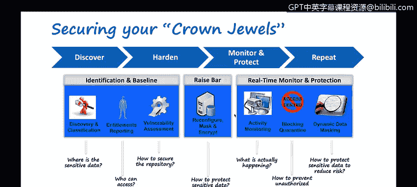
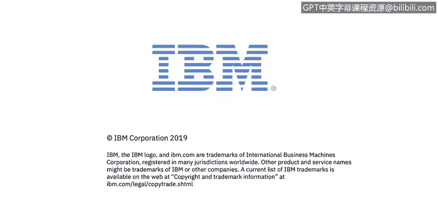

# 课程4：《网络安全与数据库漏洞》：4.3：保护数据库总结

在本节课中，我们将学习如何描述一个应用于整个IT和数据安全领域（而不仅仅是数据中心）的持续过程：**发现、加固、监控、保护与重复**。

## 概述

上一节我们讨论了数据库安全的具体措施。本节中，我们将总结一个更宏观、持续的安全管理循环。这个过程不仅适用于传统数据中心，也覆盖了现代混合IT环境中的所有数据资产。

## 核心安全循环

保护数据库和数据资产是一个持续的过程，可以概括为以下四个关键步骤的循环：

**发现 → 加固 → 监控 → 保护**

这个循环需要持续应用于你的整个IT和数据安全版图，而不仅仅是数据中心。

### 第一步：发现

发现是整个安全流程的起点。你需要识别和理解所有存储敏感数据的来源和位置。

以下是发现阶段需要关注的关键方面：

*   **数据源定位**：识别所有数据源，无论它们位于你的数据中心、使用的任何云服务提供商，还是不同的SaaS（软件即服务）和PaaS（平台即服务）供应商处。
*   **影子IT管理**：员工可能使用未经公司正式批准或记录的系统（如Dropbox、Box等），这常被称为“影子IT”。你需要发现这些连接和使用的系统。
*   **权限报告**：了解谁有权访问数据，谁有权重新配置数据源或更改数据结构本身（例如，谁有权删除数据库）。

### 第二步：加固

在发现所有资产和权限后，下一步是进行加固，即减少攻击面和安全漏洞。

加固措施需要覆盖所有环境：

*   **漏洞评估**：不仅针对数据中心，还要涵盖所有云服务提供商。
*   **分层防护**：从基础设施即服务（IaaS）、平台即服务（PaaS）到软件即服务（SaaS），每一层都需要考虑并实施相应的安全控制措施。

### 第三步：监控

加固之后，必须建立持续的监控机制，以检测异常活动和潜在威胁。

监控的核心在于关联与分析：

*   **行为分析**：例如，如果有人删除了一个数据库，监控系统应能捕获此行为，并通过变更管理流程关联分析其操作原因和合理性。

### 第四步：保护

基于监控到的信息和威胁情报，采取主动和被动的保护措施来防御和响应安全事件。

保护措施是安全策略的具体执行，旨在防止数据泄露和破坏。

## 总结

本节课中，我们一起学习了保护数据库及整个IT数据资产的持续安全循环：**发现、加固、监控、保护**。关键在于将这个循环应用于你所有的IT环境——包括数据中心、多个云提供商以及各种SaaS应用——并不断重复这一过程，以构建动态、全面的数据安全防御体系。