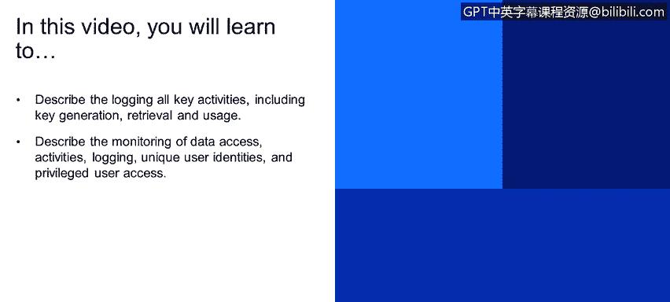
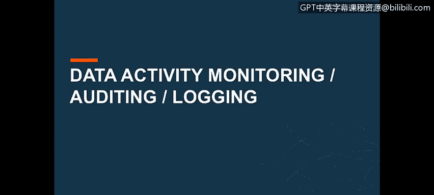
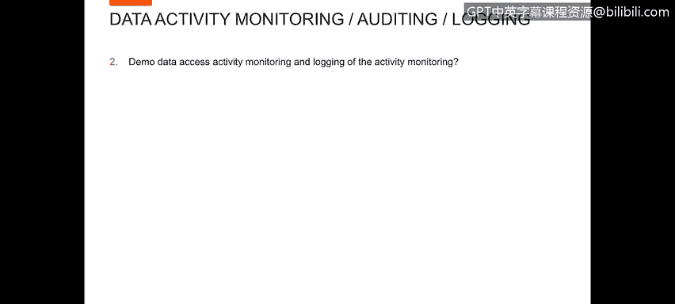
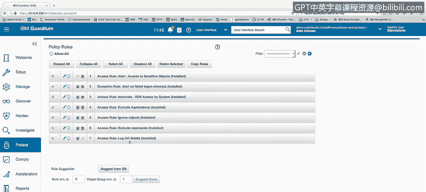
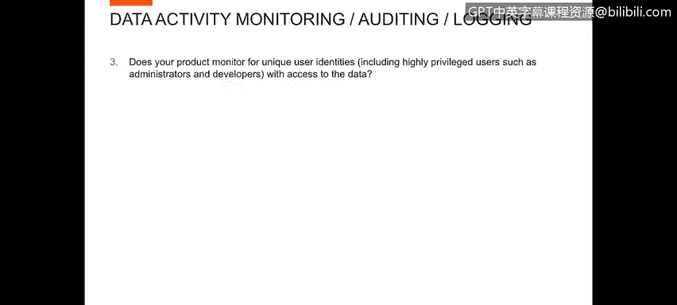
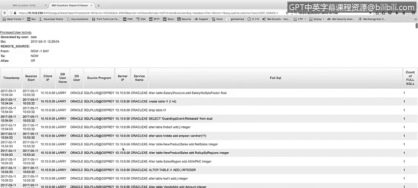
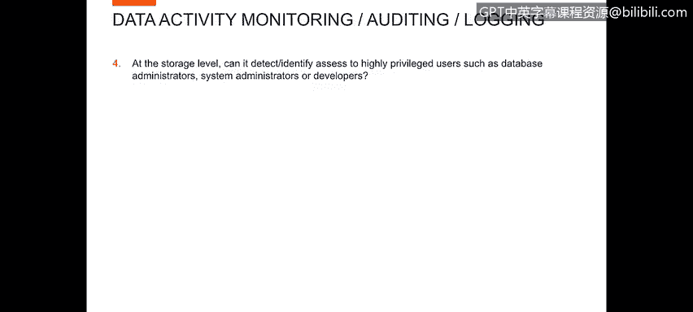
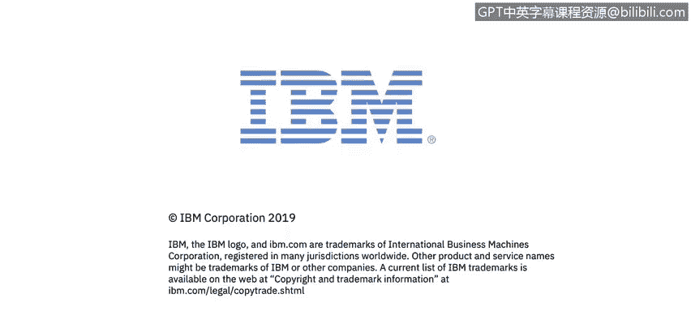

# 课程4：《网络安全与数据库漏洞》：44：43_数据监控

在本节课中，我们将学习如何描述对所有关键活动（包括密钥生成、检索和使用）的日志记录，以及如何描述对数据访问活动、日志记录、唯一用户身份和特权用户访问的监控。

大家好，我是来自IBM Security的Dale Brocklegers。在本节内容中，我将讨论活动监控、审计和日志记录。

本节包含多个主题。我不会逐一详述列表中的每一项，但需要说明的是，总共有22个独立的主题需要讨论。

让我们从一个演示开始，了解数据访问活动的监控以及活动监控的日志记录。

为了进行这个演示，我们将查看我为日志记录所建立的策略规则，这些规则用于记录Guardium将监测到的活动。

在这个策略中，我有好几条规则，其中前两条是警报规则。

*   **第一条警报规则**：每当访问敏感对象时触发警报。
*   **第二条警报规则**：每当发生失败的登录尝试时触发警报。

我的第三条规则是终止规则，这条规则将在用户系统尝试访问一个名为`SSN`（社会保险号）的表时，终止该会话。

接下来的三条规则是我称之为排除规则的规则。我排除了一些不希望记录日志的内容，例如我不希望出现在日志中的系统表，以及我希望忽略的某些命令。

最后，我的最后一条规则是用于记录信息的规则。在这个特定示例中，我记录了除被排除信息之外发生的所有事情。

现在，我们来看下一个问题：你的产品是否监控唯一用户身份，包括能够访问数据的高权限用户，例如管理员和开发人员？

为了演示这一点，我创建了一份特权用户活动报告。基本上，在这份报告中，任何非已知应用程序用户、且拥有数据库直接登录权限的用户，我都视为特权用户。

因此，你可以看到我正在为用户Larry记录信息。如果我使用导出功能，生成一份完整的、可打印、可下载的报告，我可以滚动浏览这份报告。

我可以看到用户Larry。如果我向下滚动，可以看到Larry进行了大量活动。我还可以看到用户Joeill、用户JS task，以及用户Larry的更多活动等等。

所以，任何特权用户，我都能看到他们的活动，看到他们执行了什么操作。在这份特定报告中，我展示了数据库用户名、操作系统用户名、他们使用的源程序、他们访问的服务器IP、Oracle中的服务名（即他们访问的数据库），以及他们运行的完整SQL语句。

接下来，我们来看在存储级别的问题：它能否检测和识别高权限用户（如数据库管理员、系统管理员或开发人员）的访问？这与上一个用例非常相似，但我们将查看一份单独的报告来了解高权限用户的活动。

在这个案例中，我有一份名为“管理员高权限用户活动”的报告。你会注意到，这份报告中的用户是`SYSTEM`。如果我按相反顺序对报告进行排序，可以看到`SYSTEM`、`GDP_ADMIN`、`SUPER_USER`等环境中的多个不同管理员用户。

因此，你可以看到，我们同样可以基于一组特权用户、高权限用户来生成针对这些用户的报告。

---

**本节课总结**

在本节课中，我们一起学习了数据监控的核心概念。我们首先概述了活动监控、审计和日志记录的重要性。接着，通过一个具体的策略规则演示，了解了如何配置警报、终止会话以及排除特定日志。然后，我们探讨了如何监控唯一用户身份和特权用户（包括管理员和开发人员）的访问活动，并通过报告实例展示了监控结果。最后，我们特别关注了在存储级别检测高权限用户访问的能力。这些内容共同构成了一个有效的数据安全监控框架的基础。