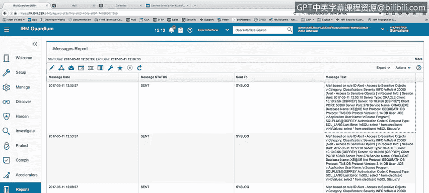
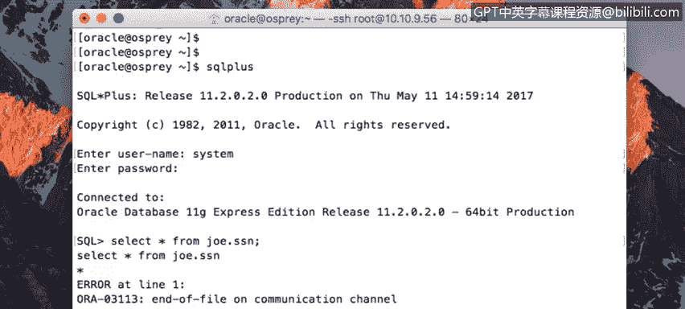
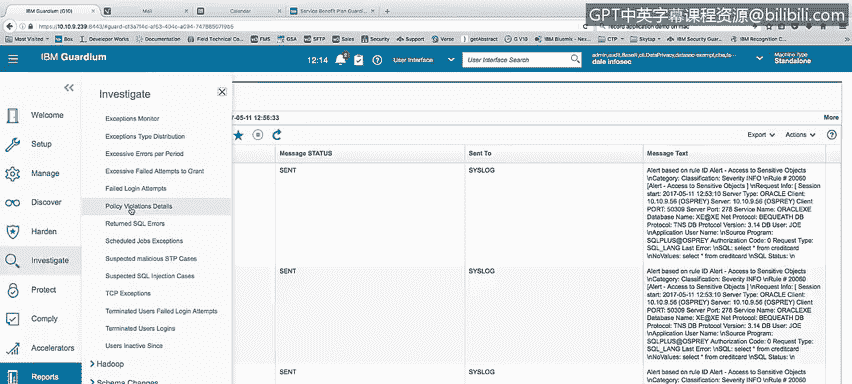
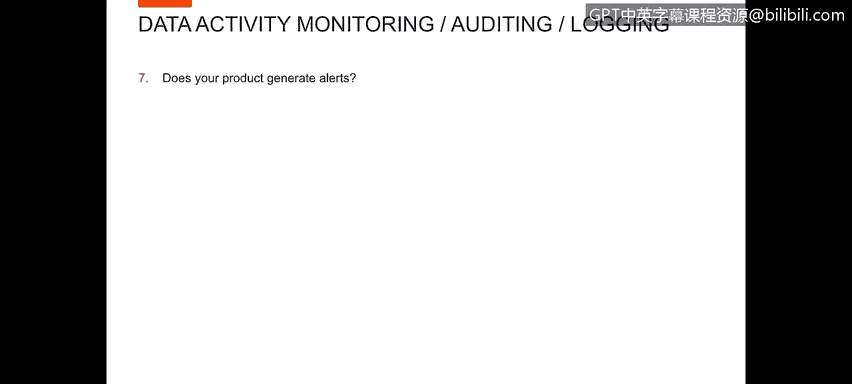

# 课程4：《网络安全与数据库漏洞》：45：44_数据警报

## 概述
在本节课中，我们将学习如何描述在记录活动时实时生成策略违规警报，以及如何自定义监控以实时阻止不可接受的用户行为、访问模式或地理位置访问。

---

## 实时策略违规警报生成

上一节我们介绍了课程概述，本节中我们来看看如何生成实时策略违规警报。

为了演示此功能，我将执行一个查询：`SELECT * FROM credit_card;`。

执行此操作将生成一个策略警报。

如果我进入调查屏幕下的“策略违规详情报告”，可以看到最近的警报：用户 Joe 访问了敏感对象，并执行了 `SELECT * FROM credit_card`。我们根据该信息生成了警报。

我还可以进入一个已创建的报告，名为“我的报告”，以显示当该活动发生时，警报消息实际上已发送到我的系统日志。这是一个基于“访问敏感对象”的实时警报，具体是 `SELECT * FROM credit_card`。在此报告的某处，我应该能看到用户 Joe。由此可见，我们确实会生成警报。

---

## 实时监控与自定义阻止

上一节我们探讨了警报生成，本节中我们来看看如何实时监控用户数据访问活动，并自定义安全警报以阻止不可接受的行为。

答案是肯定的。为了向您展示，我将进入 Guardian 环境并运行一个演示。

在 Guardian 环境中，我们已经展示了警报流程。现在，我将实时以“system”用户身份登录，并执行一个将被 Guardian 阻止的查询，因为我试图以 system 用户查询社会保险号数据。

这里可以看到，我已使用用户“system”登录到 SQL*Plus。现在我将执行查询：`SELECT * FROM joe.ssn;`。我期望 Guardian 阻止对此表的访问。确实，当我运行查询时，收到了一个错误：“在文件通信通道上，用户会话被终止”。如果我尝试在此执行其他活动也会失败，因此唯一的选择是重新连接或退出。

现在让我回到 Guardium，在调查中心的“策略违规详情”中展示。我们将看到一条记录：“因 system 用户访问 SSN 而终止会话”。

因此，当我执行 `SELECT * FROM joe.ssn;` 时，不仅生成了“访问敏感对象”的警报，还终止了用户“system”的会话，并且不允许我查看任何 SSN 信息。

---

## 警报生成机制

上一节我们看到了实时阻止的示例，本节中我们再次确认产品的警报生成能力。

我们已经在几个案例中看到了这一点，这里是“策略违规详情报告”。此外，我可以在“消息报告”中向您展示已发送的警报。这是在上次警报中发送出的警报格式，当时我们执行了 `SELECT * FROM joe.ssn;`。

---

## 总结
本节课中我们一起学习了：
1.  如何在数据库活动被记录时，实时生成策略违规警报。
2.  如何通过自定义监控规则，实时阻止基于用户身份、访问模式或地理位置的不可接受行为。
3.  通过实际演示，观察了警报的生成、日志记录以及实时拦截会话的过程。