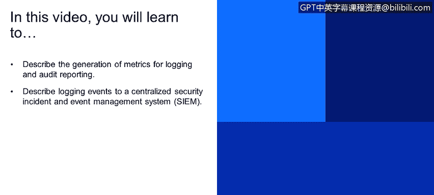
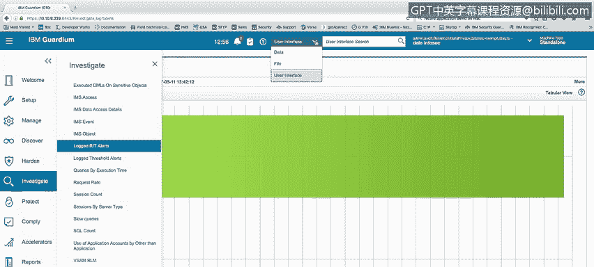
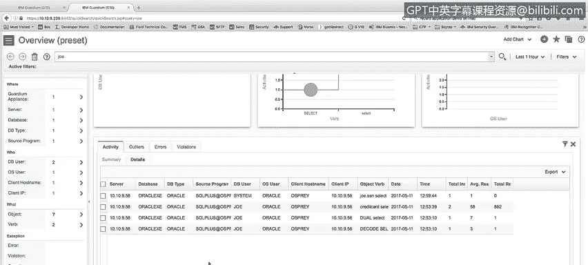
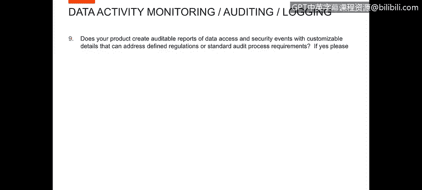
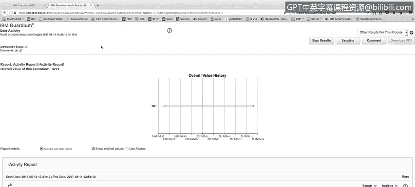
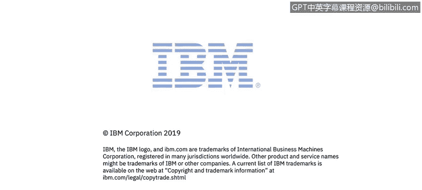

# 课程4：《网络安全与数据库漏洞》：46：45_数据活动报告

在本视频中，你将学习如何描述为日志记录和审计报告生成指标，以及如何将日志事件记录到集中式安全事件与事件管理系统中。

## 报告与指标功能演示 📊

上一节我们介绍了学习目标，本节中我们来看看如何使用记录的信息来演示报告和指标功能。

我们已经展示了几个报告。在Guardian产品中，许多标准的报告可以通过调查面板查看。

以下是Guardian产品内置的一些标准报告示例：

*   在“数据库活动”下，有诸如访问敏感对象、CL活动、数据库服务器、DV服务器、吞吐量等报告。
*   你可以看到不同时间段内不同服务器的总访问量等指标。
*   你可以查看实时警报日志，并看到相应的图表。

因此，产品内置了许多标准报告，你可以通过调查中心使用它们来识别你正在寻找的活动。

此外，我们还有数据搜索功能。例如，我可以在下拉菜单中点击“数据”，然后搜索用户“Joe”。

当我运行这个快速搜索功能时，它会查找用户Joe的活动记录，并以多种图表形式展示这些活动，例如每个数据库和数据库用户的活动、每小时的活动等，最后还会列出详细的活动清单。

由此可见，Guardian产品提供了多样化的报告和研究能力。

## 可定制的审计报告 📋

现在，我们来看下一个问题：你的产品是否能生成关于数据访问和安全事件的可审计报告，这些报告具有可定制的细节，能够满足特定法规或标准审计流程的要求？

为了演示这一点，我想向你展示审计流程构建器。它是Guardian报告功能的自动化工具。

在审计流程构建器中，你可以定义一个用户活动。你可以定义审计任务。在这个例子中，我定义了一个需要运行的活动报告。然后，你可以确定谁应该看到这个任务以及他们应该做什么。我已经为Dale和Edmin定义了一个签署此审计任务的操作。

最后，你可以安排报告，或让它按计划自动运行。此外，你还可以通过“立即运行一次”按钮交互式地运行报告。

当我们点击“立即运行一次”按钮运行报告并完成后，我们可以查看该活动报告的结果。在查看结果时，我可以看到报告运行了活动报告，我可以看到生成的所有活动。我为此运行了一天的周期，你可以看到过去一天生成的所有活动。

浏览报告后，我还可以对该报告采取行动。如果我被要求签署该报告，我可以签署结果，我可以升级它，发送给其他人，要求他们签署，我还可以向报告添加评论。

这些评论对于报告的任何其他查看者都是不可见的。

## 集成集中式安全事件管理（SIEM）系统 🔗

现在，我们来看下一个问题：你的产品是否支持将安全事件记录到集中式安全事件与事件管理系统中？

当然，答案是肯定的。我们与QRadar双向集成，这将是SIEM系统的绝佳选择，用于协调Guardian的活动。此外，我们还可以将信息集成或发送到任何SIEM环境。我们通过将信息发送到远程CIS日志来发送该信息，SIEM系统将能够读取该日志。

为了演示这个功能，我将运行一个查询：`SELECT * FROM credit_card;`，这将在系统中生成一个警报。

我正在查看两个远程CIS日志。顶部的一个是我的Osprey系统上的远程CIS日志，底部屏幕是我的Guardian收集器上的CIS日志。一旦警报生成，你会看到它出现在我的Guardian收集器的CIS日志中，警报基于规则ID“访问敏感对象”。然后，你还会看到相同的警报被发送到了我的远程CIS日志，我的SIEM产品（无论是QRadar还是任何其他SIEM）都将在那里获取该警报。

然后，该警报可供SIEM获取和报告。此外，我们可以进入Guardian系统，查看我们的消息报告。由于启用了远程CIS日志记录，所有发送到远程CIS日志的消息都已发送到我们的SIEM设备。消息文本的格式是可变的，你可以自己设置格式。例如，我们有QRadar接受的QRadar标准格式，我们有不同SIEM接受的格式，例如Splunk或你拥有的任何其他SIEM监视器。我们可以专门为它们设置格式，你也可以构建自定义格式等。因此，这是一个非常灵活的接口，用于向任何SIEM系统发送信息，解决了向SIEM发送项目的问题。

## 非关系型数据库监控演示 🗄️

现在，我想演示一下对非关系型数据库管理系统的监控，例如Cassandra、Hadoop、Spark等。

为了进行这个演示，我想看看我们拥有的各种Hadoop类型报告机制和报告。

以下是我们为Hadoop环境提供的一些不同报告示例：

*   来自BigInsights的MapReduce报告。
*   Hive异常报告。
*   Hive完整消息详情报告。
*   HBase报告。
*   HDFS文件系统报告。
*   Qubole异常报告。
*   标准的MapReduce报告（与BigInsights的MapReduce不同）。
*   未经授权的MapReduce作业报告。
*   另一个视图和最后一个报告。

你可以看到我们为Hadoop环境提供了许多不同的报告。我没有一个可以运行活动来向你展示实际活动的Hadoop数据库，但你可以看到我们确实有针对Hadoop活动的各种报告。

另外，在管理环境下的活动监控中，我想展示一下我们的ScapAP控制模块。我们确实有针对其他非关系型数据库的检查引擎，例如Cassandra（如果我们有Cassandra数据库，你可以展示该活动）、CouchDB（另一个NoSQL数据库）、MongoDB（另一个NoSQL数据库）。因此，我们也从所有这些数据库中收集信息。

## 总结

本节课中，我们一起学习了Guardian产品在数据活动报告方面的核心功能。我们了解了如何利用内置的标准报告和搜索功能来分析和监控数据库活动。重点探讨了如何通过审计流程构建器创建可定制、可自动化的审计报告以满足合规要求。我们还演示了产品如何与集中式SIEM系统（如QRadar）集成，将安全事件日志发送到远程系统进行统一管理。最后，我们展示了产品对非关系型数据库（如Hadoop生态组件和Cassandra、MongoDB等NoSQL数据库）的监控和报告能力。这些功能共同构成了一个全面的数据库安全活动监控与报告解决方案。