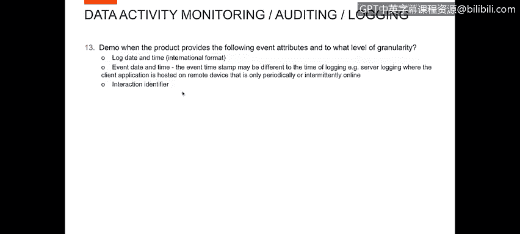
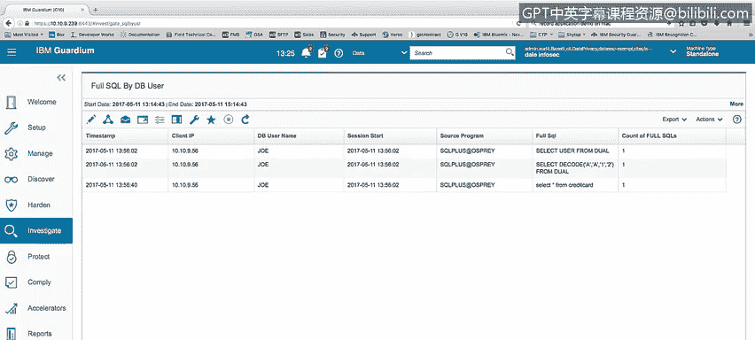
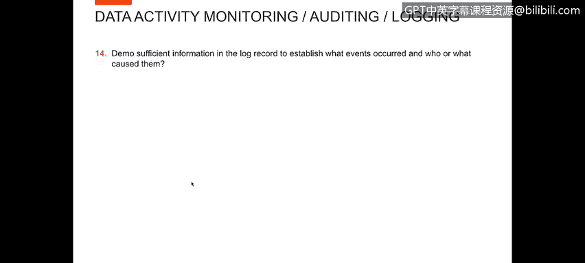
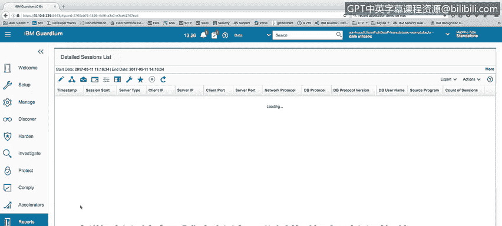
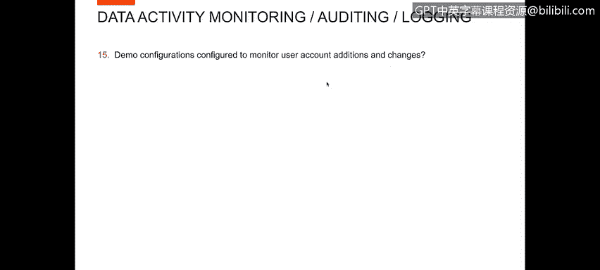
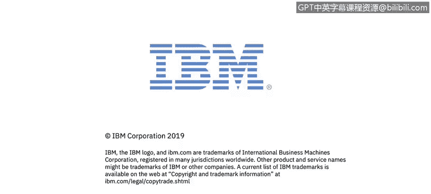

# 课程4：《网络安全与数据库漏洞》：47：46_要包括在日志中的属性

在本节课程中，我们将学习如何描述事件属性并管理其粒度。我们将通过演示来了解日志中可以捕获哪些关键信息，以及如何利用这些信息来追踪和审计数据库活动。

## 📊 事件属性与粒度管理

上一节我们介绍了日志记录的重要性，本节中我们来看看具体需要记录哪些事件属性，以及如何控制记录的详细程度。

在构建报告时，我们可以添加多种信息字段。以下是Guardian工具中可用于报告构建的部分属性列表：

*   **时间戳**：`timestamp date`, `timestamp time`, `weekday`
*   **连接信息**：`client IP`, `server IP`, `network protocol`, `database protocol`
*   **用户与程序**：`database username`, `source program`, `service name`, `operating system user`
*   **SQL详情**：`full SQL`（执行的完整SQL语句），`execution timestamp`
*   **性能与影响**：`response time`, `number of records affected`
*   **会话信息**：`session start date/time`, `client port`, `server port`, `UID chain information`

可以看到，我们能够捕获大量不同类型的属性信息，这为实现精细化的审计提供了可能。例如，在SQL报告中，我们可以精确到SQL语句在服务器上执行的毫秒级时间戳（`timestamp`），同时也能追溯到该会话的启动时间（`session start time`）和发起操作的用户（`user`）。这意味着我们能够获取到关于日期和时间的各个粒度级别的信息。

## 🔍 演示：从日志中追溯事件与责任人

现在，让我们通过演示来看看如何利用日志中的充分信息来确定发生了什么事件，以及是谁或什么导致了这些事件。

我将展示在Guardian中创建的几个报告。首先查看的是“详细会话列表”报告。

以下是该报告提供的关键会话信息：

*   **会话内最后活动的时间戳**
*   **会话开始时间**
*   **服务器与客户端信息**：服务器类型、`client IP`、`server IP`
*   **连接详情**：访问数据库的端口、协议类型（如TCP、共享内存等）
*   **用户与程序**：数据库用户名（`database username`）、使用的源程序

这份报告为我们提供了每个被监控数据库上每个登录用户的会话信息，包括登录日期、时间、会话启动时间以及他们使用的网络连接类型。

此外，如果我们查看“特权用户活动”报告，可以获取更具体的操作信息。该报告列出了SQL活动，并显示以下内容：

*   **SQL执行时间戳**
*   **所属会话及会话开始时间**
*   **执行者信息**：`client IP`、数据库用户（如Larry）、操作系统用户
*   **连接目标**：`server IP`、服务名或数据库名
*   **执行的SQL语句**

通过这份报告，你可以清楚地看到谁执行了语句、执行了什么语句，并能通过完整的SQL语句确切知道该操作意图。

## ⚙️ 演示：监控用户账户的添加与变更配置

接下来，我们想演示如何配置以监控用户账户的添加和更改操作。

为了展示这一点，我创建了一个名为“创建/修改用户操作”的报告。每当执行`ALTER USER`或`CREATE USER`命令时，该命令就会被捕获。

此报告显示了完全相同的信息结构：时间戳、会话ID、客户端IP、数据库用户等，以及执行该SQL语句的详细信息。现在，我可以知道在所有被监控系统上运行的每一次`ALTER USER`和`CREATE USER`操作，以及是哪个用户在何时运行了这些语句。

另外，如果你查看`CREATE USER`语句，会发现`IDENTIFIED BY`子句中输入的密码在Guardian中被屏蔽了。Guardian不会在其存储中保存任何密码或此类敏感信息，这符合安全最佳实践。

## 📝 本节总结

本节课中，我们一起学习了数据库安全审计中日志记录的核心要素。我们了解了需要包含在日志中的各种关键属性，如时间戳、用户身份、连接详情和完整的SQL语句，并探讨了如何通过工具（如Guardian）管理和查看这些信息的不同粒度级别。通过实际报告演示，我们看到了如何利用这些属性有效地追踪数据库活动、识别特权操作，并监控如用户账户变更等关键安全事件，同时确保密码等敏感信息得到妥善保护。掌握这些日志属性的应用，是进行有效安全监控和事件响应的基础。