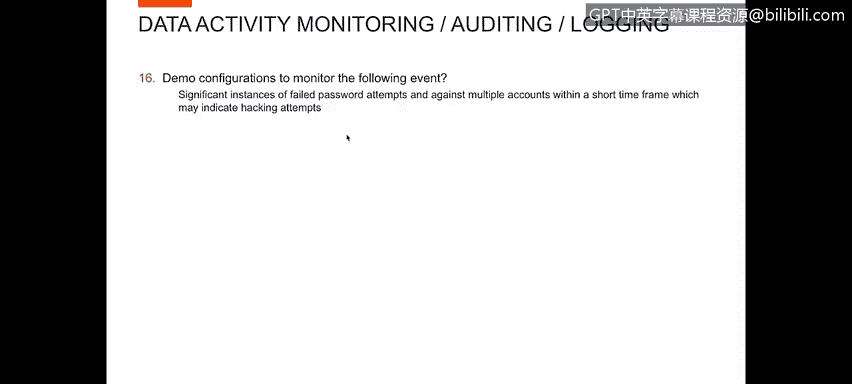
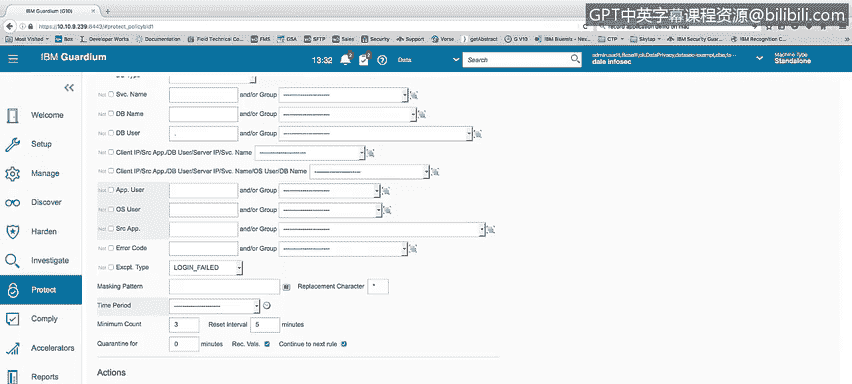
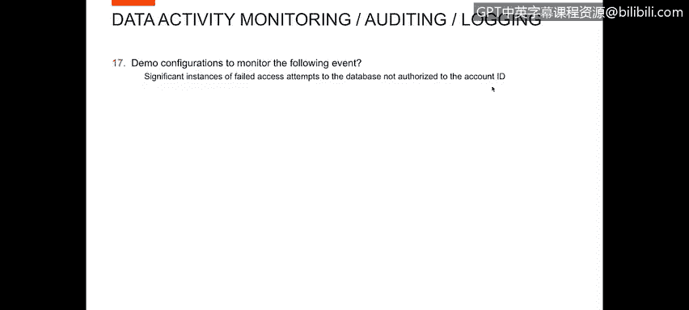
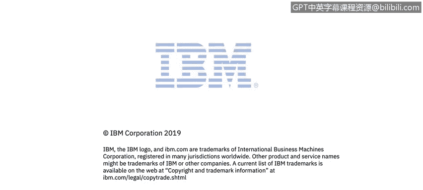

# 课程4：《网络安全与数据库漏洞》：48：47_失败访问监控

在本节课中，我们将学习如何配置系统以监控失败的密码尝试和未经授权的访问尝试。掌握这些监控技术对于识别潜在的入侵行为至关重要。

## 🎯 概述：监控失败访问的重要性

监控失败的登录和未经授权的访问是数据库安全的核心环节。攻击者常通过反复尝试密码或访问未授权资源来寻找系统漏洞。有效的监控能帮助我们及时发现这些可疑活动。

上一节我们介绍了数据库安全的基础概念，本节中我们来看看如何具体配置监控规则来应对两种主要的攻击模式。

## 🔍 监控失败的密码尝试

首先，我们需要配置系统来监控短时间内大量的失败密码尝试。这种模式通常表明攻击者正在尝试暴力破解账户。

为了演示此活动，我创建了一个“失败登录强度报告”。该报告显示了用户、数据库地址、使用的数据库协议以及发生的失败次数。

例如，在报告的一个实例中，用户“Dale”在短时间内有5次失败的登录尝试。

此外，我们可以设置警报策略。以下是如何配置警报规则的步骤：

1.  进入警报策略管理界面。
2.  编辑针对失败登录尝试的警报规则。
3.  将异常类型设置为“失败登录”。
4.  配置触发条件，例如：**`5分钟内连续失败3次`**。

这样配置后，任何在5分钟内连续失败3次登录尝试的行为都会触发警报，提示可能存在入侵企图。

## 🚫 监控未经授权的访问尝试

接下来，我们演示如何监控对数据库的未经授权访问尝试，这些尝试并非针对特定账户ID，而是针对用户无权访问的资源。

为了展示这一点，我进入已创建的报告界面。这里有一个“未经授权访问报告”。

例如，报告显示用户“Larry”因权限不足（错误代码：Oracle ORA-1031）尝试执行某项操作，并且该失败尝试发生了6次。

我还创建了另一个报告，用于显示所有执行失败的SQL语句。通过这个报告，你可以将失败访问报告中的信息与此报告关联起来。

以下是分析关联信息的步骤：

1.  在“失败访问报告”中定位可疑用户（如Larry）和失败次数。
2.  在“失败SQL语句报告”中查找同一用户在同一时间段内执行的具体SQL操作。
3.  将两者信息结合，就能完整还原用户“Larry”当时试图进行但被阻止的活动全貌。

## 📝 总结：构建主动防御

本节课中我们一起学习了如何配置系统以监控失败的密码尝试和未经授权的数据库访问。关键点包括：创建专项报告来可视化失败尝试，以及设置基于阈值的自动警报规则（如 **`5分钟内失败3次`**）。通过结合“失败访问报告”与“失败SQL语句报告”，安全分析师可以有效地关联信息，识别并调查潜在的恶意行为，从而构建更主动的数据库安全防御体系。