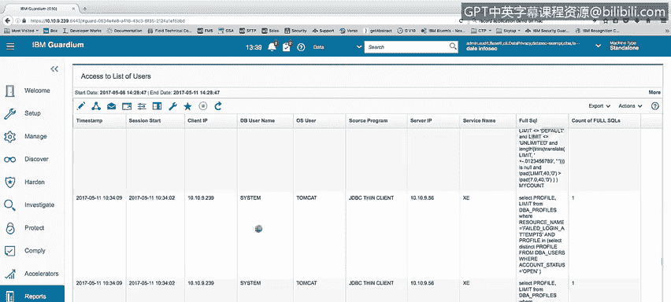
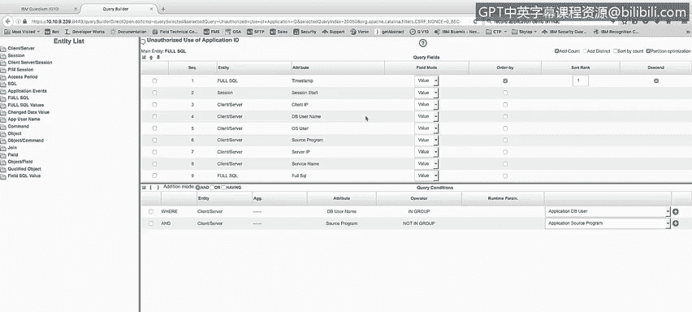
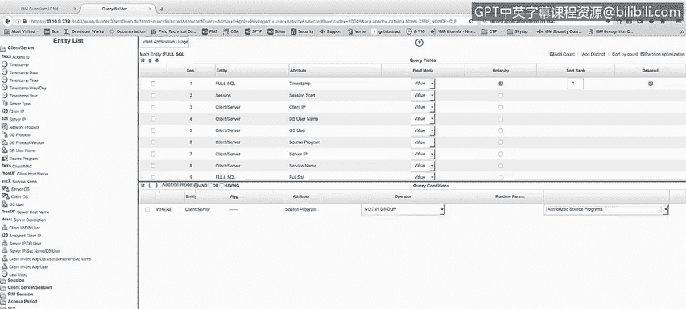
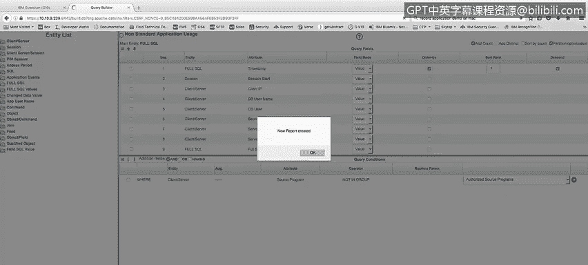

# 课程4：《网络安全与数据库漏洞》：49：48_可疑的访问事件 第1部分


在本节课程中，我们将学习如何配置监控，以检测尝试获取用户和密码列表的行为、所有未经授权的直接数据库访问尝试，以及非标准工具的使用。

## 🔍 监控用户和密码列表的查询尝试

上一节我们介绍了监控配置的目标，本节中我们来看看如何具体监控对敏感信息的查询。

我们需要监控任何尝试从数据库用户表中查询信息的行为。为此，可以创建一个报告，专门显示此类查询活动。



以下是报告的核心逻辑：


```sql
SELECT * FROM DBA_USERS;
```

该报告会展示谁执行了查询（例如用户`SYSTEM`）、对应的操作系统用户、访问的服务名以及完整的SQL语句。这样，无论是应用程序还是个人用户，只要尝试查询用户列表，都会在此报告中显示出来。

## 🚫 监控未经授权的直接数据库访问

接下来，我们关注那些本应仅通过应用程序访问的账户所进行的直接数据库访问。

为了演示，我创建了一个名为“未经授权的应用ID使用”的报告。假设我们的应用程序专用数据库用户是`APP_USER`。该报告旨在捕获`APP_USER`账户通过非授权应用程序源程序直接访问数据库的行为。

报告的关键筛选条件如下：
*   **数据库用户名**：属于“应用程序数据库用户”组。
*   **源程序**：不属于“授权应用程序源程序”组。



当`APP_USER`账户使用如`SQL*Plus`等工具直接登录数据库并执行创建表等操作时，这类活动就会被此报告捕获。通过这种方式，我们可以有效监控应用账户绕过正常应用渠道的直接访问。

## 🛠️ 监控非标准工具的直接访问


最后，我们来学习如何监控使用非标准工具直接访问数据库管理系统（DBMS）的行为。

虽然当前演示环境没有像Excel或Access这样的工具组，但我们可以学习创建此类报告的通用方法。我们可以从一个包含所需信息列（如用户、时间、SQL语句）的现有报告开始，通过克隆并修改其条件来创建新报告。

创建“非标准应用程序使用报告”的步骤如下：

1.  编辑一个合适的现有报告并创建克隆副本。
2.  将新报告命名为“非标准应用程序使用报告”。
3.  修改报告的条件设置，重点关注“客户端/服务器”或“源程序”字段。
4.  设置条件为：**源程序不属于“授权源程序”组**。
5.  保存报告定义并生成报告。

报告创建完成后，可以将其添加到仪表板中。这样，每当有用户使用不在授权列表内的程序（如未经验证的第三方工具）访问数据库时，该活动就会出现在此报告中，便于我们及时发现潜在风险。

---



**本节课总结**



本节课中，我们一起学习了监控数据库可疑访问事件的三种关键配置：
1.  监控对用户和密码列表的查询尝试。
2.  监控应用账户的未经授权直接访问。
3.  监控使用非标准工具进行的直接访问。


通过创建和配置特定的审计报告，安全分析师能够有效识别潜在的恶意或违规行为，是数据库安全防护中的重要环节。