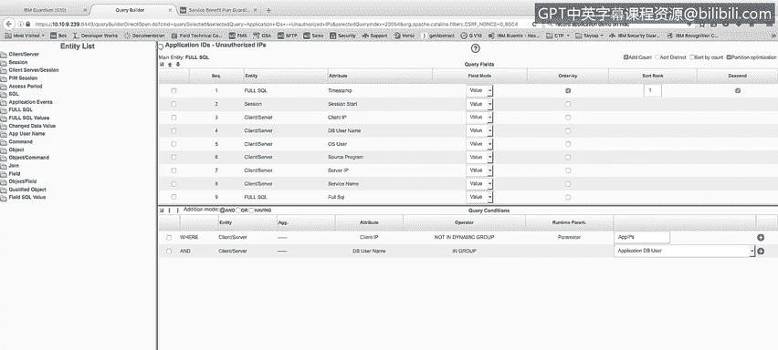
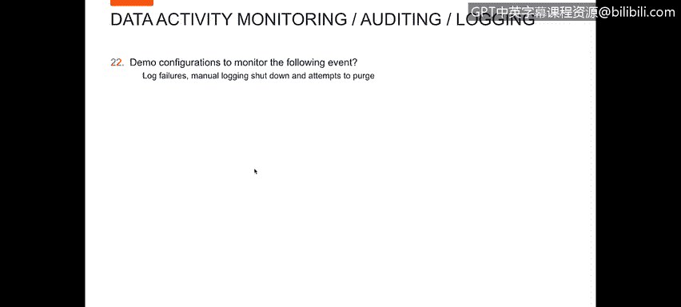
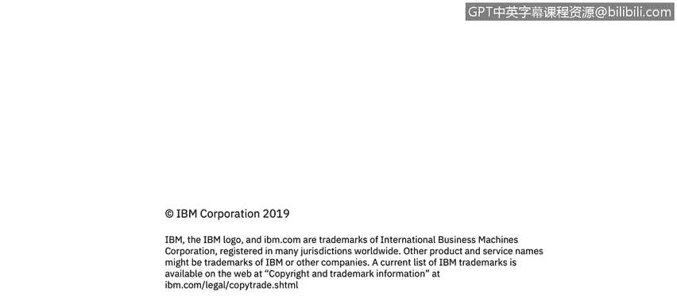

# 课程4：《网络安全与数据库漏洞》：50：49_可疑的访问事件 第2部分

在本节课程中，我们将学习如何配置监控，以检测应用程序ID从非所有者定义位置发起的访问。同时，我们还将描述如何监控日志记录失败、手动关闭日志记录以及尝试清除日志的行为。

上一节我们讨论了应用程序用户的异常行为，本节中我们来看看如何监控应用程序ID的异常访问。具体来说，我们需要监控应用程序ID是否从非所有者定义的位置（基于主机名或IP地址）被使用。

为了演示这一点，我创建了一个名为“应用程序ID来自未授权IP”的报告。这个报告与我们之前展示的“应用程序用户未使用应用程序源程序”的报告非常相似。

以下是该报告的定义细节：

在报告定义中，你可以看到条件语句为：`WHERE client_id NOT IN (application_id_group) AND database_user IN (application_user_id_group)`。这与我们为“应用程序用户未使用应用程序源程序”所做的报告定义非常相似。我们也使用了相同的报告定义，但条件改为：`WHERE final_ip NOT IN (application_ip_address_group)`。

接下来，我们想回顾或查看用于监控日志记录失败、手动关闭日志记录和尝试清除日志的演示配置。本质上，这些都属于Guardium自我监控能力所包含的内容。

首先，我们来看看S-TAP控制台。在S-TAP控制台中，我们可以看到为监控活动而设置的各种代理的状态。

以下是代理状态示例：

*   服务器 `10109128` 的代理状态为红色（不活动）。这可能意味着通信中断或服务器宕机，我们无法从该服务器监控数据。
*   服务器 `1010956` 的代理状态为绿色（活动）。我们正在监控来自该服务器的活动。

我们还可以查看检查引擎，以了解我们配置了监控哪些数据库的活动。例如，Cassandra、CouchDB、Db2显示为绿色（活动），MongoDB、Oracle等也是如此。显然，对于我们今天的演示，我们一直在查看Oracle的活动。

这是查看日志记录失败状态的一个地方。任何时候代理宕机，我们就无法记录日志，这将被视为日志记录失败。当代理正常运行时，我们就在记录日志，不会发生日志记录失败。

此外，我们还有环境内的报告功能。让我转到“实时操作报告”部分，这里会显示Guardium环境中正在发生的事情。

以下是可用的操作报告类型：

*   **缓冲使用监控**：显示CPU使用率百分比、缓冲区空间的状态，以及我们使用了多少数据库缓冲区。
*   **S-TAP状态报告**：与我们之前看到的报告类似，但包含最后响应时间、主机名、每个S-TAP代理中安装的组件以及我们标记了哪些数据库。这为我们提供了哪些代理正在运行和监控、哪些活动、哪些不活动的状态。
*   **实时连接分析列表**：我们可以查看过去一段时间内（例如三天）所有活动的连接分析，获取每个用户的连接画像。例如，应用程序用户从IP `1956` 使用SQL*Plus登录到Oracle等。你可以获取所有这些信息，并为他们的活动生成连接画像。

更重要的是，我想看看“监控Guardium系统”部分。在“监控Guardium系统”中，你可以查看用户活动审计日志。

以下是审计日志包含的信息：

*   你可以看到用户何时登录到我现在所在的Guardium界面并执行了操作。
*   例如，你可以看到用户“Bill”登录并执行了删除操作，你可以查看该操作的记录详情，了解具体执行了何种删除（例如，删除了组定义）。

这为针对Guardium系统本身执行的操作提供了审计追踪。

此外，我们还有关联和监控功能。其中一些功能只是定义，但可以设置为运行状态。

以下是可配置的监控警报示例：

*   **活动S-TAP变更**：可以设置当S-TAP发生任何变更时生成警报。
*   **数据源变更**：当有人更改数据源时发出警报。
*   **磁盘空间不足**：当磁盘空间不足时发出警报。
*   **企业内无流量**：当企业内没有流量时发出警报。
*   **Guardium登录失败**：可以对此生成警报。
*   **托管单元交互**：当我们的某个收集器不活动或停止工作时报告此情况。

因此，存在针对所有你希望监控的事件的警报，以确保你的数据库日志记录和Guardium管理系统正常运行，没有错误发生。

本节课中我们一起学习了如何配置监控以检测应用程序ID的异常访问，并了解了Guardium系统内置的自我监控和审计功能，包括代理状态检查、操作报告和可配置的警报。通过这些配置，我们可以有效监控日志记录的健康状况和系统本身的安全性。至此，我们完成了数据活动监控、策略和日志记录部分的演示，并准备好进入下一个学习环节。