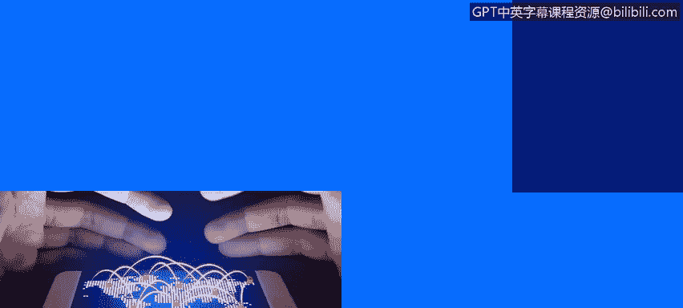
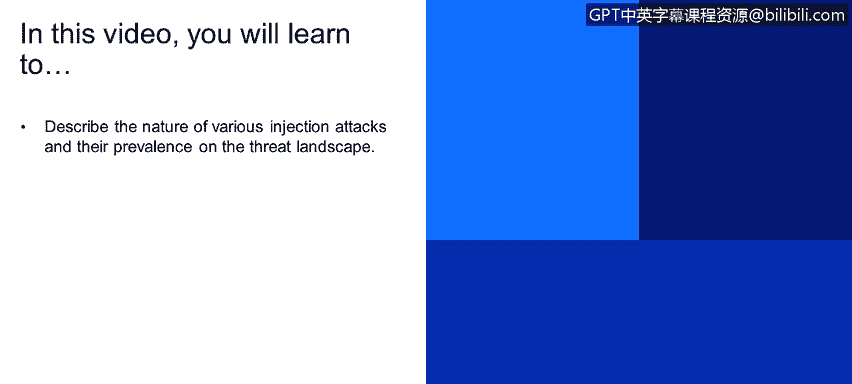
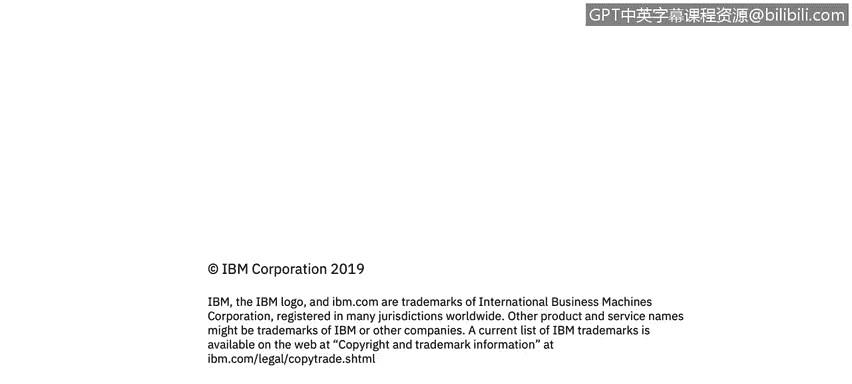

# 课程4：《网络安全与数据库漏洞》：52：51_注入缺陷简介






在本节课中，我们将学习描述各种注入攻击的本质及其在威胁环境中的普遍性。

我是Dimitri Boza，是Ex Force道德黑客团队的成员。


关于我们的工作，我们会在安全产品发布给客户之前对其进行渗透测试。对于不了解的人来说，渗透测试是一种安全测试，测试人员或质量保证人员扮演攻击者或黑客的角色。我们使用与外部攻击者攻击客户和产品时相同的技术和工具，这帮助我们找出安全漏洞，并向开发团队报告。在产品发布之前，这些漏洞会被修复。

在这些演示中，我们将展示许多我们在真实案例场景中看到的例子。希望通过我们给出的建议，您将能够解决并预防软件中的安全漏洞。现在让我们开始。


## 💉 注入缺陷概述


如果给注入缺陷下一个定义，它们通常允许攻击者通过易受攻击的应用程序向另一个系统（可能是操作系统、数据库服务器、LDAP服务器，或任何接受脚本作为输入的组件）中传递恶意代码。

从这张图表可以看出，它们相当普遍。但它们的特殊之处在于，它们通常被评定为高风险问题，是顶级问题，并且极其危险。在最坏的情况下，它们可能允许完全接管易受攻击的系统。

您可能熟悉OWASP Top 10列表。OWASP是开放网络应用安全项目，它列出了影响Web应用程序的最常见安全漏洞。从2013年的旧版本到2017年的当前版本，注入漏洞一直位居该列表的榜首，被认为是目前最危险的漏洞类型。

还有CWE/SANS Top 25列表，您可能也熟悉。这里可以看到同样的情况，第一名和第二名分别是SQL注入和操作系统命令注入。整个行业基本达成共识，认为这些是目前最危险的漏洞类型。

我们经常在新闻中听到关于注入漏洞的消息。它们促成了近期历史上一些最引人注目的黑客攻击。您去年可能听说的Equifax黑客攻击，攻击者就利用了这类漏洞泄露了大约1.5亿美国和加拿大公民的数据，规模非常巨大。另一个例子是英国电信公司TalkTalk的黑客攻击，通过SQL注入暴露了15.7万名客户的记录。如果您阅读新闻，会经常看到这类漏洞出现，而这些泄露事件的最终结果是大量客户数据和个人用户信息被泄露，它们确实非常危险。




## 📝 核心概念与影响

上一节我们介绍了注入缺陷的基本定义和普遍性。本节中，我们来看看其核心机制和造成的影响。

注入攻击的核心在于，应用程序将**用户输入**未经充分验证或净化，就直接拼接并发送给解释器（如数据库、操作系统外壳、LDAP服务）执行。攻击者利用这一点，插入恶意代码或命令。

一个简单的SQL注入示例可以表示为：
```sql
-- 假设原始查询意图是：SELECT * FROM users WHERE username = ‘用户输入’
-- 攻击者输入：admin‘ OR ‘1’=‘1
-- 最终执行的查询变为：SELECT * FROM users WHERE username = ‘admin‘ OR ‘1’=‘1’
```
这将导致条件永远为真，可能返回所有用户数据。

以下是注入缺陷可能导致的主要后果：

*   **数据泄露**：攻击者可以读取数据库中的敏感数据，如用户凭证、个人信息、财务记录。
*   **数据篡改**：攻击者可以修改、添加或删除数据库中的数据，破坏数据完整性。
*   **拒绝服务**：通过注入消耗大量资源的命令，使系统或服务不可用。
*   **系统完全接管**：在某些情况下，例如通过操作系统命令注入，攻击者可能获得对底层服务器的完全控制权。

## 🛡️ 总结与前瞻

本节课中，我们一起学习了注入缺陷的基本概念。我们了解到，注入缺陷是一种允许攻击者通过应用程序向其他系统传递恶意代码的高危漏洞，在OWASP等权威榜单中常年位居首位，并且是许多重大数据泄露事件的根源。

其危险性在于可能直接导致数据泄露、系统被控等严重后果。理解其本质和普遍性是防范的第一步。


在接下来的课程中，我们将深入探讨几种具体的注入攻击类型，如SQL注入、OS命令注入等，并学习如何通过安全的编码实践来防御它们。