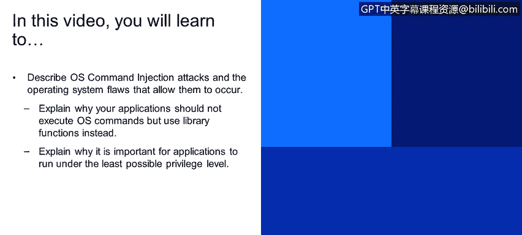
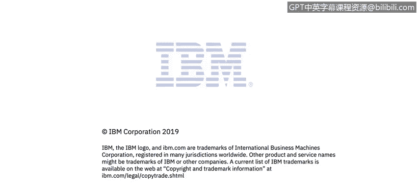

# 课程4：《网络安全与数据库漏洞》：53：OS命令注入 第1部分




在本节课程中，我们将学习描述操作系统命令注入攻击，以及允许此类攻击发生的操作系统缺陷。我们将解释为何应用程序不应执行操作系统命令，而应改用库函数。同时，我们也会说明为何应用程序以尽可能低的权限级别运行至关重要。

## 🖥️ 什么是OS命令注入？

上一节我们介绍了常见的网络攻击类型，本节中我们来看看一种具体的应用层攻击——OS命令注入。

OS命令注入是一种对存在漏洞的应用程序功能的滥用，它会导致执行由攻击者指定的操作系统命令。没有任何一个操作系统能对此免疫。此类攻击可能发生在任何操作系统上，包括Linux、Windows、Mac，因为漏洞本质上并不在操作系统本身，而是由存在漏洞的应用程序引发的。

这类漏洞之所以能够存在，是由于缺乏输入净化，以及开发人员执行操作系统命令的方式不安全。

## 📂 一个具体示例

为了更好地理解，让我们看一个具体例子。假设你有一个应用程序，其支持的功能之一是管理日志文件。日志文件作为真实文件存储在操作系统上。我们有一个界面可以列出日志文件，并允许用户通过点击来查看文件，或通过旁边的删除图标来删除文件。这是一个相当常见的场景。

我们假设删除操作在你点击图标时，会以POST请求的形式发送到服务器。当然，我们需要向服务器发送参数。在这个特定案例中，我们发送`action`（值为`delete`）和`filename`。

假设后端使用Java语言实现，后台很可能执行的是`Runtime`类的`exec`函数。我们发送的文件名（包含完整路径）会被传递给shell解释器，作为`rm`（删除文件）命令的参数。熟悉Linux的用户会认出这个模式。最终，操作系统执行的是底部这行命令：

```bash
/bin/sh -c "rm /path/to/logs/user_supplied_filename"
```

## ⚠️ 可能发生的最坏情况是什么？

在这个场景中，最坏的情况是什么？因为用户本质上指定了文件名，而我们假设应用程序中没有防御性代码来验证这个文件参数是否正确，攻击者实际上可以传递任何内容作为该参数。

在以下示例中，攻击者可以指定一个系统库文件。请注意`..`的用法，它表示向上级目录移动。在这个案例中，攻击者指示系统向上移动3个目录，再进入`lib`目录，然后删除一个系统库文件。如果没有保护措施，这个原本用于删除日志文件的命令，实际上会删除一个重要的操作系统库文件，导致拒绝服务。你的服务器在此之后将无法运行。这非常糟糕，一个普通用户就能使服务器崩溃。

但还有更糟的情况。攻击者可以利用Linux命令语法来注入另一个操作系统命令。在这个特定案例中，红色文本是由用户或攻击者提供的内容。他们设定的文件名是`x`（实际文件名并不重要，因为后面有一个分号）。在Linux中，分号用于分隔或链接多个命令。这意味着在执行完`rm`命令后，会继续执行分号后的内容。在许多系统上，`rm -rf /`命令会导致整个文件系统被删除，这是最坏的结果。

## 🚨 OS命令注入的后果

OS命令注入可能导致各种严重后果：
*   **完全系统接管**：攻击者获得对系统的完全控制。
*   **拒绝服务**：系统或服务变得不可用。
*   **敏感信息泄露**：密码、加密密钥、用户个人信息、机密商业数据可能被窃取。
*   **横向移动**：攻击者可以利用你的系统作为跳板，攻击网络上的其他计算机。
*   **恶意滥用**：系统可能被用于组建僵尸网络或进行加密货币挖矿。

一旦你给了攻击者执行操作系统命令的途径，他们几乎可以在那台机器上为所欲为。这是一种“游戏结束”级别的事件。

## 🛡️ 如何预防OS命令注入？

了解了OS命令注入的危害后，我们来看看如何预防它。

以下是预防OS命令注入的核心建议：

### 1. 避免执行OS命令

第一条建议是：不要执行操作系统命令。这听起来有点奇怪，但并非玩笑。在大多数情况下，执行OS命令是一种过于“重型”的工具，有更轻量级的方法可以完成工作。将OS命令执行引入你的应用程序，会极大地增加攻击面，如果不小心，很容易被滥用。

OS命令的引入通常是为了快速修复。例如，你想删除一个文件，但不想费心研究如何用你正在使用的编程语言正确实现，于是你想：“好吧，直接运行一个OS命令，又快又简单。”本质上，你让操作系统去做繁重的工作。但正如我们之前看到的例子，如果你不小心，一个破坏性的OS命令就可能混入并造成巨大损害。

因此，我们建议，当你面临这种情况时，最好抵制运行OS命令的诱惑，转而使用你所使用语言的内置功能或第三方库。

这里有一些例子：
*   **删除文件**：在Java中，有内置的`Files.delete`函数。
*   **复制文件**：同样，Java中有`Files.copy`函数，其他语言也有类似功能。

在大多数情况下，你可以通过使用库函数来避免运行OS命令。这样做的一大好处是显著减少了攻击面。如果你运行一个OS命令，攻击者可以指定任何他们想要的命令；但如果你使用库函数来删除文件，攻击面就急剧缩小，攻击最多只能被滥用来删除系统中的一个特定文件（我们稍后会展示如何防范这一点）。你可以看到，这远比直接执行OS命令安全得多。

### 2. 以最低权限运行

我们经常看到应用程序以超级用户（root）身份运行，但在绝大多数情况下，这是不必要的。这样做的问题是，如果攻击者滥用了你的应用程序功能，而该应用程序以非常高的权限级别运行，攻击者就能造成巨大破坏。

例如，如果你允许应用程序删除一个特定文件：
*   如果应用程序以root用户身份运行，它可以删除各种重要的操作系统文件。
*   但如果它以`tomcat`用户（例如）身份运行，它可以删除的文件范围就大大缩小，能造成的损害也有限得多。

实际上，这条“以尽可能低的权限级别运行”的建议，有助于防范许多其他类型的漏洞，而不仅仅是OS命令注入。

## 📝 本节总结



本节课中，我们一起学习了OS命令注入攻击。我们了解到，这种攻击源于应用程序不安全地执行用户输入，并将其作为操作系统命令的一部分。攻击后果非常严重，可能导致系统完全被控制。为了预防，我们应遵循两个核心原则：第一，尽可能使用编程语言的内置库函数来替代直接执行OS命令，以缩小攻击面；第二，确保应用程序以完成其功能所需的最低权限运行，以限制潜在攻击造成的损害。在下一节中，我们将继续探讨更多关于防范此类攻击的具体技术和最佳实践。