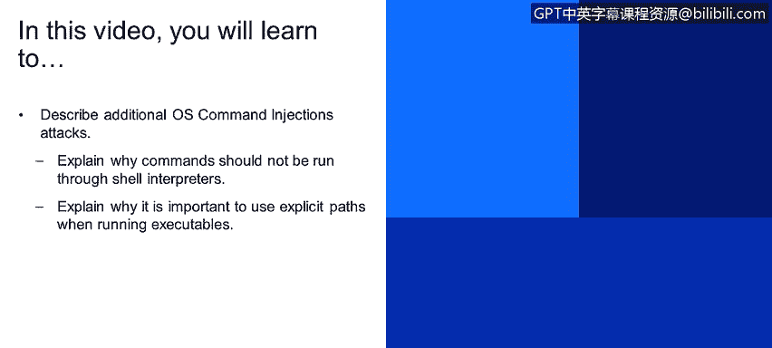
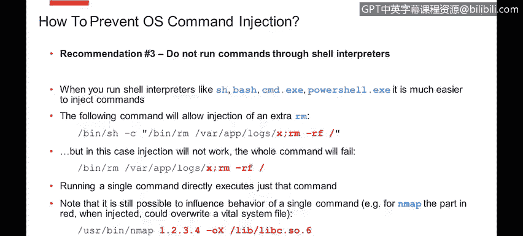
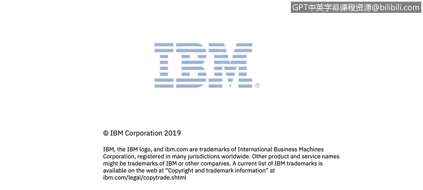

# 课程4：《网络安全与数据库漏洞》：54：OS命令注入 第2部分




## 📚 概述
在本节课中，我们将继续学习操作系统命令注入攻击。我们将了解为何不应通过Shell解释器运行命令，以及为何在执行程序时使用显式路径至关重要。这些知识将帮助你更好地理解和防范此类安全漏洞。

---

## 🚫 避免通过Shell解释器运行命令
上一节我们介绍了OS命令注入的基本原理，本节中我们来看看如何通过改进编程实践来降低风险。首先，一个关键建议是避免通过Shell解释器运行命令。

你可能熟悉诸如Unix上的SH、Bash，或Windows上的CMD和PowerShell等Shell解释器。当你的业务逻辑要求必须运行操作系统命令时，你可能别无选择。然而，如果你将命令作为参数提供给Shell解释器执行，这同样会赋予攻击者额外的能力。

例如，攻击者可以利用分号等Shell语法串联多个命令。他们可以下载恶意代码、删除文件、创建Web Shell，造成各种破坏。但如果你不通过Shell解释器，而是直接运行命令，那么一整套由Shell解释器引入和理解的语法（如分号、管道符、反引号、美元符号等）将不再有效。

以下是一个代码示例，展示了两种执行方式的不同：
```bash
# 通过Shell解释器执行（危险）
system("rm /tmp/" . $user_input);

# 直接执行命令（更安全，但需注意参数）
exec("/bin/rm", array("/tmp/" . $user_input));
```
在第二种方式中，即使攻击者在输入中注入分号，`rm`命令本身也无法理解该语法，因此注入会失败。

需要注意的是，即使直接执行命令，风险依然存在。攻击者可能不仅操纵单个参数，还可能为你运行的命令添加额外参数。

以下是一个例子：
```bash
# 预期执行
nmap 192.168.1.1

# 攻击者可能注入的参数
nmap 192.168.1.1 -oN /etc/passwd
```
在这个例子中，攻击者控制了输入，并添加了`-oN`参数，导致`nmap`将日志写入指定的文件（如`/etc/passwd`）。如果命令以root权限运行，这可能覆盖重要文件。因此，虽然攻击面缩小了（不再需要处理完整的Shell语法），但风险并未完全消除，你需要专注于防范单个命令的参数注入。

此外，另一个常见情况是，你可能直接执行一个Shell脚本。但脚本内部可能包含对传入参数的操作，这些操作仍可能触发意外的命令执行。因此，即使不涉及Shell解释器，你仍需仔细审查如何处理用户输入，防止恶意命令被间接执行。

---

## 📁 使用显式路径执行程序
接下来，我们探讨第二个重要建议：在执行程序时使用显式路径。



应用程序通常由操作系统根据系统路径设置来查找和执行。存在一种攻击类型：如果系统上存在一个文件夹，该文件夹对普通用户可写，并且有多个用户使用这台机器，同时，这个文件夹在系统路径中的位置，排在包含你试图运行的可执行文件的文件夹之前。

以下是可能发生的攻击步骤：
1.  攻击者拥有系统上的一个低权限账户。
2.  他们可以登录，并在其控制下的文件夹中放置一个恶意版本的应用程序（例如`nmap`）。
3.  这个恶意文件夹在系统路径中的顺序，先于存放真正`nmap`的常规文件夹。
4.  当你执行不带完整路径的命令（例如`nmap 192.168.1.1`）时，系统将运行那个恶意可执行文件，而非你预期的那个。

为了防止这种攻击，最佳做法是通过完整路径来引用所有要运行的可执行文件。这样可以消除歧义，确保加载正确的程序。

以下是一个示例：
```bash
# 不推荐：依赖系统路径
system("nmap 192.168.1.1");

# 推荐：使用显式路径
system("/usr/bin/nmap 192.168.1.1");
```
顺便提一下，同样的建议也适用于另一种名为“DLL劫持”的攻击类型。其原理类似：攻击者可以将恶意版本的共享库或DLL放入他们控制的、且位于搜索路径中的文件夹，这样，系统就会在加载合法版本之前先加载这个恶意文件。

---



## ✅ 总结
本节课中，我们一起学习了两种关键的防范OS命令注入攻击的实践方法。首先，我们了解了应避免通过Shell解释器运行命令，以限制攻击者利用Shell语法的能力。其次，我们强调了使用显式路径执行程序的重要性，以防止路径劫持攻击。通过实施这些措施，可以显著降低应用程序面临的操作系统命令注入风险。