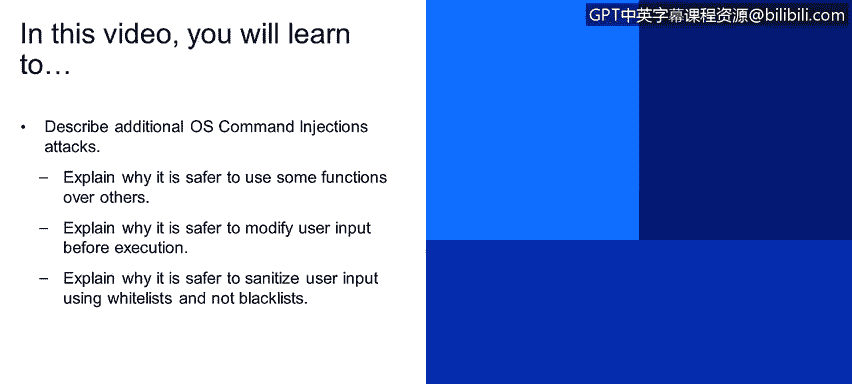
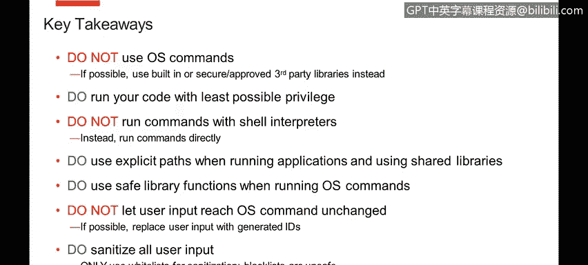
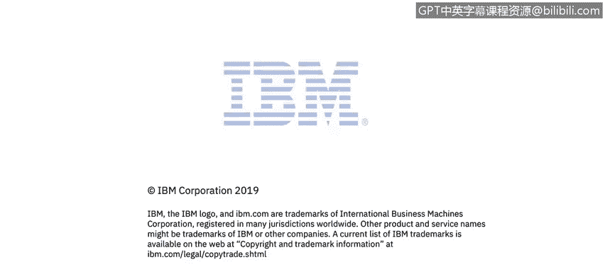

# 课程4：《网络安全与数据库漏洞》：55：OS命令注入 第3部分

## 📖 概述
在本节课程中，我们将继续学习操作系统命令注入攻击。我们将探讨如何通过选择更安全的函数、修改用户输入以及使用白名单而非黑名单进行输入净化，来编写更安全的代码，从而有效防御此类攻击。

上一节我们介绍了避免使用操作系统命令以及使用最小权限原则。本节中，我们来看看在必须执行系统命令时，如何通过编码实践来降低风险。

## 💡 使用更安全的函数执行系统命令
如果业务逻辑确实需要执行系统命令，那么正确编写和执行代码至关重要。不同的编程语言提供了多种执行命令的方式，其中一些方式比其他方式更安全。

以下是选择执行函数时的建议：

*   **避免拼接字符串执行命令**：例如在Java中，一种常见但不安全的方式是将可执行文件及其参数拼接成一个完整的字符串再执行。这种方式更容易受到注入攻击。
*   **使用参数预解析的函数**：更安全的方式是使用接受字符串数组作为参数的函数。例如，在Java中，使用 `Runtime.exec(String[] cmdarray)` 比 `Runtime.exec(String command)` 更安全。因为前者已经将命令和参数作为独立的字符串预先解析好并传递给操作系统，攻击者难以将单个参数“篡改”成多个命令。

因此，在执行命令时，请评估可用的函数，并选择最安全的那一个。

## 🛡️ 修改用户输入后再执行
另一个重要的建议是，尽可能不要让原始的用户输入直接到达命令执行点。

这意味着可以在用户界面（UI）中使用符号化的ID来代表操作系统命令将要操作的不同实体。

以下是具体做法：

*   **建立映射关系**：例如，不让用户直接指定要删除的文件名，而是让用户操作一个代表该文件的数字ID。
*   **内部转换**：当参数传入后端代码时，程序内部使用一个转换表将这个ID映射到真实的文件名，然后再执行删除操作。

这种方式安全得多，因为攻击者无法通过参数值传入任何恶意的操作系统命令。如果他们传入的ID值在内部映射表中不存在，请求就会被直接拒绝。

## ✅ 使用白名单而非黑名单进行输入净化
对用户输入进行严格净化是一条通用的安全建议。在净化策略上，我们强烈推荐使用**白名单**，而非**黑名单**。

*   **黑名单的问题**：黑名单是一份已知危险输入的列表。程序逻辑会检查用户输入是否匹配列表中的任何一项，如果不匹配则放行。问题在于，构建一个成功的黑名单极其困难，因为攻击者非常有创造力，总能找到方法绕过它。
*   **白名单的优势**：白名单则是一份严格控制的、允许输入的列表。所有不在列表上的输入都会被拒绝。这样，你只需要分析一个已知的、范围较小的合法输入集合，判断它们是否安全。

以下是一些真实案例，展示了黑名单如何被轻易绕过：

*   **案例1**：如果程序黑名单包含分号、与符号和管道符，攻击者可以使用反引号来执行命令，例如 **`malicious_command`**。
*   **案例2**：如果将反引号也加入黑名单，攻击者可以使用 **$(malicious_command)** 这种语法。
*   **案例3**：如果程序试图通过禁止空格来防御，攻击者可以使用系统变量（如 **${IFS}**）来替代空格。
*   **案例4**：如果程序将输入用双引号包裹并转义内部的双引号，攻击者可以传入已转义的双引号（如 **\"**），导致程序转义逻辑出错，从而注入命令。

相比之下，一个简单的白名单正则表达式，例如只允许字母、数字和点号（用于文件扩展名），就可以轻松防御上述所有攻击尝试。例如，使用白名单规则 **`^[a-zA-Z0-9._]+$`**。

## 📝 总结
本节课中我们一起学习了防御操作系统命令注入攻击的进阶编码实践。关键要点如下：

1.  **尽量避免使用OS命令**，寻找更安全的替代方案。
2.  **如果必须使用**，确保由业务逻辑驱动，而非随意添加。
3.  **遵循最小权限原则**运行代码。
4.  **避免通过Shell解释器执行命令**，尽量直接调用。
5.  **使用显式路径**来调用应用程序和共享库。
6.  **选择更安全的库函数**来执行命令。
7.  **不要直接使用原始用户输入**，尝试使用生成的ID进行内部映射。
8.  **使用严格的白名单**来净化和验证所有用户输入。

通过遵循这些最佳实践，可以显著降低应用程序遭受操作系统命令注入攻击的风险。