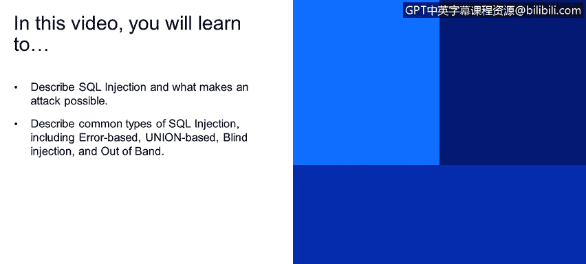
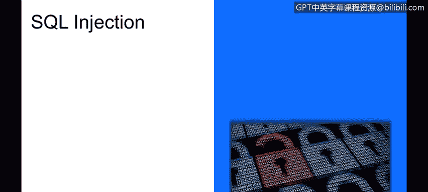
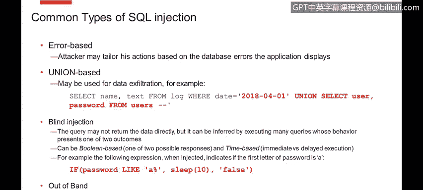
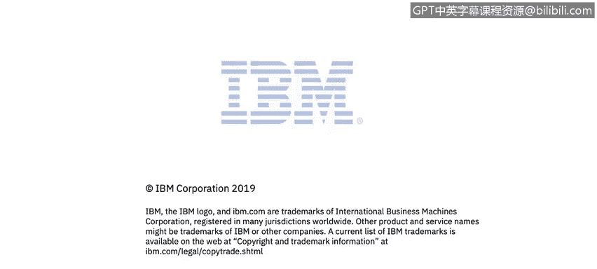

# 课程4：《网络安全与数据库漏洞》：56：SQL注入 第1部分




在本节课程中，我们将学习SQL注入攻击的基本概念、常见类型及其工作原理。SQL注入是一种针对数据库的常见攻击手段，理解其原理对于防范此类威胁至关重要。



## 什么是SQL注入？

上一节我们介绍了命令注入，本节中我们来看看SQL注入。与命令注入类似，SQL注入是**利用应用程序的漏洞，导致执行非预期的SQL查询**。这些查询由数据库系统执行。

SQL注入几乎可能发生在任何SQL数据库中。主要的缓解措施同样是**输入净化**。

## SQL注入示例

让我们看一个例子。假设我们有一个登录对话框，这在您开发的应用程序中很常见。通常，在代码中我们会看到类似以下的Java语句，它用于拼接一个SQL命令，并直接将用户名和密码嵌入到该SQL语句中。

```java
String query = "SELECT * FROM users WHERE username='" + username + "' AND password='" + password + "'";
```

当在数据库中找到匹配该用户名和密码的用户时，系统会让用户登录。当输入是良性的时，一切运行正常。

然而，让我们看看如果攻击者注入恶意内容会发生什么。在底部有一个语句，它实际上没有指定任何密码（密码留空），但用户名部分很有趣。

```
username: ' OR 1=1; --
```

让我们逐步解释发生了什么。在SQL语法中，值通常由单引号包围。这里的第一个单引号实际上关闭了用户名的值。接下来，攻击者添加了一个布尔子句`OR`和一个表达式`1=1`。`1=1`的结果总是为真。如果您熟悉布尔逻辑，如果某个条件`OR`真，那么整个表达式的结果总是为真。分号用于分隔不同的SQL查询。在许多SQL方言中，`--`是注释符号，它会注释掉该行剩余的部分。因此，`‘ AND password=’‘`实际上被忽略了。

本质上，攻击者将我们的SQL查询变成了一个**查找用户表中任何用户**的查询，它不检查用户名，也不检查密码，只是盲目地允许人们登录。通过这段非常简单的文本，您就可以绕过易受攻击系统的登录对话框，我们已经见过这样的例子。

## SQL注入的危险性

以下是SQL注入可能带来的主要危险：

*   **绕过认证机制**：如上例所示，攻击者可以无需有效凭证即可登录系统。
*   **数据窃取**：攻击者可以窃取数据。新闻中报道的许多黑客攻击中，客户数据就是这样通过SQL注入被窃取的。
*   **执行操作系统命令**：在某些SQL变体中，您可以指定运行操作系统命令。如果能够注入包含`SELECT 1; \! OS_COMMAND`的SQL语句，就可能执行该OS命令。
*   **破坏或拒绝服务攻击**：例如，您可以指示SQL服务器删除表，之后您的系统基本上就瘫痪了。通过一个包含SQL注入命令的简单请求，您就可以使整个系统崩溃。下面有一个使用分号分隔语句的示例。

不要假设攻击者如果能在您的查询中注入恶意内容，就无法执行其他查询。存在将查询链接在一起并执行嵌套查询的方法。

## SQL注入的常见类型

SQL注入有多种变体，以下是几种主要类型：

### 1. 基于错误的SQL注入

在这种攻击中，攻击者会观察系统根据返回的错误消息如何表现。将数据库错误中的私有信息直接返回给应用程序用户，会泄露很多后端信息，并允许攻击者调整他们的命令。

### 2. 联合查询SQL注入

这是一个有趣的案例，展示了数据如何从系统中被窃取。我们有一个查询，它从日志文件中获取特定日期过滤后的名称和一些文本。在这种情况下，该日期由应用程序用户控制。

如果没有任何输入净化措施，他们可以指定不仅仅是日期，还可以向该查询添加一个`UNION`子句。例如，`UNION SELECT username, password FROM users`。这样，当他们滥用从日志加载数据的功能时，该功能将返回特定日期的日志中的名称和文本，并附加返回用户名和密码，这是您不希望发生的事情。

### 3. 盲SQL注入

这是一种有趣的情况，因为有时人们会说：“是的，我运行SQL查询，但没有数据返回给用户，这有什么大不了的？”实际上，有很多方法可以进行盲注，仅通过系统的行为来猜测数据是什么。

主要有两种类型：
*   **基于布尔的盲注**：您运行一个查询，当您调整参数时，可能有一到两种可能的响应。根据系统的响应方式，您可以一点一点地猜测数据是什么。
*   **基于时间的盲注**：例如，您可以在查询执行中插入一个延迟。如果数据是某种类型，它不会延迟；如果内容中有其他东西，它就会延迟。

用一个例子来解释可能更容易。在下面的红色代码中，我们有一个SQL表达式，它表示如果密码以字母`a`开头，则休眠10秒，否则返回`false`。

```sql
IF (SUBSTRING(password, 1, 1) = 'a') THEN SLEEP(10) ELSE 0 END IF
```

当攻击者执行此表达式时，如果他们猜对了，响应将延迟10秒（或10毫秒）返回；而对于他们尝试的所有其他字符，则不会有延迟。因此，通过执行大约26次查询来覆盖英文字母表中的所有字母，他们最终将能够知道密码的第一个字母。如果对您可以执行的查询数量没有限制，您可以编写一个脚本，逐个尝试密码中的每个字母，遍历所有可能的值范围，这样您就可以在不从数据库向屏幕输出任何数据的情况下发现密码。因此，即使您的应用程序不向攻击者返回数据，如果他们能够进行SQL注入，他们也可能获取到内容。

### 4. 带外SQL注入

在这种攻击中，攻击者可以触发向其他站点的请求，并通过其他方式（甚至不是通过您的应用程序，而是通过其他渠道）窃取数据。

## 总结





本节课中，我们一起学习了SQL注入的基本概念。我们了解到，SQL注入是通过操纵应用程序的输入来执行恶意SQL查询的攻击。它可能导致认证绕过、数据窃取、命令执行和拒绝服务等严重后果。我们还探讨了几种常见的SQL注入类型，包括基于错误、联合查询、盲注（布尔型和基于时间型）以及带外注入。理解这些攻击的原理是构建安全应用程序、实施有效输入验证和净化措施的第一步。在后续课程中，我们将学习如何防御这些攻击。